# Multi-Cluster Implementation - Epics & Stories

**Project:** Multi-cluster Kubernetes platform with shared-base GitOps pattern
**Methodology:** Agile with Epics → Stories → Tasks
**Duration:** 10 weeks (50 working days)
**Architecture:** Flux-standard multi-cluster with shared bases + variable substitution

---

## Epic Overview

| Epic ID | Name | Stories | Est. Days | Dependencies | Status |
|---------|------|---------|-----------|--------------|--------|
| EPIC-1 | Talos Multi-Cluster Bootstrap | 3 | 3 | None | ✅ 90% |
| EPIC-2 | CNI & Networking | 4 | 4 | EPIC-1 | ✅ 75% |
| EPIC-3 | GitOps Foundation | 3 | 3 | EPIC-2 | ✅ 70% |
| EPIC-4 | Storage Infrastructure | 5 | 10 | EPIC-3 | ✅ 85% |
| EPIC-5 | Security & Secrets | 4 | 6 | EPIC-3 | ✅ 80% |
| EPIC-6 | Observability Stack | 6 | 8 | EPIC-4 | ✅ 70% |
| EPIC-7 | Database Platform | 4 | 5 | EPIC-4, EPIC-5 | ✅ 80% |
| EPIC-8 | Authentication & SSO | 3 | 5 | EPIC-7 | ❌ 0% |
| EPIC-9 | Application Workloads | 3 | 10 | EPIC-8 | ⚠️ 20% |
| EPIC-10 | Backup & DR | 4 | 6 | EPIC-4 | ❌ 0% |

**Total: 41 stories, 60 estimated days (10 weeks with buffer)**

**Legend:** ✅ Config Complete | ⚠️ Partial | ❌ Not Started

---

## Repository Architecture Pattern

**IMPORTANT:** This implementation uses a **Flux-standard multi-cluster shared-base pattern**, not per-cluster configurations.

###  Directory Structure

```
kubernetes/
├── bases/                      # Shared HelmReleases (cluster-agnostic)
│   ├── cilium/
│   ├── cert-manager/
│   ├── rook-ceph-operator/
│   └── ...
│
├── infrastructure/             # Platform capabilities (composed from bases)
│   ├── networking/
│   │   ├── cilium/            # References bases/cilium + cluster config
│   │   ├── coredns/
│   │   └── spegel/
│   ├── security/
│   │   ├── cert-manager/
│   │   ├── external-secrets/
│   │   └── rbac/
│   └── storage/
│       ├── rook-ceph/
│       └── openebs/
│
├── workloads/                  # Applications
│   ├── platform/              # Platform services (databases, observability)
│   │   ├── databases/
│   │   │   ├── cloudnative-pg/
│   │   │   └── dragonfly/
│   │   └── observability/
│   │       ├── victoria-metrics/
│   │       ├── victoria-logs/
│   │       └── fluent-bit/
│   └── tenants/               # User applications
│       └── gitlab/
│
└── clusters/                   # Flux entry points (per-cluster)
    ├── infra/
    │   ├── flux-system/
    │   ├── infrastructure.yaml    # Kustomization with postBuild.substitute
    │   └── workloads.yaml
    └── apps/
        ├── flux-system/
        ├── infrastructure.yaml
        └── workloads.yaml
```

### How Variable Substitution Works

Each cluster defines its own variables in `clusters/<name>/infrastructure.yaml`:

**Example: `clusters/infra/infrastructure.yaml`**
```yaml
apiVersion: kustomize.toolkit.fluxcd.io/v1
kind: Kustomization
spec:
  path: ./kubernetes/infrastructure
  postBuild:
    substitute:
      CLUSTER: infra
      CLUSTER_ID: "1"
      POD_CIDR: "10.244.0.0/16"
      SERVICE_CIDR: "10.245.0.0/16"
      CLUSTERMESH_IP: "10.25.11.100"
      CILIUM_BGP_LOCAL_ASN: "64512"
      # ... 30+ more variables
```

**Example: `clusters/apps/infrastructure.yaml`**
```yaml
apiVersion: kustomize.toolkit.fluxcd.io/v1
kind: Kustomization
spec:
  path: ./kubernetes/infrastructure
  postBuild:
    substitute:
      CLUSTER: apps
      CLUSTER_ID: "2"
      POD_CIDR: "10.246.0.0/16"
      SERVICE_CIDR: "10.247.0.0/16"
      CLUSTERMESH_IP: "10.25.11.150"
      CILIUM_BGP_LOCAL_ASN: "64513"
      # ... different values for apps cluster
```

**Same manifests + different variables = cluster-specific deployments.**

### Benefits of This Pattern

1. **DRY (Don't Repeat Yourself):** Single source of truth for each component
2. **Easy scaling:** Add third cluster by creating `clusters/staging/` with new variables
3. **Clear differences:** Variables explicitly show what differs between clusters
4. **Standard pattern:** Follows FluxCD multi-cluster best practices
5. **Reduced maintenance:** Update one file instead of per-cluster copies

### Deployment Flow

```
1. Flux bootstraps: flux bootstrap github --path=clusters/infra
   ↓
2. Flux reads: clusters/infra/infrastructure.yaml
   ↓
3. Flux applies: kubernetes/infrastructure/ with variable substitution
   ↓
4. Components reference: kubernetes/bases/ for shared HelmReleases
   ↓
5. Result: Infra-specific deployment from shared manifests
```

### Impact on Stories

**Stories that say "Deploy on Apps Cluster":**
- **Old approach:** Copy configs, change values, apply to apps
- **New approach:** Already deployed! Shared configs + different variables

**Example:** Story 4.4 (Deploy OpenEBS on Apps)
- Configs in `kubernetes/infrastructure/storage/openebs/` deploy to **BOTH** clusters
- No separate files needed for apps cluster
- Apps cluster just uses different `CLUSTER` variable value

---

## EPIC-1: Talos Multi-Cluster Bootstrap
**Goal:** Split single 6-node cluster into two 3-node clusters
**Status:** ✅ 90% Complete (configs done, deployment pending)

### Story 1.1: Prepare Talos Configuration ✅
**Priority:** P0 | **Points:** 3 | **Days:** 1 | **Status:** ✅ COMPLETE

**Acceptance Criteria:**
- [x] `convert-to-multicluster.sh` script executed successfully
- [x] Node configs moved to `talos/infra/` and `talos/apps/`
- [x] Hostnames updated (infra-01, infra-02, infra-03, apps-01, apps-02, apps-03)
- [x] `machineconfig.yaml.j2` updated with cluster parameterization
- [x] Taskfiles updated with CLUSTER parameter support
- [x] machineconfig.yaml.j2 validated with `talosctl validate`

**Tasks:**
- Run `./scripts/convert-to-multicluster.sh`
- Update `talos/machineconfig.yaml.j2` with cluster variables
- Update `.taskfiles/talos/Taskfile.yaml` apply-node task
- Update `.taskfiles/bootstrap/Taskfile.yaml` bootstrap tasks
- Test config generation: `minijinja-cli ... | op inject | talosctl validate`

**Files Created/Modified:**
- ✅ `talos/infra/10.25.11.11.yaml`
- ✅ `talos/infra/10.25.11.12.yaml`
- ✅ `talos/infra/10.25.11.13.yaml`
- ✅ `talos/apps/10.25.11.14.yaml`
- ✅ `talos/apps/10.25.11.15.yaml`
- ✅ `talos/apps/10.25.11.16.yaml`
- ✅ `talos/machineconfig-multicluster.yaml.j2`
- ✅ `.taskfiles/talos/Taskfile.yaml`
- ✅ `.taskfiles/bootstrap/Taskfile.yaml`

---

### Story 1.2: Generate Cluster Secrets ⚠️
**Priority:** P0 | **Points:** 2 | **Days:** 0.5 | **Status:** ⚠️ PARTIALLY COMPLETE

**Acceptance Criteria:**
- [ ] Secrets generated for infra cluster
- [ ] Secrets generated for apps cluster
- [ ] Secrets imported to 1Password (infra-talos item)
- [ ] Secrets imported to 1Password (apps-talos item)
- [ ] `op inject` tested and working

**Tasks:**
- Run `talosctl gen secrets -o /tmp/infra-secrets.yaml`
- Run `talosctl gen secrets -o /tmp/apps-secrets.yaml`
- Run `./scripts/extract-talos-secrets.sh /tmp/infra-secrets.yaml infra`
- Execute `op item create` command for infra
- Run `./scripts/extract-talos-secrets.sh /tmp/apps-secrets.yaml apps`
- Execute `op item create` command for apps
- Test: `echo "op://Prod/infra-talos/MACHINE_TOKEN" | op inject`

**Files Created:**
- `/tmp/infra-secrets.yaml` (temporary)
- `/tmp/apps-secrets.yaml` (temporary)
- 1Password items: `infra-talos`, `apps-talos`

---

### Story 1.3: Bootstrap Both Clusters
**Priority:** P0 | **Points:** 5 | **Days:** 1.5 | **Status:** 🔲 PENDING

**Acceptance Criteria:**
- [ ] DNS records created (infra-k8s.monosense.io → 10.25.11.11)
- [ ] DNS records created (apps-k8s.monosense.io → 10.25.11.14)
- [ ] Infra cluster deployed (10.25.11.11-13)
- [ ] Apps cluster deployed (10.25.11.14-16)
- [ ] Both clusters bootstrapped and healthy
- [ ] Kubeconfigs generated and merged
- [ ] All 6 nodes in NotReady state (expected - no CNI yet)
- [ ] PodCIDRs verified as non-overlapping

**Tasks:**
- Add DNS A records in Cloudflare (or local DNS)
- Apply configs to infra nodes:
  ```bash
  task talos:apply-node NODE=10.25.11.11 CLUSTER=infra MACHINE_TYPE=controlplane
  task talos:apply-node NODE=10.25.11.12 CLUSTER=infra MACHINE_TYPE=controlplane
  task talos:apply-node NODE=10.25.11.13 CLUSTER=infra MACHINE_TYPE=controlplane
  ```
- Bootstrap infra: `talosctl bootstrap --nodes 10.25.11.11`
- Wait for health: `talosctl health --wait-timeout 10m`
- Generate infra kubeconfig: `talosctl kubeconfig --force`
- Apply configs to apps nodes:
  ```bash
  task talos:apply-node NODE=10.25.11.14 CLUSTER=apps MACHINE_TYPE=controlplane
  task talos:apply-node NODE=10.25.11.15 CLUSTER=apps MACHINE_TYPE=controlplane
  task talos:apply-node NODE=10.25.11.16 CLUSTER=apps MACHINE_TYPE=controlplane
  ```
- Create talosctl context for apps: `talosctl config context apps --nodes 10.25.11.14,10.25.11.15,10.25.11.16`
- Bootstrap apps: `talosctl bootstrap --nodes 10.25.11.14 --context apps`
- Generate apps kubeconfig
- Verify: `kubectl --context infra get nodes` (should show NotReady)
- Verify: `kubectl --context apps get nodes` (should show NotReady)
- Verify PodCIDRs: `kubectl --context infra get nodes -o jsonpath='{.items[*].spec.podCIDR}'`

**Files Created:**
- Kubeconfig contexts: `infra` and `apps`
- DNS records in Cloudflare

---

## EPIC-2: CNI & Networking
**Goal:** Deploy Cilium on both clusters with ClusterMesh
**Status:** ✅ 75% Complete (configs done, External-DNS missing)

### Story 2.1: Deploy Cilium with BGP, Gateway API, and ClusterMesh ✅
**Priority:** P0 | **Points:** 5 | **Days:** 1 | **Status:** ✅ CONFIG COMPLETE

**Acceptance Criteria:**
- [x] Cilium base HelmRelease created in `bases/cilium/`
- [x] Cilium infrastructure configs created in `infrastructure/networking/cilium/`
- [x] BGP control plane configured (`CiliumBGPPeeringPolicy`)
- [x] Gateway API (Envoy) enabled
- [x] ClusterMesh configuration prepared
- [x] Cluster variables defined in `clusters/infra/infrastructure.yaml`
- [ ] Cilium deployed and all infra nodes transition to Ready state
- [ ] Cilium status shows healthy: `cilium status --wait`
- [ ] BGP peering with upstream router verified
- [ ] LoadBalancer IP pool working (10.25.11.100-149)

**Tasks:**
- **Files already created** (verify they exist):
  - `kubernetes/bases/cilium/helmrelease.yaml`
  - `kubernetes/infrastructure/networking/cilium/kustomization.yaml`
  - `kubernetes/infrastructure/networking/cilium/bgp/bgppeeringpolicy.yaml`
  - `kubernetes/infrastructure/networking/cilium/clustermesh/externalsecret.yaml`
  - `kubernetes/infrastructure/networking/cilium/gateway/gatewayclass.yaml`
  - `clusters/infra/infrastructure.yaml` (with Cilium variables)

- **Deploy via Flux** (after Flux bootstrap):
  ```bash
  flux reconcile kustomization cluster-infra-infrastructure --context infra
  ```

- **Or deploy manually for testing:**
  ```bash
  kubectl --context infra apply -k kubernetes/infrastructure/networking/cilium/
  ```

- **Verify deployment:**
  ```bash
  kubectl --context infra rollout status -n kube-system ds/cilium
  cilium status --context infra
  kubectl --context infra get nodes  # Should now show Ready
  ```

- **Test LoadBalancer:**
  ```bash
  kubectl --context infra create service loadbalancer test-lb --tcp=80:80
  kubectl --context infra get svc test-lb  # Should get IP from pool
  kubectl --context infra delete svc test-lb
  ```

**Files Created:**
- ✅ `kubernetes/bases/cilium/helmrelease.yaml`
- ✅ `kubernetes/infrastructure/networking/cilium/kustomization.yaml`
- ✅ `kubernetes/infrastructure/networking/cilium/bgp/bgppeeringpolicy.yaml`
- ✅ `kubernetes/infrastructure/networking/cilium/clustermesh/externalsecret.yaml`
- ✅ `kubernetes/infrastructure/networking/cilium/gateway/gatewayclass.yaml`

**Variables Used** (from `clusters/infra/infrastructure.yaml`):
- `CLUSTER_ID: "1"`
- `POD_CIDR: "10.244.0.0/16"`
- `SERVICE_CIDR: "10.245.0.0/16"`
- `CLUSTERMESH_IP: "10.25.11.100"`
- `CILIUM_BGP_LOCAL_ASN: "64512"`
- `CILIUM_BGP_PEER_ASN: "64501"`
- `CILIUM_BGP_PEER_ADDRESS: "10.25.11.1/32"`
- `CILIUM_GATEWAY_LB_IP: "10.25.11.120"`

---

### Story 2.2: Configure Apps Cluster Cilium Variables ✅
**Priority:** P0 | **Points:** 1 | **Days:** 0.5 | **Status:** ✅ COMPLETE

**Acceptance Criteria:**
- [x] `clusters/apps/infrastructure.yaml` created with apps-specific variables
- [x] CLUSTER_ID set to "2"
- [x] POD_CIDR set to non-overlapping range (10.246.0.0/16)
- [x] SERVICE_CIDR set to non-overlapping range (10.247.0.0/16)
- [x] LoadBalancer IP pool variables set (10.25.11.150-199)
- [x] BGP ASN set to different value (64513)
- [x] CLUSTERMESH_IP set to apps pool (10.25.11.150)
- [ ] Apps cluster deployed and nodes transition to Ready

**Tasks:**
- Verify `clusters/apps/infrastructure.yaml` exists and contains:
  ```yaml
  postBuild:
    substitute:
      CLUSTER: apps
      CLUSTER_ID: "2"
      POD_CIDR: '["10.246.0.0/16"]'
      SERVICE_CIDR: '["10.247.0.0/16"]'
      CLUSTERMESH_IP: "10.25.11.150"
      CILIUM_BGP_LOCAL_ASN: "64513"
      # ... more variables
  ```

- **Deploy via Flux** (after Flux bootstrap):
  ```bash
  flux reconcile kustomization cluster-apps-infrastructure --context apps
  ```

- **Verify:**
  ```bash
  kubectl --context apps get nodes  # Should show Ready
  cilium status --context apps
  ```

**Files Modified:**
- ✅ `clusters/apps/infrastructure.yaml` (variables configured)

**Note:** No separate Cilium configs needed! Same shared base deploys to both clusters with different variables.

---

### Story 2.3: Enable and Configure Cilium ClusterMesh ✅
**Priority:** P0 | **Points:** 3 | **Days:** 1.5 | **Status:** ✅ CONFIG READY

**Acceptance Criteria:**
- [x] ClusterMesh externalsecret configured in `infrastructure/networking/cilium/clustermesh/`
- [ ] ClusterMesh enabled on infra cluster
- [ ] ClusterMesh enabled on apps cluster
- [ ] Clusters connected via ClusterMesh
- [ ] Cross-cluster connectivity verified
- [ ] Global services can be created
- [ ] Network policies tested

**Tasks:**
- **ClusterMesh is configured in Helm values** - verify:
  - `infrastructure/networking/cilium/clustermesh/externalsecret.yaml` exists
  - ClusterMesh enabled in `bases/cilium/helmrelease.yaml`

- **Enable ClusterMesh** (after both clusters have Cilium):
  ```bash
  cilium clustermesh enable --context infra
  cilium clustermesh enable --context apps
  ```

- **Connect clusters:**
  ```bash
  cilium clustermesh connect --context infra --destination-context apps
  ```

- **Verify status:**
  ```bash
  cilium clustermesh status --context infra
  cilium clustermesh status --context apps
  ```

- **Test cross-cluster connectivity:**
  ```bash
  # Deploy test workload on infra
  kubectl --context infra create deployment test --image=nginx
  kubectl --context infra expose deployment test --port=80

  # Mark as global service
  kubectl --context infra annotate service test service.cilium.io/global="true"

  # Deploy test pod on apps cluster
  kubectl --context apps run test-client --image=curlimages/curl -it --rm -- sh
  # Inside pod: curl test.default.svc.clusterset.local
  ```

- **Clean up:**
  ```bash
  kubectl --context infra delete deployment test
  kubectl --context infra delete service test
  ```

**Files Created:**
- ✅ `kubernetes/infrastructure/networking/cilium/clustermesh/externalsecret.yaml`

**ClusterMesh Configuration:**
- Infra ClusterMesh API: `10.25.11.100:2379`
- Apps ClusterMesh API: `10.25.11.150:2379`
- Secrets managed via 1Password ExternalSecret

---

### Story 2.4: Deploy External DNS
**Priority:** P1 | **Points:** 3 | **Days:** 1 | **Status:** ❌ NOT IMPLEMENTED

**Acceptance Criteria:**
- [ ] External DNS base HelmRelease created
- [ ] External DNS infrastructure config created
- [ ] Cloudflare provider configured
- [ ] ExternalSecret for Cloudflare API token created
- [ ] DNS records automatically created for test service
- [ ] Deployed to both clusters (shared base pattern)

**Tasks:**
- Create `kubernetes/bases/external-dns/helmrelease.yaml`
- Create `kubernetes/infrastructure/networking/external-dns/kustomization.yaml`
- Create `kubernetes/infrastructure/networking/external-dns/externalsecret.yaml`
- Update `kubernetes/infrastructure/networking/kustomization.yaml` to include external-dns
- Add variables to `clusters/*/infrastructure.yaml`:
  ```yaml
  SECRET_DOMAIN: "monosense.io"
  EXTERNAL_DNS_CLOUDFLARE_SECRET_PATH: "kubernetes/<cluster>/external-dns/cloudflare"
  ```

- **Deploy via Flux:**
  ```bash
  flux reconcile kustomization cluster-infra-infrastructure
  flux reconcile kustomization cluster-apps-infrastructure
  ```

- **Verify:**
  ```bash
  kubectl --context infra logs -n networking -l app=external-dns
  ```

- **Test:**
  ```bash
  # Create service with external-dns annotation
  kubectl --context infra create service loadbalancer test-dns --tcp=80:80
  kubectl --context infra annotate service test-dns external-dns.alpha.kubernetes.io/hostname=test.monosense.io
  # Verify DNS record created in Cloudflare
  kubectl --context infra delete service test-dns
  ```

**Files to Create:**
- 🔲 `kubernetes/bases/external-dns/helmrelease.yaml`
- 🔲 `kubernetes/infrastructure/networking/external-dns/kustomization.yaml`
- 🔲 `kubernetes/infrastructure/networking/external-dns/externalsecret.yaml`

---

### Story 2.5: Deploy Spegel (Container Image Mirror) ✅
**Priority:** P2 | **Points:** 2 | **Days:** 0.5 | **Status:** ✅ CONFIG COMPLETE

**Acceptance Criteria:**
- [x] Spegel base HelmRelease created
- [x] Spegel infrastructure config created
- [ ] Spegel deployed to both clusters
- [ ] Image mirroring verified

**Tasks:**
- Files already created, verify:
  - ✅ `kubernetes/bases/spegel/helmrelease.yaml`
  - ✅ `kubernetes/infrastructure/networking/spegel/kustomization.yaml`

- **Deploy via Flux** (automatic with infrastructure reconciliation)

- **Verify:**
  ```bash
  kubectl --context infra get pods -n kube-system -l app.kubernetes.io/name=spegel
  ```

**Files Created:**
- ✅ `kubernetes/bases/spegel/helmrelease.yaml`
- ✅ `kubernetes/infrastructure/networking/spegel/kustomization.yaml`

---

## EPIC-3: GitOps Foundation
**Goal:** Bootstrap FluxCD on both clusters
**Status:** ✅ 70% Complete (ready for bootstrap, not deployed)

### Story 3.1: Create FluxCD Repository Structure ✅
**Priority:** P0 | **Points:** 5 | **Days:** 1 | **Status:** ✅ COMPLETE

**Acceptance Criteria:**
- [x] FluxCD directory structure created using shared-base pattern
- [x] `kubernetes/bases/` created with shared HelmReleases
- [x] `kubernetes/infrastructure/` created with platform capabilities
- [x] `kubernetes/workloads/` created with application manifests
- [x] `clusters/infra/` and `clusters/apps/` created with Flux entry points
- [x] `infrastructure.yaml` and `workloads.yaml` created for each cluster
- [x] `postBuild.substitute` variables defined
- [x] Base configs reusable across clusters

**Directory Structure Created:**
```
kubernetes/
├── bases/                          # ✅ Shared HelmReleases
│   ├── cilium/
│   ├── cert-manager/
│   ├── coredns/
│   ├── external-secrets/
│   ├── fluent-bit/
│   ├── flux/
│   ├── openebs/
│   ├── rook-ceph-cluster/
│   ├── rook-ceph-operator/
│   ├── spegel/
│   ├── victoria-logs/
│   └── victoria-metrics-stack/
│
├── infrastructure/                  # ✅ Platform capabilities
│   ├── gitops/
│   │   └── flux/
│   ├── networking/
│   │   ├── cilium/
│   │   ├── coredns/
│   │   └── spegel/
│   ├── security/
│   │   ├── cert-manager/
│   │   ├── external-secrets/
│   │   └── rbac/
│   └── storage/
│       ├── openebs/
│       └── rook-ceph/
│
├── workloads/                       # ✅ Applications
│   ├── platform/
│   │   ├── databases/
│   │   │   ├── cloudnative-pg/
│   │   │   └── dragonfly/
│   │   ├── mesh-demo/
│   │   └── observability/
│   │       ├── fluent-bit/
│   │       ├── victoria-logs/
│   │       └── victoria-metrics/
│   └── tenants/
│       └── gitlab/
│
└── clusters/                        # ✅ Flux entry points
    ├── infra/
    │   ├── flux-system/
    │   │   ├── gotk-sync.yaml       # ✅ Created (points to main branch)
    │   │   └── kustomization.yaml
    │   ├── infrastructure.yaml       # ✅ Created (with 60+ variables)
    │   ├── workloads.yaml            # ✅ Created
    │   └── kustomization.yaml
    └── apps/
        ├── flux-system/
        │   ├── gotk-sync.yaml
        │   └── kustomization.yaml
        ├── infrastructure.yaml
        ├── workloads.yaml
        └── kustomization.yaml
```

**Tasks:**
- ✅ Structure created (verify with `tree kubernetes/`)
- ✅ Document structure in `kubernetes/STRUCTURE.md`
- ✅ Verify shared bases reference pattern
- ✅ Verify variable substitution in cluster files

**Key Differences from Original Epic:**
- **Old approach:** `kubernetes/infra/base/` and `kubernetes/apps/base/` (separate configs)
- **New approach:** `kubernetes/bases/` + `kubernetes/infrastructure/` (shared configs)
- **Why better:** DRY principle, single source of truth, standard Flux pattern

---

### Story 3.2: Bootstrap FluxCD on Infra Cluster
**Priority:** P0 | **Points:** 3 | **Days:** 1 | **Status:** 🔲 READY TO DEPLOY

**Acceptance Criteria:**
- [x] `clusters/infra/flux-system/gotk-sync.yaml` created
- [ ] FluxCD installed on infra cluster
- [ ] GitHub repository connected
- [ ] Flux sync verified
- [ ] All Flux controllers healthy
- [ ] Flux can reconcile manifests from `kubernetes/clusters/infra/`

**Tasks:**
- Install Flux CLI (if not installed):
  ```bash
  brew install fluxcd/tap/flux
  ```

- **Bootstrap Flux:**
  ```bash
  flux bootstrap github \
    --owner=monosense-io \
    --repository=k8s-gitops \
    --branch=main \
    --path=kubernetes/clusters/infra \
    --context=infra \
    --personal
  ```

- **Verify installation:**
  ```bash
  flux check --context infra
  kubectl --context infra get pods -n flux-system
  ```

- **Verify Flux reconciliation:**
  ```bash
  flux get kustomizations --context infra
  flux logs --follow --context infra
  ```

- **Verify infrastructure deployment:**
  ```bash
  kubectl --context infra get pods -n kube-system  # Should see Cilium, CoreDNS
  kubectl --context infra get helmreleases -A
  ```

**Files Created:**
- ✅ `kubernetes/clusters/infra/flux-system/gotk-sync.yaml` (pre-created)
- 🔲 `kubernetes/clusters/infra/flux-system/gotk-components.yaml` (created by flux bootstrap)
- 🔲 `kubernetes/clusters/infra/flux-system/kustomization.yaml` (created by flux bootstrap)

**Post-Bootstrap:**
- Flux controllers running in `flux-system` namespace
- GitRepository source created pointing to this repo
- Kustomizations created for infrastructure and workloads
- All infrastructure components deploy automatically

---

### Story 3.3: Bootstrap FluxCD on Apps Cluster
**Priority:** P0 | **Points:** 3 | **Days:** 1 | **Status:** 🔲 READY TO DEPLOY

**Acceptance Criteria:**
- [x] `clusters/apps/flux-system/gotk-sync.yaml` created
- [ ] FluxCD installed on apps cluster
- [ ] GitHub repository connected
- [ ] Flux sync verified
- [ ] All Flux controllers healthy

**Tasks:**
- **Bootstrap Flux on apps cluster:**
  ```bash
  flux bootstrap github \
    --owner=monosense-io \
    --repository=k8s-gitops \
    --branch=main \
    --path=kubernetes/clusters/apps \
    --context=apps \
    --personal
  ```

- **Verify:**
  ```bash
  flux check --context apps
  kubectl --context apps get pods -n flux-system
  flux get kustomizations --context apps
  ```

- **Verify apps cluster deployment:**
  ```bash
  kubectl --context apps get pods -n kube-system  # Should see Cilium
  kubectl --context apps get helmreleases -A
  ```

**Files Created:**
- ✅ `kubernetes/clusters/apps/flux-system/gotk-sync.yaml` (pre-created)
- 🔲 `kubernetes/clusters/apps/flux-system/gotk-components.yaml` (created by bootstrap)

---

## EPIC-4: Storage Infrastructure
**Goal:** Deploy Rook Ceph and OpenEBS
**Status:** ✅ 85% Complete (configs complete, deployment pending)

### Story 4.1: Deploy Rook Ceph Operator ✅
**Priority:** P0 | **Points:** 3 | **Days:** 1 | **Status:** ✅ CONFIG COMPLETE

**Acceptance Criteria:**
- [x] Rook Ceph operator base HelmRelease created
- [x] Rook Ceph operator infrastructure config created
- [ ] Operator deployed on infra cluster
- [ ] Operator healthy and running
- [ ] CRDs installed

**Tasks:**
- Files already created, verify:
  - ✅ `kubernetes/bases/rook-ceph-operator/helmrelease.yaml`
  - ✅ `kubernetes/infrastructure/storage/rook-ceph/operator/kustomization.yaml`

- **Deploy via Flux** (automatic after infrastructure reconciliation):
  ```bash
  flux reconcile kustomization cluster-infra-infrastructure
  ```

- **Verify:**
  ```bash
  kubectl --context infra get pods -n rook-ceph
  kubectl --context infra get crd | grep ceph
  ```

**Files Created:**
- ✅ `kubernetes/bases/rook-ceph-operator/helmrelease.yaml`
- ✅ `kubernetes/infrastructure/storage/rook-ceph/operator/kustomization.yaml`

---

### Story 4.2: Deploy Rook Ceph Cluster ✅
**Priority:** P0 | **Points:** 5 | **Days:** 2 | **Status:** ✅ CONFIG COMPLETE

**Acceptance Criteria:**
- [x] Ceph cluster manifest created
- [x] RBD StorageClass configured
- [ ] Ceph cluster deployed (3 nodes)
- [ ] 3x1TB NVMe disks configured as OSDs
- [ ] Ceph health: HEALTH_OK
- [ ] RBD StorageClass `rook-ceph-block` created
- [ ] Test PVC can be created and bound

**Tasks:**
- Files already created, verify:
  - ✅ `kubernetes/bases/rook-ceph-cluster/cephcluster.yaml`
  - ✅ `kubernetes/bases/rook-ceph-cluster/storageclass-rbd.yaml`
  - ✅ `kubernetes/infrastructure/storage/rook-ceph/cluster/kustomization.yaml`

- **Deploy via Flux** (automatic after operator is ready)

- **Wait for Ceph health (5-10 minutes):**
  ```bash
  kubectl --context infra get cephcluster -n rook-ceph
  kubectl --context infra exec -n rook-ceph deploy/rook-ceph-tools -- ceph status
  ```

- **Verify StorageClass:**
  ```bash
  kubectl --context infra get storageclass rook-ceph-block
  ```

- **Test PVC:**
  ```bash
  kubectl --context infra create -f - <<EOF
  apiVersion: v1
  kind: PersistentVolumeClaim
  metadata:
    name: test-pvc
  spec:
    accessModes: [ReadWriteOnce]
    resources:
      requests:
        storage: 1Gi
    storageClassName: rook-ceph-block
  EOF

  kubectl --context infra get pvc test-pvc  # Should show Bound
  kubectl --context infra delete pvc test-pvc
  ```

**Files Created:**
- ✅ `kubernetes/bases/rook-ceph-cluster/cephcluster.yaml`
- ✅ `kubernetes/bases/rook-ceph-cluster/storageclass-rbd.yaml`
- ✅ `kubernetes/infrastructure/storage/rook-ceph/cluster/kustomization.yaml`

**Ceph Configuration:**
- Device filter: `^nvme[0-9]+n1$` (1TB NVMe drives)
- OSD device class: `ssd`
- MON count: 3
- Replica size: 3
- Image tag: `v18.2.2`

---

### Story 4.3: Deploy OpenEBS (Both Clusters) ✅
**Priority:** P1 | **Points:** 3 | **Days:** 1 | **Status:** ✅ CONFIG COMPLETE

**Acceptance Criteria:**
- [x] OpenEBS base HelmRelease created
- [x] OpenEBS infrastructure config created
- [x] LocalPV hostpath StorageClass configured
- [ ] Deployed to infra cluster
- [ ] Deployed to apps cluster (automatic - shared base)
- [ ] Test PVC works on both clusters

**Tasks:**
- Files already created, verify:
  - ✅ `kubernetes/bases/openebs/helmrelease.yaml`
  - ✅ `kubernetes/infrastructure/storage/openebs/kustomization.yaml`
  - ✅ `kubernetes/infrastructure/storage/openebs/storageclass.yaml`

- **Deploy via Flux** (automatic to both clusters):
  ```bash
  flux reconcile kustomization cluster-infra-infrastructure
  flux reconcile kustomization cluster-apps-infrastructure
  ```

- **Verify on both clusters:**
  ```bash
  kubectl --context infra get pods -n openebs
  kubectl --context apps get pods -n openebs
  kubectl --context infra get storageclass openebs-local-nvme
  kubectl --context apps get storageclass openebs-local-nvme
  ```

- **Test PVC on infra:**
  ```bash
  kubectl --context infra create -f - <<EOF
  apiVersion: v1
  kind: PersistentVolumeClaim
  metadata:
    name: test-openebs
  spec:
    accessModes: [ReadWriteOnce]
    resources:
      requests:
        storage: 1Gi
    storageClassName: openebs-local-nvme
  EOF

  kubectl --context infra get pvc test-openebs
  kubectl --context infra delete pvc test-openebs
  ```

**Files Created:**
- ✅ `kubernetes/bases/openebs/helmrelease.yaml`
- ✅ `kubernetes/infrastructure/storage/openebs/kustomization.yaml`
- ✅ `kubernetes/infrastructure/storage/openebs/storageclass.yaml`

**Note:** Story 4.4 (Deploy OpenEBS on Apps) is automatic with shared-base pattern!

**OpenEBS Configuration:**
- Base path: `/var/openebs/local`
- StorageClass: `openebs-local-nvme`
- Node selector: 512GB NVMe drives
- Suitable for: Cache, ephemeral volumes, non-replicated workloads

---

### Story 4.5: Configure Cross-Cluster Storage Access
**Priority:** P1 | **Points:** 3 | **Days:** 1 | **Status:** ⚠️ PARTIALLY DESIGNED

**Acceptance Criteria:**
- [ ] Apps cluster can access Ceph from infra cluster via ClusterMesh
- [ ] Global services configured for Ceph
- [ ] CSI driver deployed on apps cluster
- [ ] Test PVC created on apps cluster using infra Ceph
- [ ] Cross-cluster storage verified

**Tasks:**
- **Option 1: ClusterMesh Global Service** (recommended):
  - Annotate Ceph services on infra cluster:
    ```bash
    kubectl --context infra annotate service -n rook-ceph rook-ceph-mon-a service.cilium.io/global="true"
    kubectl --context infra annotate service -n rook-ceph rook-ceph-mon-b service.cilium.io/global="true"
    kubectl --context infra annotate service -n rook-ceph rook-ceph-mon-c service.cilium.io/global="true"
    ```
  - Apps cluster can now access via ClusterMesh DNS
  - Deploy Ceph CSI driver on apps cluster with mon endpoints pointing to global services

- **Option 2: Remote StorageClass** (simpler):
  - Create StorageClass on apps cluster
  - Reference infra cluster Ceph via ClusterMesh service DNS
  - Test PVC creation

- **Verify cross-cluster access:**
  ```bash
  # On apps cluster, create PVC using infra Ceph
  kubectl --context apps create -f test-remote-pvc.yaml
  kubectl --context apps get pvc
  ```

**Files to Create:**
- 🔲 `kubernetes/workloads/tenants/gitlab/remote-storageclass.yaml` (if needed)
- 🔲 Documentation on cross-cluster storage pattern

**Note:** Current implementation may use OpenEBS on apps instead of remote Ceph for simplicity.

---

## EPIC-5: Security & Secrets
**Goal:** Deploy cert-manager and external-secrets
**Status:** ✅ 80% Complete (configs complete, deployment pending)

### Story 5.1: Deploy cert-manager (Both Clusters) ✅
**Priority:** P0 | **Points:** 3 | **Days:** 1 | **Status:** ✅ CONFIG COMPLETE

**Acceptance Criteria:**
- [x] cert-manager base HelmRelease created
- [x] cert-manager infrastructure config created
- [x] ClusterIssuer manifests created
- [ ] cert-manager deployed to infra cluster
- [ ] cert-manager deployed to apps cluster (automatic)
- [ ] ClusterIssuer for Let's Encrypt created
- [ ] Test certificate issued successfully

**Tasks:**
- Files already created, verify:
  - ✅ `kubernetes/bases/cert-manager/helmrelease.yaml`
  - ✅ `kubernetes/infrastructure/security/cert-manager/kustomization.yaml`
  - ✅ `kubernetes/infrastructure/security/cert-manager/clusterissuer.yaml`

- **Deploy via Flux** (automatic to both clusters)

- **Verify on both clusters:**
  ```bash
  kubectl --context infra get pods -n cert-manager
  kubectl --context apps get pods -n cert-manager
  kubectl --context infra get clusterissuer
  ```

- **Test certificate issuance:**
  ```bash
  kubectl --context infra create -f - <<EOF
  apiVersion: cert-manager.io/v1
  kind: Certificate
  metadata:
    name: test-cert
  spec:
    secretName: test-cert-tls
    issuerRef:
      name: letsencrypt-staging
      kind: ClusterIssuer
    dnsNames:
      - test.monosense.io
  EOF

  kubectl --context infra get certificate test-cert
  kubectl --context infra delete certificate test-cert
  ```

**Files Created:**
- ✅ `kubernetes/bases/cert-manager/helmrelease.yaml`
- ✅ `kubernetes/infrastructure/security/cert-manager/kustomization.yaml`
- ✅ `kubernetes/infrastructure/security/cert-manager/clusterissuer.yaml`

**Note:** Stories 5.3 (cert-manager on Apps) is automatic!

---

### Story 5.2: Deploy External Secrets Operator (Both Clusters) ✅
**Priority:** P0 | **Points:** 3 | **Days:** 1 | **Status:** ✅ CONFIG COMPLETE

**Acceptance Criteria:**
- [x] External Secrets Operator base HelmRelease created
- [x] External Secrets infrastructure config created
- [x] ClusterSecretStore for 1Password configured
- [ ] Operator deployed to infra cluster
- [ ] Operator deployed to apps cluster (automatic)
- [ ] 1Password Connect accessible
- [ ] Test ExternalSecret syncs successfully

**Tasks:**
- Files already created, verify:
  - ✅ `kubernetes/bases/external-secrets/helmrelease.yaml`
  - ✅ `kubernetes/infrastructure/security/external-secrets/kustomization.yaml`
  - ✅ `kubernetes/infrastructure/security/external-secrets/clustersecretstore.yaml`

- **Deploy via Flux** (automatic)

- **Verify on both clusters:**
  ```bash
  kubectl --context infra get pods -n external-secrets
  kubectl --context apps get pods -n external-secrets
  kubectl --context infra get clustersecretstore onepassword
  ```

- **Test ExternalSecret:**
  ```bash
  kubectl --context infra create -f - <<EOF
  apiVersion: external-secrets.io/v1beta1
  kind: ExternalSecret
  metadata:
    name: test-secret
  spec:
    refreshInterval: 1m
    secretStoreRef:
      name: onepassword
      kind: ClusterSecretStore
    target:
      name: test-secret-data
    data:
      - secretKey: test
        remoteRef:
          key: test-item
          property: password
  EOF

  kubectl --context infra get externalsecret test-secret
  kubectl --context infra get secret test-secret-data
  kubectl --context infra delete externalsecret test-secret
  ```

**Files Created:**
- ✅ `kubernetes/bases/external-secrets/helmrelease.yaml`
- ✅ `kubernetes/infrastructure/security/external-secrets/kustomization.yaml`
- ✅ `kubernetes/infrastructure/security/external-secrets/clustersecretstore.yaml`

**1Password Configuration:**
- Connect host: From `ONEPASSWORD_CONNECT_HOST` variable
- Token: From `ONEPASSWORD_CONNECT_TOKEN_SECRET` variable
- Vault: Production

**Note:** Stories 5.4 (External Secrets on Apps) is automatic!

---

## EPIC-6: Observability Stack
**Goal:** Deploy Victoria Metrics, Victoria Logs, Grafana, Fluent-bit
**Status:** ✅ 70% Complete (most configs done, deployment pending)

### Story 6.1: Deploy Victoria Metrics Stack on Infra Cluster ✅
**Priority:** P0 | **Points:** 5 | **Days:** 2 | **Status:** ✅ CONFIG COMPLETE

**Acceptance Criteria:**
- [x] Victoria Metrics stack base HelmRelease created
- [x] VM stack workload config created
- [x] Includes: VMCluster, VMAgent, VMAlert, Grafana
- [x] Persistent storage configured (Rook Ceph)
- [ ] Deployed on infra cluster
- [ ] VMAgent scraping infra cluster metrics
- [ ] Grafana accessible with Victoria Metrics datasource
- [ ] Metrics visible in Grafana

**Tasks:**
- Files already created, verify:
  - ✅ `kubernetes/bases/victoria-metrics-stack/helmrelease.yaml`
  - ✅ `kubernetes/workloads/platform/observability/victoria-metrics/kustomization.yaml`

- **Deploy via Flux** (automatic via workloads reconciliation):
  ```bash
  flux reconcile kustomization cluster-infra-workloads
  ```

- **Verify:**
  ```bash
  kubectl --context infra get pods -n observability
  kubectl --context infra get vmcluster -n observability
  kubectl --context infra get vmagent -n observability
  ```

- **Access Grafana:**
  ```bash
  kubectl --context infra port-forward -n observability svc/victoria-metrics-stack-grafana 3000:80
  # Open http://localhost:3000
  # Admin password in 1Password
  ```

- **Verify metrics:**
  - Check Grafana datasources (Victoria Metrics should be configured)
  - Import Kubernetes dashboard
  - Verify metrics displayed

**Files Created:**
- ✅ `kubernetes/bases/victoria-metrics-stack/helmrelease.yaml`
- ✅ `kubernetes/workloads/platform/observability/victoria-metrics/kustomization.yaml`

**Components Included:**
- VMCluster (vmstorage, vmselect, vminsert)
- VMAgent (metrics scraping)
- VMAlert (alerting)
- Grafana (visualization)
- Persistent storage: Uses `OBSERVABILITY_BLOCK_SC` (rook-ceph-block)

---

### Story 6.2: Deploy Victoria Logs on Infra Cluster ✅
**Priority:** P0 | **Points:** 3 | **Days:** 1 | **Status:** ✅ CONFIG COMPLETE

**NEW STORY** - Victoria Logs added for modern log aggregation

**Acceptance Criteria:**
- [x] Victoria Logs base HelmRelease created
- [x] Victoria Logs workload config created
- [ ] Deployed on infra cluster
- [ ] Logs storage configured
- [ ] VMAuth configured for multi-tenancy
- [ ] Grafana datasource configured

**Tasks:**
- Files already created, verify:
  - ✅ `kubernetes/bases/victoria-logs/helmrelease.yaml`
  - ✅ `kubernetes/workloads/platform/observability/victoria-logs/kustomization.yaml`

- **Deploy via Flux** (automatic)

- **Verify:**
  ```bash
  kubectl --context infra get pods -n observability -l app=victoria-logs
  kubectl --context infra get svc -n observability victoria-logs
  ```

- **Test log ingestion:**
  ```bash
  curl -X POST http://<victoria-logs-ip>:9428/insert \
    -H "VL-Msg: Test log message" \
    -H "VL-Stream-Fields: app=test,env=dev"
  ```

**Files Created:**
- ✅ `kubernetes/bases/victoria-logs/helmrelease.yaml`
- ✅ `kubernetes/workloads/platform/observability/victoria-logs/kustomization.yaml`

**Victoria Logs Configuration:**
- Retention: From `OBSERVABILITY_LOGS_RETENTION` variable (14d)
- Storage: Uses Rook Ceph block storage
- Multi-tenancy: Enabled via VMAuth
- Endpoint: `http://victorialogs-vmauth.observability.svc:9428`

---

### Story 6.3: Deploy Fluent-bit (Both Clusters) ✅
**Priority:** P1 | **Points:** 3 | **Days:** 1 | **Status:** ✅ CONFIG COMPLETE

**Acceptance Criteria:**
- [x] Fluent-bit base HelmRelease created
- [x] Fluent-bit workload config created
- [x] Configured to forward to Victoria Logs
- [x] Multi-tenant configuration (infra/apps tenant headers)
- [ ] Deployed to infra cluster
- [ ] Deployed to apps cluster (automatic with tenant variable)
- [ ] Logs forwarded to Victoria Logs
- [ ] Logs visible in Grafana

**Tasks:**
- Files already created, verify:
  - ✅ `kubernetes/bases/fluent-bit/helmrelease.yaml`
  - ✅ `kubernetes/workloads/platform/observability/fluent-bit/kustomization.yaml`

- **Deploy via Flux** (automatic to both clusters)

- **Verify on both clusters:**
  ```bash
  kubectl --context infra get pods -n observability -l app=fluent-bit
  kubectl --context apps get pods -n observability -l app=fluent-bit
  ```

- **Check logs are forwarded:**
  ```bash
  kubectl --context infra logs -n observability -l app=fluent-bit
  ```

- **Verify in Grafana:**
  - Add Victoria Logs datasource
  - Create Logs dashboard
  - Query: `{cluster="infra"}` and `{cluster="apps"}`

**Files Created:**
- ✅ `kubernetes/bases/fluent-bit/helmrelease.yaml`
- ✅ `kubernetes/workloads/platform/observability/fluent-bit/kustomization.yaml`

**Fluent-bit Configuration:**
- Output: HTTP to Victoria Logs
- Endpoint: Uses `OBSERVABILITY_LOG_ENDPOINT_HOST` variable
- Tenant header: Uses `OBSERVABILITY_LOG_TENANT` variable (infra/apps)
- Format: JSON with Kubernetes metadata

**Multi-tenant Setup:**
- Infra cluster: `OBSERVABILITY_LOG_TENANT: "infra"`
- Apps cluster: `OBSERVABILITY_LOG_TENANT: "apps"`
- Logs segregated by tenant in Victoria Logs

**Note:** Stories 6.4 and 6.5 merged - single config deploys to both clusters!

---

## EPIC-7: Database Platform
**Goal:** Deploy CloudNativePG and Dragonfly
**Status:** ✅ 80% Complete (configs complete, deployment pending)

### Story 7.1: Deploy CloudNativePG Operator ✅
**Priority:** P0 | **Points:** 3 | **Days:** 1 | **Status:** ✅ CONFIG COMPLETE

**Acceptance Criteria:**
- [x] CloudNativePG operator manifests created
- [ ] Operator deployed on infra cluster
- [ ] Operator healthy
- [ ] CRDs installed

**Tasks:**
- Files already created, verify:
  - ✅ `kubernetes/workloads/platform/databases/cloudnative-pg/operator/kustomization.yaml`

- **Deploy via Flux** (automatic)

- **Verify:**
  ```bash
  kubectl --context infra get pods -n cnpg-system
  kubectl --context infra get crd | grep postgresql
  ```

**Files Created:**
- ✅ `kubernetes/workloads/platform/databases/cloudnative-pg/operator/kustomization.yaml`

---

### Story 7.2: Deploy Shared PostgreSQL Cluster ✅
**Priority:** P0 | **Points:** 5 | **Days:** 2 | **Status:** ✅ CONFIG COMPLETE

**Acceptance Criteria:**
- [x] PostgreSQL cluster manifest created
- [x] 3-replica configuration
- [x] Storage configured (OpenEBS local-nvme)
- [x] Backups configured to MinIO
- [x] Global service annotation for ClusterMesh
- [ ] Cluster deployed on infra
- [ ] Cluster healthy and ready
- [ ] Can connect to database
- [ ] Failover tested
- [ ] Accessible from apps cluster via ClusterMesh

**Tasks:**
- Files already created, verify:
  - ✅ `kubernetes/workloads/platform/databases/cloudnative-pg/cluster/cluster.yaml`
  - ✅ `kubernetes/workloads/platform/databases/cloudnative-pg/cluster/externalsecret.yaml`

- **Deploy via Flux** (automatic)

- **Wait for cluster ready:**
  ```bash
  kubectl --context infra get cluster -n databases
  kubectl --context infra get pods -n databases
  ```

- **Verify global service (ClusterMesh):**
  ```bash
  kubectl --context infra get service -n databases -o yaml | grep global
  # Should see: service.cilium.io/global: "true"
  ```

- **Test connection from apps cluster:**
  ```bash
  kubectl --context apps run psql-test --image=postgres:15 -it --rm -- \
    psql -h <cluster-name>-rw.databases.svc.clusterset.local -U postgres
  ```

- **Test failover:**
  ```bash
  # Delete primary pod
  kubectl --context infra delete pod <primary-pod> -n databases
  # Verify automatic failover and new primary election
  kubectl --context infra get cluster -n databases
  ```

**Files Created:**
- ✅ `kubernetes/workloads/platform/databases/cloudnative-pg/cluster/cluster.yaml`
- ✅ `kubernetes/workloads/platform/databases/cloudnative-pg/cluster/externalsecret.yaml`

**CloudNativePG Configuration:**
- Instances: 3 (HA)
- Storage class: `openebs-local-nvme`
- Data size: `200Gi`
- WAL size: `100Gi`
- Backup: MinIO S3 (configured via variables)
- Global service: Enabled for cross-cluster access

---

### Story 7.3: Create Application Databases
**Priority:** P1 | **Points:** 2 | **Days:** 1 | **Status:** 🔲 PENDING

**Acceptance Criteria:**
- [ ] Databases created: gitlab, harbor, keycloak, grafana, mattermost
- [ ] ExternalSecrets created for each database
- [ ] Connection tested from apps cluster
- [ ] Apps can access databases via ClusterMesh

**Tasks:**
- Create database users and databases:
  ```bash
  kubectl --context infra exec -n databases <cluster-pod> -- \
    psql -U postgres -c "CREATE DATABASE gitlab;"
  kubectl --context infra exec -n databases <cluster-pod> -- \
    psql -U postgres -c "CREATE USER gitlab WITH PASSWORD '<password>';"
  kubectl --context infra exec -n databases <cluster-pod> -- \
    psql -U postgres -c "GRANT ALL ON DATABASE gitlab TO gitlab;"
  # Repeat for harbor, keycloak, grafana, mattermost
  ```

- Create ExternalSecrets for credentials:
  - Store passwords in 1Password
  - Create ExternalSecret manifests
  - Deploy to apps cluster

- **Test connections:**
  ```bash
  # From apps cluster
  kubectl --context apps run test-db --image=postgres:15 -it --rm -- \
    psql -h <cluster>-rw.databases.svc.clusterset.local -U gitlab -d gitlab
  ```

**Files to Create:**
- 🔲 `kubernetes/workloads/platform/databases/cloudnative-pg/databases.yaml` (database creation jobs)
- 🔲 `kubernetes/workloads/tenants/gitlab/externalsecret-db.yaml`
- 🔲 Similar ExternalSecrets for other apps

---

### Story 7.4: Deploy Dragonfly (Redis-compatible) ✅
**Priority:** P1 | **Points:** 3 | **Days:** 1 | **Status:** ✅ CONFIG COMPLETE

**NEW STORY** - Dragonfly added for high-performance caching

**Acceptance Criteria:**
- [x] Dragonfly manifests created
- [x] Storage configured
- [x] Global service annotation for ClusterMesh
- [ ] Deployed on infra cluster
- [ ] Accessible from apps cluster
- [ ] Test Redis commands work

**Tasks:**
- Files already created, verify:
  - ✅ `kubernetes/workloads/platform/databases/dragonfly/kustomization.yaml`
  - ✅ `kubernetes/workloads/platform/databases/dragonfly/helmrelease.yaml`

- **Deploy via Flux** (automatic)

- **Verify:**
  ```bash
  kubectl --context infra get pods -n databases -l app=dragonfly
  kubectl --context infra get service -n databases dragonfly
  ```

- **Test from apps cluster:**
  ```bash
  kubectl --context apps run redis-test --image=redis:7 -it --rm -- \
    redis-cli -h dragonfly.databases.svc.clusterset.local PING
  ```

**Files Created:**
- ✅ `kubernetes/workloads/platform/databases/dragonfly/kustomization.yaml`
- ✅ `kubernetes/workloads/platform/databases/dragonfly/helmrelease.yaml`

**Dragonfly Configuration:**
- Storage: Uses `DRAGONFLY_STORAGE_CLASS` (openebs-local-nvme)
- Data size: `50Gi`
- Auth: Configured via ExternalSecret
- Global service: Enabled for apps cluster access
- Performance: Drop-in Redis replacement, 25x faster

---

## EPIC-8: Authentication & SSO
**Goal:** Deploy Keycloak
**Status:** ❌ 0% Complete (not implemented)

### Story 8.1: Deploy Keycloak Operator
**Priority:** P0 | **Points:** 3 | **Days:** 1 | **Status:** ❌ NOT IMPLEMENTED

**Acceptance Criteria:**
- [ ] Keycloak operator base HelmRelease created
- [ ] Keycloak operator infrastructure config created
- [ ] Operator deployed on infra cluster
- [ ] Operator healthy

**Tasks:**
- Create `kubernetes/bases/keycloak-operator/helmrelease.yaml`
- Create `kubernetes/workloads/platform/auth/keycloak/operator/kustomization.yaml`
- Update `kubernetes/workloads/platform/kustomization.yaml` to include auth/
- Deploy via Flux
- Verify: `kubectl --context infra get pods -n auth`

**Files to Create:**
- 🔲 `kubernetes/bases/keycloak-operator/helmrelease.yaml`
- 🔲 `kubernetes/workloads/platform/auth/keycloak/operator/kustomization.yaml`

**Note:** This is a **BLOCKER** for EPIC-9 applications that need SSO.

---

### Story 8.2: Deploy Keycloak Instance
**Priority:** P0 | **Points:** 5 | **Days:** 2 | **Status:** ❌ NOT IMPLEMENTED

**Acceptance Criteria:**
- [ ] Keycloak instance manifest created
- [ ] Connected to shared PostgreSQL (CloudNativePG)
- [ ] Admin credentials in 1Password
- [ ] Admin console accessible via HTTPRoute
- [ ] TLS certificate configured (cert-manager)
- [ ] Backup configured

**Tasks:**
- Create Keycloak instance CR
- Create ExternalSecret for admin password and DB credentials
- Create HTTPRoute for external access
- Configure cert-manager Certificate
- Deploy via Flux
- Access admin console: `https://keycloak.monosense.io`
- Configure initial realm

**Files to Create:**
- 🔲 `kubernetes/workloads/platform/auth/keycloak/instance/keycloak.yaml`
- 🔲 `kubernetes/workloads/platform/auth/keycloak/instance/externalsecret.yaml`
- 🔲 `kubernetes/workloads/platform/auth/keycloak/instance/httproute.yaml`

**Keycloak Configuration:**
- Database: PostgreSQL from Story 7.3
- Storage: OpenEBS for Keycloak data
- Replicas: 2 (HA)
- Resources: 2 CPU, 4GB RAM per replica (per ADR-012)

---

### Story 8.3: Configure SSO for Services
**Priority:** P1 | **Points:** 3 | **Days:** 2 | **Status:** ❌ NOT IMPLEMENTED

**Acceptance Criteria:**
- [ ] Grafana configured with Keycloak SSO (OIDC)
- [ ] GitLab configured with Keycloak SSO (OIDC)
- [ ] Harbor configured with Keycloak SSO (OIDC)
- [ ] Test logins work for each service

**Tasks:**
- Create Keycloak clients:
  - grafana-oidc
  - gitlab-oidc
  - harbor-oidc

- Update application HelmReleases with OIDC configuration:
  - Grafana: Add OIDC provider config
  - GitLab: Add OIDC provider
  - Harbor: Add OIDC auth

- Create ExternalSecrets for client secrets

- Test login flow:
  - Access Grafana → redirect to Keycloak → login → redirect back
  - Access GitLab → same flow
  - Access Harbor → same flow

**Files Modified:**
- 🔲 `kubernetes/workloads/platform/observability/victoria-metrics/grafana-oidc.yaml`
- 🔲 `kubernetes/workloads/tenants/gitlab/oidc-config.yaml`
- 🔲 `kubernetes/workloads/tenants/harbor/oidc-config.yaml` (when created)

---

## EPIC-9: Application Workloads
**Goal:** Deploy GitLab, Harbor, Mattermost
**Status:** ⚠️ 20% Complete (only GitLab configured)

### Story 9.1: Deploy GitLab ✅
**Priority:** P1 | **Points:** 5 | **Days:** 3 | **Status:** ✅ CONFIG COMPLETE

**Acceptance Criteria:**
- [x] GitLab manifests created
- [x] Connected to shared PostgreSQL on infra (via ClusterMesh)
- [x] Connected to Dragonfly (via ClusterMesh)
- [x] MinIO object storage configured
- [ ] GitLab deployed on apps cluster
- [ ] GitLab accessible via HTTPRoute
- [ ] SSO configured (pending EPIC-8)
- [ ] Can create repo and run pipeline

**Tasks:**
- Files already created, verify:
  - ✅ `kubernetes/workloads/tenants/gitlab/kustomization.yaml`
  - ✅ `kubernetes/workloads/tenants/gitlab/helmrelease.yaml`
  - ✅ `kubernetes/workloads/tenants/gitlab/externalsecret.yaml`

- **Deploy via Flux** (automatic when workloads reconcile on apps cluster)

- **Verify:**
  ```bash
  kubectl --context apps get pods -n gitlab
  kubectl --context apps get httproute -n gitlab
  ```

- **Access GitLab:**
  - URL: `https://gitlab.monosense.io`
  - Root password: From 1Password

- **Test:**
  - Create test project
  - Push code
  - Create .gitlab-ci.yml
  - Verify pipeline runs

**Files Created:**
- ✅ `kubernetes/workloads/tenants/gitlab/kustomization.yaml`
- ✅ `kubernetes/workloads/tenants/gitlab/helmrelease.yaml`
- ✅ `kubernetes/workloads/tenants/gitlab/externalsecret.yaml`

**GitLab Configuration:**
- PostgreSQL: `<cluster>-rw.databases.svc.clusterset.local` (cross-cluster)
- Redis: `dragonfly.databases.svc.clusterset.local` (cross-cluster)
- Object storage: MinIO at `http://10.25.11.3:9000`
- Storage: OpenEBS local-nvme for git repositories
- Runners: To be deployed after GitLab is operational

---

### Story 9.2: Deploy Harbor Registry
**Priority:** P1 | **Points:** 3 | **Days:** 2 | **Status:** ❌ NOT IMPLEMENTED

**Acceptance Criteria:**
- [ ] Harbor manifests created
- [ ] Connected to shared PostgreSQL
- [ ] Connected to Dragonfly (Redis)
- [ ] Object storage configured (MinIO or Ceph RGW)
- [ ] Deployed on apps cluster
- [ ] SSO configured
- [ ] Can push/pull images

**Tasks:**
- Create `kubernetes/workloads/tenants/harbor/helmrelease.yaml`
- Create `kubernetes/workloads/tenants/harbor/externalsecret.yaml` (DB, Redis, admin password)
- Create `kubernetes/workloads/tenants/harbor/httproute.yaml`
- Deploy via Flux
- Configure SSO with Keycloak (after EPIC-8)
- Test docker push/pull:
  ```bash
  docker login harbor.monosense.io
  docker tag test-image harbor.monosense.io/library/test-image
  docker push harbor.monosense.io/library/test-image
  ```

**Files to Create:**
- 🔲 `kubernetes/workloads/tenants/harbor/kustomization.yaml`
- 🔲 `kubernetes/workloads/tenants/harbor/helmrelease.yaml`
- 🔲 `kubernetes/workloads/tenants/harbor/externalsecret.yaml`
- 🔲 `kubernetes/workloads/tenants/harbor/httproute.yaml`

**Harbor Configuration:**
- Database: PostgreSQL (cross-cluster)
- Redis: Dragonfly (cross-cluster)
- Storage: MinIO or Ceph for images
- Replicas: 2 (HA)

---

### Story 9.3: Deploy Mattermost
**Priority:** P1 | **Points:** 3 | **Days:** 2 | **Status:** ❌ NOT IMPLEMENTED

**Acceptance Criteria:**
- [ ] Mattermost operator deployed
- [ ] Mattermost instance created
- [ ] Connected to shared PostgreSQL
- [ ] Deployed on apps cluster
- [ ] SSO configured
- [ ] Can send messages

**Tasks:**
- Create Mattermost operator and instance manifests
- Connect to PostgreSQL (cross-cluster)
- Create HTTPRoute for external access
- Configure SSO with Keycloak
- Deploy via Flux
- Test messaging functionality

**Files to Create:**
- 🔲 `kubernetes/workloads/tenants/mattermost/operator/kustomization.yaml`
- 🔲 `kubernetes/workloads/tenants/mattermost/instance/mattermost.yaml`
- 🔲 `kubernetes/workloads/tenants/mattermost/instance/externalsecret.yaml`
- 🔲 `kubernetes/workloads/tenants/mattermost/instance/httproute.yaml`

---

## EPIC-10: Backup & DR
**Goal:** Deploy VolSync and Velero
**Status:** ❌ 0% Complete (not implemented - **CRITICAL GAP**)

**IMPORTANT:** ADR-004 specifies Velero Day 1 implementation. This epic should be **HIGH PRIORITY**.

### Story 10.1: Deploy VolSync on Infra Cluster
**Priority:** P0 | **Points:** 3 | **Days:** 1 | **Status:** ❌ NOT IMPLEMENTED

**Acceptance Criteria:**
- [ ] VolSync operator base HelmRelease created
- [ ] VolSync infrastructure config created
- [ ] MinIO bucket configured for backups
- [ ] Deployed on infra cluster
- [ ] Test ReplicationSource created
- [ ] Backup runs successfully

**Tasks:**
- Create `kubernetes/bases/volsync/helmrelease.yaml`
- Create `kubernetes/infrastructure/backup/volsync/kustomization.yaml`
- Create ExternalSecret for MinIO credentials
- Create test ReplicationSource:
  ```yaml
  apiVersion: volsync.backube/v1alpha1
  kind: ReplicationSource
  spec:
    sourcePVC: test-pvc
    trigger:
      schedule: "0 */6 * * *"  # Every 6 hours (ADR-006)
    restic:
      repository: volsync-restic-config
      retain:
        hourly: 6
        daily: 7
        weekly: 4
        monthly: 6
  ```
- Verify backup created in MinIO

**Files to Create:**
- 🔲 `kubernetes/bases/volsync/helmrelease.yaml`
- 🔲 `kubernetes/infrastructure/backup/volsync/kustomization.yaml`
- 🔲 `kubernetes/infrastructure/backup/volsync/externalsecret-minio.yaml`

**VolSync Configuration:**
- RPO: 6 hours (per ADR-006)
- Retention: 6H/7D/4W/6M
- Backend: MinIO S3 on Synology
- Method: Restic with Ceph CSI snapshots

---

### Story 10.2: Deploy VolSync on Apps Cluster
**Priority:** P1 | **Points:** 2 | **Days:** 0.5 | **Status:** ❌ NOT IMPLEMENTED

**Acceptance Criteria:**
- [ ] VolSync deployed on apps cluster (automatic via shared base)
- [ ] Test replication working

**Tasks:**
- VolSync deploys automatically to apps cluster (shared infrastructure)
- Create test ReplicationSource on apps cluster
- Verify backup to MinIO

**Note:** With shared-base pattern, this is mostly automatic!

---

### Story 10.3: Deploy Velero on Infra Cluster
**Priority:** P0 | **Points:** 3 | **Days:** 1 | **Status:** ❌ NOT IMPLEMENTED

**Acceptance Criteria:**
- [ ] Velero base HelmRelease created
- [ ] Velero infrastructure config created
- [ ] MinIO configured as backup destination
- [ ] Deployed on infra cluster
- [ ] Schedule created for weekly backups
- [ ] Test backup created successfully

**Tasks:**
- Create `kubernetes/bases/velero/helmrelease.yaml`
- Create `kubernetes/infrastructure/backup/velero/kustomization.yaml`
- Create `kubernetes/infrastructure/backup/velero/schedule.yaml`
- Create ExternalSecret for MinIO credentials
- Deploy via Flux

- **Trigger test backup:**
  ```bash
  velero backup create test-backup --wait --context infra
  velero backup describe test-backup --context infra
  ```

- **Create backup schedule:**
  ```yaml
  apiVersion: velero.io/v1
  kind: Schedule
  metadata:
    name: daily-backup
  spec:
    schedule: "0 2 * * 0"  # Sundays at 2 AM
    template:
      includedNamespaces:
        - '*'
      storageLocation: default
      volumeSnapshotLocations:
        - default
  ```

**Files to Create:**
- 🔲 `kubernetes/bases/velero/helmrelease.yaml`
- 🔲 `kubernetes/infrastructure/backup/velero/kustomization.yaml`
- 🔲 `kubernetes/infrastructure/backup/velero/schedule.yaml`
- 🔲 `kubernetes/infrastructure/backup/velero/externalsecret-minio.yaml`

**Velero Configuration:**
- Schedule: Weekly (Sundays 2 AM)
- Retention: 30 days
- Backend: MinIO S3 on Synology
- CSI snapshots: Enabled for Ceph PVCs

---

### Story 10.4: Deploy Velero on Apps Cluster
**Priority:** P1 | **Points:** 2 | **Days:** 0.5 | **Status:** ❌ NOT IMPLEMENTED

**Acceptance Criteria:**
- [ ] Velero deployed on apps cluster (automatic)
- [ ] Backups working

**Tasks:**
- Velero deploys automatically (shared infrastructure)
- Test backup on apps cluster:
  ```bash
  velero backup create test-apps-backup --wait --context apps
  ```

**Note:** With shared-base pattern, this is automatic!

---

## Story Dependencies Graph

```mermaid
graph TD
    S1.1[1.1: Prepare Talos ✅] --> S1.2[1.2: Generate Secrets ⚠️]
    S1.2 --> S1.3[1.3: Bootstrap Clusters 🔲]
    S1.3 --> S2.1[2.1: Cilium + BGP + Gateway ✅]
    S1.3 --> S2.2[2.2: Cilium Variables ✅]
    S2.1 --> S2.3[2.3: ClusterMesh ✅]
    S2.2 --> S2.3
    S2.3 --> S2.4[2.4: External-DNS ❌]
    S2.3 --> S2.5[2.5: Spegel ✅]
    S2.3 --> S3.1[3.1: Flux Structure ✅]
    S3.1 --> S3.2[3.2: Bootstrap Flux Infra 🔲]
    S3.1 --> S3.3[3.3: Bootstrap Flux Apps 🔲]
    S3.2 --> S4.1[4.1: Rook Operator ✅]
    S4.1 --> S4.2[4.2: Rook Cluster ✅]
    S4.2 --> S4.3[4.3: OpenEBS Both ✅]
    S4.2 --> S4.5[4.5: Remote Ceph ⚠️]
    S3.2 --> S5.1[5.1: cert-manager Both ✅]
    S3.2 --> S5.2[5.2: External Secrets Both ✅]
    S4.2 --> S6.1[6.1: Victoria Metrics ✅]
    S6.1 --> S6.2[6.2: Victoria Logs ✅]
    S6.2 --> S6.3[6.3: Fluent-bit Both ✅]
    S4.2 --> S7.1[7.1: CNPG Operator ✅]
    S7.1 --> S7.2[7.2: CNPG Cluster ✅]
    S7.2 --> S7.3[7.3: App Databases 🔲]
    S7.2 --> S7.4[7.4: Dragonfly ✅]
    S7.3 --> S8.1[8.1: Keycloak Operator ❌]
    S8.1 --> S8.2[8.2: Keycloak Instance ❌]
    S8.2 --> S8.3[8.3: Configure SSO ❌]
    S4.5 --> S9.1[9.1: GitLab ✅]
    S7.3 --> S9.1
    S8.3 --> S9.1
    S7.3 --> S9.2[9.2: Harbor ❌]
    S8.3 --> S9.2
    S7.3 --> S9.3[9.3: Mattermost ❌]
    S8.3 --> S9.3
    S4.2 --> S10.1[10.1: VolSync Infra ❌]
    S10.1 --> S10.2[10.2: VolSync Apps ❌]
    S5.2 --> S10.3[10.3: Velero Infra ❌]
    S10.3 --> S10.4[10.4: Velero Apps ❌]
```



**Legend:**
- ✅ Config Complete
- ⚠️ Partial/Ready
- 🔲 Pending
- ❌ Not Implemented

---

## GitHub Project Setup

### Create Milestones
1. **Milestone 1: Foundation (Week 1-2)** - EPIC-1, EPIC-2, EPIC-3
2. **Milestone 2: Storage & Security (Week 3-4)** - EPIC-4, EPIC-5, EPIC-10 ⚠️
3. **Milestone 3: Observability (Week 5-6)** - EPIC-6, EPIC-7
4. **Milestone 4: Platform Services (Week 7-8)** - EPIC-8
5. **Milestone 5: Applications (Week 9-10)** - EPIC-9

### Issue Labels
- `epic` - Epic tracking issue
- `story` - User story
- `p0-critical` - Must have (Backup, Auth, Networking)
- `p1-high` - Should have
- `p2-medium` - Nice to have
- `infra-cluster` - Infra cluster work
- `apps-cluster` - Apps cluster work
- `both-clusters` - Shared base (deploys to both)
- `config-complete` - Manifests exist, needs deployment
- `documentation` - Documentation needed
- `testing` - Testing required

### GitHub Projects Board
- **Backlog** - All stories not yet started
- **In Progress** - Currently being worked on (WIP limit: 3)
- **Review** - Waiting for review/testing
- **Done** - Completed and verified

---

## Priority Actions

### Critical Path (Next Steps)
1. **Story 1.3:** Bootstrap both Talos clusters (READY)
2. **Story 3.2 & 3.3:** Bootstrap Flux on both clusters (READY)
3. **Stories 10.1 & 10.3:** Implement VolSync + Velero (CRITICAL - ADR-004)
4. **Stories 8.1 & 8.2:** Deploy Keycloak (BLOCKER for apps)
5. **Story 2.4:** Deploy External-DNS (missing)

### Implementation Status Summary

**✅ Ready to Deploy (Config Complete):**
- Talos multi-cluster (1.1, 1.2)
- Cilium + BGP + ClusterMesh (2.1, 2.2, 2.3, 2.5)
- Flux structure (3.1)
- Rook Ceph (4.1, 4.2)
- OpenEBS (4.3)
- cert-manager (5.1)
- External Secrets (5.2)
- Victoria Metrics (6.1)
- Victoria Logs (6.2)
- Fluent-bit (6.3)
- CloudNativePG (7.1, 7.2)
- Dragonfly (7.4)
- GitLab (9.1)

**⚠️ Partially Complete:**
- Talos secrets (1.2 - may be in 1Password already)
- Remote Ceph access (4.5 - design unclear)

**❌ Critical Gaps:**
- **Backup & DR (EPIC-10)** - Violates ADR-004
- **Authentication (EPIC-8)** - Blocks applications
- **External-DNS (2.4)** - Missing from networking

**🔲 Not Started:**
- Cluster bootstrap deployment (1.3)
- Flux bootstrap (3.2, 3.3)
- Application databases (7.3)
- Harbor (9.2)
- Mattermost (9.3)
- All of EPIC-10

---

## Definition of Done

A story is complete when:
- [ ] All acceptance criteria met
- [ ] All tasks completed
- [ ] Configuration files created and committed to git
- [ ] Manifests deployed to cluster (via Flux or kubectl)
- [ ] Services healthy and running (pods, health checks)
- [ ] Tests passed (manual or automated)
- [ ] Cross-cluster connectivity verified (if applicable)
- [ ] Documentation updated (inline comments, README)
- [ ] Peer reviewed (if applicable)
- [ ] No known bugs or issues

**Additional for Shared-Base Pattern:**
- [ ] Variables defined in `clusters/*/infrastructure.yaml`
- [ ] Kustomization references correct base paths
- [ ] Deployed to both clusters (if applicable)
- [ ] Cluster-specific behavior verified

---

*Implementation Epics & Stories - v2.0*
*Updated for Flux Multi-Cluster Shared-Base Pattern*
*41 Stories, 10 Epics, 10 Weeks*
*58% Config Complete | 0% Deployed*

---

## Appendix: Path Migration Reference

For reference when migrating documentation or scripts:

| Old Epic Path | New Actual Path | Layer |
|--------------|-----------------|-------|
| `kubernetes/infra/base/cilium/` | `kubernetes/infrastructure/networking/cilium/` | Infrastructure |
| `kubernetes/apps/base/cilium/` | (Same shared base, different variables) | N/A |
| `kubernetes/infra/base/rook-ceph/` | `kubernetes/infrastructure/storage/rook-ceph/` | Infrastructure |
| `kubernetes/infra/base/cert-manager/` | `kubernetes/infrastructure/security/cert-manager/` | Infrastructure |
| `kubernetes/infra/base/victoria-metrics/` | `kubernetes/workloads/platform/observability/victoria-metrics/` | Workloads |
| `kubernetes/infra/base/cloudnative-pg/` | `kubernetes/workloads/platform/databases/cloudnative-pg/` | Workloads |
| `kubernetes/apps/base/gitlab/` | `kubernetes/workloads/tenants/gitlab/` | Workloads |

**Base HelmReleases:** All in `kubernetes/bases/<component>/helmrelease.yaml`
**Cluster Variables:** All in `kubernetes/clusters/<name>/infrastructure.yaml` or `workloads.yaml`
