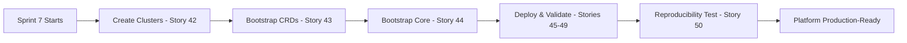

# 🚀 Platform Delivery Schedule — Greenfield Resequenced (Q4 2025 – Q1 2026)

> **Multi-cluster GitOps platform delivery roadmap**
> **Version**: 2.0 — Greenfield Architecture (Implementation-First)

---

## 📋 Assumptions

| Parameter | Value |
|-----------|-------|
| **Sprint Length** | 2 weeks |
| **Sprint 1 Start** | Monday, October 27, 2025 |
| **Change Freeze** | December 22, 2025 – January 2, 2026 |
| **Target Clusters** | `infra`, `apps` (+ optional `apps-dev`/`stg`/`prod`) |

---

## 🎯 Greenfield Sequencing Philosophy

**FINAL CORRECTED SEQUENCE** (v3.0 — October 26, 2025):

1. **Build ALL Manifests FIRST** (Stories 1-41) — Create `kubernetes/**` deployment manifests WITHOUT clusters
2. **Bootstrap & Deploy EVERYTHING** (Stories 42-44) — Create clusters, install CRDs and core components
3. **Validate By Platform Layer** (Stories 45-49) — Deploy and test all manifests by logical groups
4. **Prove Complete Reproducibility** (Story 50) — Destroy and recreate from scratch, final gate to production

**Why This Matters**:
- **Manifests first, clusters last** — Design complete system before building anything
- **No deployment during manifest creation** — Stories 1-41 use only local validation (kustomize, flux build, kubeconform)
- **Comprehensive integration testing** — Stories 42-50 deploy and validate everything works together
- **Guaranteed reproducibility** — Story 50 proves you can recreate the entire platform from git
- **True greenfield approach** — Complete blueprint before construction begins

---

## 🛤️ Parallelization Model

| Lane | Scope | Priority |
|------|-------|----------|
| **Infra** | `kubernetes/infrastructure` + shared platform workloads | Critical Path |
| **Apps** | `kubernetes/workloads` on apps cluster(s) | Secondary |
| **Cross-Platform** | Observability, CI/CD, Registry, Tenancy | Shared |

**Rule of Thumb**: Complete \"Critical Path\" first; run \"Parallel Options\" in the same sprint when prerequisites are explicitly met.

---

## 📊 Story Sequence Index (1–50) — FINAL v3.0

<strong>Click to expand complete story sequence</strong>

### 🌐 Phase 1: Networking Manifests (1-13)
1. `STORY-NET-CILIUM-CORE-GITOPS` — Create Cilium GitOps manifests
2. `STORY-NET-CILIUM-IPAM` — Create Cilium IPAM manifests
3. `STORY-NET-CILIUM-GATEWAY` — Create Cilium Gateway API manifests
4. `STORY-DNS-COREDNS-BASE` — Create CoreDNS manifests
5. `STORY-SEC-EXTERNAL-SECRETS-BASE` — Create External Secrets manifests
6. `STORY-SEC-CERT-MANAGER-ISSUERS` — Create cert-manager issuer manifests
7. `STORY-OPS-RELOADER-ALL-CLUSTERS` — Create Reloader manifests
8. `STORY-DNS-EXTERNALDNS-CF-BIND-TUNNEL` — Create ExternalDNS manifests
9. `STORY-NET-CILIUM-BGP` — Create Cilium BGP manifests
10. `STORY-NET-CILIUM-BGP-CP-IMPLEMENT` — Create BGP Control Plane manifests
11. `STORY-NET-SPEGEL-REGISTRY-MIRROR` — Create Spegel manifests
12. `STORY-NET-CILIUM-CLUSTERMESH` — Create ClusterMesh manifests
13. `STORY-NET-CLUSTERMESH-DNS` — Create ClusterMesh DNS manifests

### 💾 Phase 2: Storage Manifests (14-16)
14. `STORY-STO-OPENEBS-BASE` — Create OpenEBS manifests (infra)
15. `STORY-STO-ROOK-CEPH-OPERATOR` — Create Rook-Ceph operator manifests (infra)
16. `STORY-STO-ROOK-CEPH-CLUSTER` — Create Rook-Ceph cluster manifests (infra)

### 📈 Phase 3: Observability Manifests (17-22)
17. `STORY-OBS-VM-STACK` — Create Victoria Metrics stack manifests
18. `STORY-OBS-VICTORIA-LOGS` — Create Victoria Logs manifests
19. `STORY-OBS-FLUENT-BIT` — Create Fluent Bit manifests
20. `STORY-OBS-VM-STACK-IMPLEMENT` — Create VM implementation manifests
21. `STORY-OBS-VICTORIA-LOGS-IMPLEMENT` — Create Victoria Logs implementation manifests
22. `STORY-OBS-FLUENT-BIT-IMPLEMENT` — Create Fluent Bit implementation manifests

### 🗄️ Phase 4: Database Manifests (23-25)
23. `STORY-DB-CNPG-OPERATOR` — Create CloudNative-PG operator manifests
24. `STORY-DB-CNPG-SHARED-CLUSTER` — Create shared PostgreSQL cluster manifests
25. `STORY-DB-DRAGONFLY-OPERATOR-CLUSTER` — Create DragonflyDB manifests

### 🔒 Phase 5: Security & Identity Manifests (26-28)
26. `STORY-SEC-NP-BASELINE` — Create Network Policy manifests
27. `STORY-IDP-KEYCLOAK-OPERATOR` — Create Keycloak manifests
28. `STORY-SEC-SPIRE-CILIUM-AUTH` — Create SPIRE authentication manifests

### 💾 Phase 6: Apps Cluster Storage Manifests (29-31)
29. `STORY-STO-APPS-OPENEBS-BASE` — Create OpenEBS manifests (apps)
30. `STORY-STO-APPS-ROOK-CEPH-OPERATOR` — Create Rook-Ceph operator manifests (apps)
31. `STORY-STO-APPS-ROOK-CEPH-CLUSTER` — Create Rook-Ceph cluster manifests (apps)

### 🔄 Phase 7: CI/CD & Registry Manifests (32-34)
32. `STORY-CICD-GITHUB-ARC` — Create GitHub Actions Runner manifests
33. `STORY-CICD-GITLAB-APPS` — Create GitLab manifests
34. `STORY-APP-HARBOR` — Create Harbor manifests

### 🏢 Phase 8: Tenancy & Backup Manifests (35-36)
35. `STORY-TENANCY-BASELINE` — Create multi-tenancy manifests
36. `STORY-BACKUP-VOLSYNC-APPS` — Create Volsync backup manifests

### 📨 Phase 9: Messaging & Flux Manifests (37-41)
37. `STORY-MSG-STRIMZI-OPERATOR` — Create Strimzi operator manifests
38. `STORY-MSG-KAFKA-CLUSTER-APPS` — Create Kafka cluster manifests
39. `STORY-MSG-SCHEMA-REGISTRY` — Create Schema Registry manifests
40. `STORY-OBS-APPS-COLLECTORS` — Create apps observability collector manifests
41. `STORY-GITOPS-SELF-MGMT-FLUX` — Create Flux self-management manifests

### ✅ Phase 10: Bootstrap & Validation (42-50)
42. `STORY-BOOT-TALOS` — **Create Talos clusters** (infra + apps)
43. `STORY-BOOT-CRDS` — **Bootstrap CRDs** on both clusters
44. `STORY-BOOT-CORE` — **Bootstrap core components** (Cilium, Flux, cert-manager, External Secrets)
45. `STORY-VALIDATE-NETWORKING` — **Deploy & validate** all networking manifests (stories 1-13)
46. `STORY-VALIDATE-STORAGE-OBSERVABILITY` — **Deploy & validate** storage + observability (stories 14-22)
47. `STORY-VALIDATE-DATABASES-SECURITY` — **Deploy & validate** databases + security (stories 23-28)
48. `STORY-VALIDATE-APPS-CLUSTER` — **Deploy & validate** apps cluster workloads (stories 29-34)
49. `STORY-VALIDATE-MESSAGING-TENANCY` — **Deploy & validate** messaging + tenancy (stories 35-41)
50. `STORY-BOOT-AUTOMATION-ALIGN` — **Final reproducibility test** - destroy & recreate everything

> **Sequence Change Summary (v3.0 — FINAL)**:
> - **Stories 1-41**: Pure manifest creation (NO clusters, NO deployment)
> - **Stories 42-44**: Create clusters and bootstrap foundation
> - **Stories 45-49**: Deploy and validate manifests by platform layer
> - **Story 50**: Prove complete reproducibility (destroy/recreate test)
> - **Total stories: 50** (expanded from 45)

---

## 📅 Sprint Schedule

> **🎯 v3.0 Approach**: Sprints 1-6 create ALL manifests WITHOUT any clusters. Sprint 7 creates clusters, bootstraps, deploys, and validates EVERYTHING.

### 📝 Sprint 1 — Networking Manifests (Phase 1)
**Oct 27 – Nov 7, 2025** | 2 weeks

#### ⭐ Stories (Manifest Creation — NO Deployment)
1. `STORY-NET-CILIUM-CORE-GITOPS` — Create Cilium core GitOps manifests
2. `STORY-NET-CILIUM-IPAM` — Create Cilium IPAM manifests
3. `STORY-NET-CILIUM-GATEWAY` — Create Gateway API manifests
4. `STORY-DNS-COREDNS-BASE` — Create CoreDNS manifests
5. `STORY-SEC-EXTERNAL-SECRETS-BASE` — Create External Secrets manifests
6. `STORY-SEC-CERT-MANAGER-ISSUERS` — Create cert-manager manifests
7. `STORY-OPS-RELOADER-ALL-CLUSTERS` — Create Reloader manifests
8. `STORY-DNS-EXTERNALDNS-CF-BIND-TUNNEL` — Create ExternalDNS manifests

#### ✅ Validation (Local Tools Only)
- `flux build kustomization` for each component
- `kubeconform` for schema validation
- `kustomize build` for syntax checks
- Git commits with manifest files

#### 🔀 Parallel Work
- All 8 stories can be worked on in parallel by different team members
- No dependencies between stories (all create independent manifests)
- Focus: YAML quality, not runtime behavior

---

### 📝 Sprint 2 — Advanced Networking & Storage Manifests (Phases 1-2)
**Nov 10 – Nov 21, 2025** | 2 weeks

#### ⭐ Stories (Manifest Creation — NO Deployment)
9. `STORY-NET-CILIUM-BGP` — Create BGP manifests
10. `STORY-NET-CILIUM-BGP-CP-IMPLEMENT` — Create BGP Control Plane manifests
11. `STORY-NET-SPEGEL-REGISTRY-MIRROR` — Create Spegel manifests
12. `STORY-NET-CILIUM-CLUSTERMESH` — Create ClusterMesh manifests
13. `STORY-NET-CLUSTERMESH-DNS` — Create ClusterMesh DNS manifests
14. `STORY-STO-OPENEBS-BASE` — Create OpenEBS manifests
15. `STORY-STO-ROOK-CEPH-OPERATOR` — Create Rook-Ceph operator manifests
16. `STORY-STO-ROOK-CEPH-CLUSTER` — Create Rook-Ceph cluster manifests

#### ✅ Validation (Local Tools Only)
- `flux build kustomization` for each component
- `kubeconform` for schema validation
- Validate BGP configuration syntax
- Storage class definitions validated

#### 🔀 Parallel Work
- Networking stories (9-13) and Storage stories (14-16) are independent
- Can be worked on by separate teams simultaneously

---

### 📝 Sprint 3 — Observability Manifests (Phase 3)
**Nov 24 – Dec 5, 2025** | 2 weeks

#### ⭐ Stories (Manifest Creation — NO Deployment)
17. `STORY-OBS-VM-STACK` — Create Victoria Metrics Stack manifests
18. `STORY-OBS-VICTORIA-LOGS` — Create Victoria Logs manifests
19. `STORY-OBS-FLUENT-BIT` — Create Fluent Bit manifests
20. `STORY-OBS-VM-STACK-IMPLEMENT` — Create VM Stack implementation manifests
21. `STORY-OBS-VICTORIA-LOGS-IMPLEMENT` — Create VLogs implementation manifests
22. `STORY-OBS-FLUENT-BIT-IMPLEMENT` — Create Fluent Bit implementation manifests

#### ✅ Validation (Local Tools Only)
- `flux build kustomization` for each observability component
- Validate HelmRelease values with `helm template`
- Check PrometheusRule and ServiceMonitor syntax
- Validate Grafana dashboard JSON

#### 🔀 Parallel Work
- All observability stories can be developed concurrently
- Different team members can own different components

> ⚠️ **Note**: Nov 27 (Thanksgiving) — pace scope accordingly

---

### 📝 Sprint 4 — Database & Security Manifests (Phases 4-5)
**Dec 8 – Dec 19, 2025** | 2 weeks

#### ⭐ Stories (Manifest Creation — NO Deployment)

**Databases (Phase 4)**:
23. `STORY-DB-CNPG-OPERATOR` — Create CloudNative-PG operator manifests
24. `STORY-DB-CNPG-SHARED-CLUSTER` — Create shared PostgreSQL cluster manifests
25. `STORY-DB-DRAGONFLY-OPERATOR-CLUSTER` — Create DragonflyDB manifests

**Security & Identity (Phase 5)**:
26. `STORY-SEC-NP-BASELINE` — Create Network Policy manifests
27. `STORY-IDP-KEYCLOAK-OPERATOR` — Create Keycloak manifests
28. `STORY-SEC-SPIRE-CILIUM-AUTH` — Create SPIRE manifests

#### ✅ Validation (Local Tools Only)
- Validate CNPG Cluster and Pooler CRDs
- Check database connection strings and secret references
- Validate NetworkPolicy syntax with `kubectl --dry-run`
- Verify Keycloak HelmRelease values

#### 🔀 Parallel Work
- Database stories (23-25) and Security stories (26-28) independent
- Can work on both tracks simultaneously

---

### ❄️ Change Freeze
**Dec 22, 2025 – Jan 2, 2026**

> 🎄 **Holiday break** — No production changes during this period

---

### 📝 Sprint 5 — Apps Cluster & CI/CD Manifests (Phases 6-7)
**Jan 5 – Jan 16, 2026** | 2 weeks

#### ⭐ Stories (Manifest Creation — NO Deployment)

**Apps Cluster Storage (Phase 6)**:
29. `STORY-STO-APPS-OPENEBS-BASE` — Create OpenEBS manifests for apps cluster
30. `STORY-STO-APPS-ROOK-CEPH-OPERATOR` — Create Rook-Ceph operator manifests (apps)
31. `STORY-STO-APPS-ROOK-CEPH-CLUSTER` — Create Rook-Ceph cluster manifests (apps)

**CI/CD & Registry (Phase 7)**:
32. `STORY-CICD-GITHUB-ARC` — Create GitHub Actions Runner manifests
33. `STORY-CICD-GITLAB-APPS` — Create GitLab manifests
34. `STORY-APP-HARBOR` — Create Harbor manifests

#### ✅ Validation (Local Tools Only)
- Validate apps cluster storage classes
- Check GitLab HelmRelease values and database connections
- Verify Harbor S3 storage configuration
- Validate ARC runner scale set definitions

#### 🔀 Parallel Work
- Storage stories (29-31) and CI/CD stories (32-34) independent
- Can work on both tracks concurrently

---

### 📝 Sprint 6 — Tenancy, Backup, Messaging & Flux Manifests (Phases 8-9)
**Jan 19 – Feb 6, 2026** | 3 weeks

#### ⭐ Stories (Manifest Creation — NO Deployment)

**Tenancy & Backup (Phase 8)**:
35. `STORY-TENANCY-BASELINE` — Create multi-tenant namespace manifests
36. `STORY-BACKUP-VOLSYNC-APPS` — Create Volsync backup manifests

**Messaging & Final Components (Phase 9)**:
37. `STORY-MSG-STRIMZI-OPERATOR` — Create Strimzi operator manifests
38. `STORY-MSG-KAFKA-CLUSTER-APPS` — Create Kafka cluster manifests
39. `STORY-MSG-SCHEMA-REGISTRY` — Create Schema Registry manifests
40. `STORY-OBS-APPS-COLLECTORS` — Create apps observability collector manifests
41. `STORY-GITOPS-SELF-MGMT-FLUX` — Create Flux self-management manifests

#### ✅ Validation (Local Tools Only)
- Validate Kafka cluster configuration and topic definitions
- Check Volsync ReplicationSource/Destination specs
- Verify namespace templates and RBAC roles
- Validate Flux self-managing HelmRelease

#### 🔀 Parallel Work
- All manifest stories independent and can be worked concurrently
- Tenancy (35-36), Messaging (37-39), and Observability (40-41) are separate tracks

#### 📨 Manifest Considerations
- **Kafka Configuration**: Broker count, storage class selection, retention policies
- **Schema Registry**: Compatibility modes, storage backend
- **Volsync**: S3 bucket configuration, backup schedules
- **Tenancy**: ResourceQuota, LimitRange, NetworkPolicy templates
- **Flux**: Self-update strategy, image automation policies

---

### 🚀 Sprint 7 — BOOTSTRAP, DEPLOY & VALIDATE EVERYTHING (Phase 10)
**Feb 9 – Feb 27, 2026** | 3 weeks

> **🎯 THE BIG SPRINT**: This is where we create clusters, bootstrap, deploy ALL manifests (stories 1-41), and validate everything works!

#### ⭐ Critical Path (MUST be Sequential)

**Week 1: Bootstrap Foundation (Stories 42-44)**
42. `STORY-BOOT-TALOS` — **CREATE** Talos clusters (infra + apps)
43. `STORY-BOOT-CRDS` — **BOOTSTRAP** CRDs on both clusters
44. `STORY-BOOT-CORE` — **BOOTSTRAP** core components (Cilium, Flux, cert-manager, External Secrets)

**Week 2: Deploy & Validate Platform Layers (Stories 45-48)**
45. `STORY-VALIDATE-NETWORKING` — **DEPLOY & VALIDATE** networking stack (stories 1-13)
    - Cilium, BGP, ClusterMesh, DNS, cert-manager, External Secrets, Spegel
46. `STORY-VALIDATE-STORAGE-OBSERVABILITY` — **DEPLOY & VALIDATE** storage + observability (stories 14-22)
    - OpenEBS, Rook-Ceph, Victoria Metrics, Victoria Logs, Fluent Bit
47. `STORY-VALIDATE-DATABASES-SECURITY` — **DEPLOY & VALIDATE** databases + security (stories 23-28)
    - CloudNative-PG, DragonflyDB, Network Policies, Keycloak, SPIRE
48. `STORY-VALIDATE-APPS-CLUSTER` — **DEPLOY & VALIDATE** apps cluster workloads (stories 29-34)
    - Apps storage, GitHub ARC, GitLab, Harbor

**Week 3: Final Validation (Stories 49-50)**
49. `STORY-VALIDATE-MESSAGING-TENANCY` — **DEPLOY & VALIDATE** messaging + tenancy (stories 35-41)
    - Kafka, Schema Registry, Volsync, Tenancy, Flux self-management
50. `STORY-BOOT-AUTOMATION-ALIGN` — **FINAL TEST**: Destroy everything, recreate from scratch, prove reproducibility

#### ✅ Success Criteria
- Both clusters (infra + apps) operational
- All platform components deployed and healthy
- Cross-cluster connectivity (ClusterMesh) functional
- Database replication and backups working
- CI/CD pipelines executing
- Messaging infrastructure operational
- **Final reproducibility test passes** (destroy/recreate succeeds)

#### 🚨 Risk Mitigation
- Daily standups to catch blockers early
- Dedicated troubleshooting time allocated
- Rollback plan for each validation story
- Senior engineer on-call for critical issues
- Documentation of all issues and resolutions

#### 📊 Metrics to Track
- Component deployment success rate
- Time to resolution for blockers
- Test coverage percentage
- Performance baselines captured
- Number of manual interventions required

---

## 🔀 Concurrency Notes (v3.0 — Manifests-First)

### Sprints 1-6: Manifest Creation (Maximum Parallelism)

| Sprint | Concurrency Opportunities |
|--------|---------------------------|
| **Sprint 1 (1-8)** | All 8 networking manifest stories can be worked on in parallel — no dependencies |
| **Sprint 2 (9-16)** | Advanced networking (9-13) and storage (14-16) are independent — full parallelism |
| **Sprint 3 (17-22)** | All 6 observability manifest stories can be developed concurrently |
| **Sprint 4 (23-28)** | Database stories (23-25) and security stories (26-28) are independent tracks |
| **Sprint 5 (29-34)** | Apps storage (29-31) and CI/CD (32-34) can be worked on by separate teams |
| **Sprint 6 (35-41)** | Tenancy (35-36), messaging (37-39), and observability/Flux (40-41) are all independent |

**Key Insight**: Without clusters, there are NO runtime dependencies. Teams can work on manifests in parallel across all platform layers.

### Sprint 7: Bootstrap & Validation (MUST be Sequential)

| Phase | Sequence Requirement |
|-------|----------------------|
| **Bootstrap (42-44)** | SEQUENTIAL — Talos → CRDs → Core (cannot parallelize) |
| **Validation (45-49)** | MOSTLY SEQUENTIAL — Each validation builds on previous layer's functionality |
| **Reproducibility (50)** | FINAL — Runs after all validation passes |

**Exception**: Some validation stories could run in parallel if teams coordinate (e.g., story 45 on infra cluster while story 48 on apps cluster)

---

## ✅ Go/No-Go Gates (v3.0)

| Sprint | Success Criteria |
|--------|------------------|
| **Sprint 1** | ✓ All networking manifests created (stories 1-8) ✓ Manifests pass `flux build kustomization` ✓ Manifests pass `kubeconform` validation ✓ Code reviewed and committed to git |
| **Sprint 2** | ✓ Advanced networking + storage manifests created (stories 9-16) ✓ BGP configuration validated ✓ Storage class definitions correct ✓ All manifests in git |
| **Sprint 3** | ✓ All observability manifests created (stories 17-22) ✓ HelmRelease values validated with `helm template` ✓ PrometheusRule and ServiceMonitor syntax correct ✓ Grafana dashboards JSON validated |
| **Sprint 4** | ✓ Database + security manifests created (stories 23-28) ✓ CNPG Cluster and Pooler specs validated ✓ NetworkPolicy syntax checked ✓ Keycloak HelmRelease values correct |
| **Sprint 5** | ✓ Apps cluster + CI/CD manifests created (stories 29-34) ✓ GitLab database connection configs validated ✓ Harbor S3 storage configuration correct ✓ ARC runner definitions validated |
| **Sprint 6** | ✓ All remaining manifests created (stories 35-41) ✓ Kafka cluster configuration validated ✓ Volsync backup specs correct ✓ Flux self-management HelmRelease ready ✓ **ALL 41 MANIFEST STORIES COMPLETE** ✅ |
| **Sprint 7 Week 1** | ✓ Both clusters created and bootstrapped ✓ CRDs installed on both clusters ✓ Core components operational (Cilium, Flux, cert-manager, External Secrets) |
| **Sprint 7 Week 2** | ✓ Networking, storage, observability, databases, security deployed and validated ✓ Apps cluster operational with GitLab and Harbor ✓ Cross-cluster connectivity working |
| **Sprint 7 Week 3** | ✓ Messaging infrastructure operational ✓ **Final reproducibility test passes** (destroy/recreate succeeds) ✓ **Platform ready for production workloads** ✅ |

---

## 🔄 Change Management (v3.0)

### GitOps Principles

- ✅ **All manifests** created via Git PRs (stories 1-41)
- 🏷️ **Story IDs** must be used in PR titles and commit messages for traceability
  - Example: `STORY-NET-CILIUM-GATEWAY: create Gateway API manifests`
- 🚫 **NO deployment** during manifest creation (sprints 1-6)
- ✅ **Validation** using local tools only (`flux build`, `kubeconform`, `helm template`)

### Workflow (Sprints 1-6: Manifest Creation)

### Workflow (Sprint 7: Bootstrap & Validation)

**Key Philosophy (v3.0 — FINAL)**:
- **Sprints 1-6**: Create ALL manifests (stories 1-41) WITHOUT any clusters
- **Sprint 7**: Create clusters, bootstrap, deploy, and validate EVERYTHING
- **Final Test**: Story 50 destroys and recreates to prove reproducibility
- This is "manifests-first, bootstrap-last, TRUE greenfield" ✅

---

## 🎯 Critical Success Factors (v3.0)

### Schedule Philosophy Change (October 26, 2025 — v3.0 FINAL)

**Major Architecture Shift**:
- ✅ **v3.0 "Manifests-First" Approach**: Complete reversal from v2.1 "bootstrap-first"
  - **OLD (v2.1)**: Bootstrap clusters first, then create/transition manifests
  - **NEW (v3.0)**: Create ALL manifests first, THEN bootstrap and deploy everything
  - **Rationale**: True greenfield approach — design complete system before building anything

**New Story Structure**:
- ✅ **Stories 1-41**: Pure manifest creation (NO clusters, NO deployment)
- ✅ **Stories 42-44**: Create clusters and bootstrap foundation
- ✅ **Stories 45-49**: Deploy and validate manifests by platform layer (NEW validation stories)
- ✅ **Story 50**: Final reproducibility test (destroy/recreate from scratch)
- **Total Stories**: Expanded from 45 to **50 stories**

**Benefits of v3.0 Approach**:
- ⚡ **Maximum Parallelism (Sprints 1-6)**: Teams can work on manifests concurrently without cluster dependencies
- 🔍 **Early Validation**: Catch errors with local tools before infrastructure costs
- 🎯 **Single Integration Event**: Sprint 7 deploys and validates everything at once
- 📊 **Guaranteed Reproducibility**: Story 50 proves platform can be recreated from git
- 💰 **Cost Savings**: No cluster costs during manifest creation (6 sprints)

**Timeline Impact**:
- **Manifest Creation (Sprints 1-6)**: Oct 27, 2025 – Feb 6, 2026 (15 weeks)
- **Bootstrap & Validation (Sprint 7)**: Feb 9 – Feb 27, 2026 (3 weeks)
- **Total Duration**: 18 weeks (vs. original 17 weeks in v2.1)
- **Final Completion**: **Feb 27, 2026** (extended by 1 week for comprehensive validation)

### Sprint 7 is the Gate to Production

**Why This Matters**:
1. **Manifests First (Sprints 1-6)**: Complete platform design in YAML before building anything
2. **Bootstrap & Deploy (Sprint 7 Week 1-2)**: Create clusters and deploy all 41 manifest stories
3. **Validation (Sprint 7 Week 2-3)**: Comprehensive integration testing across all platform layers
4. **Reproducibility Test (Sprint 7 Week 3)**: Story 50 proves entire platform can be destroyed and recreated from git
5. This validates both **initial deployment** AND **disaster recovery** capability

### Acceptance Criteria for Sprint 7 (Story 50 — Final Reproducibility Test)

**Phase 1: Initial Deployment**
- [ ] All manifests (stories 1-41) committed to git and validated locally
- [ ] Both clusters created and bootstrapped (stories 42-44)
- [ ] All validation stories pass (stories 45-49)

**Phase 2: Reproducibility Test**
- [ ] Destroy both clusters completely (infra + apps)
- [ ] Recreate infra cluster from scratch: `task cluster:create-infra`
- [ ] Recreate apps cluster from scratch: `task cluster:create-apps`
- [ ] All Flux Kustomizations reconcile to Ready state on both clusters
- [ ] All health checks pass: `task cluster:health CLUSTER=infra` and `CLUSTER=apps`
- [ ] Cross-cluster connectivity (ClusterMesh) re-established automatically
- [ ] Databases restored and operational
- [ ] CI/CD pipelines functional (GitLab + Harbor)
- [ ] Messaging infrastructure operational (Kafka)

**Phase 3: Production Readiness**
- [ ] Idempotency validated (re-run bootstrap safely without errors)
- [ ] Disaster recovery runbook tested and documented
- [ ] Performance baselines captured and documented
- [ ] All critical issues resolved
- [ ] Platform declared production-ready ✅

---

**Generated**: October 2025 (Resequenced v3.0 — FINAL)
**Maintained By**: Platform Engineering Team
**Last Updated**: October 26, 2025

**Version**: 3.0 — Greenfield Architecture (Manifests-First, Bootstrap-Last, TRUE Greenfield)

