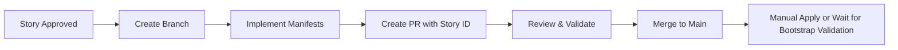

# 🚀 Platform Delivery Schedule — Greenfield Resequenced (Q4 2025 – Q1 2026)

> **Multi-cluster GitOps platform delivery roadmap**
> **Version**: 2.0 — Greenfield Architecture (Implementation-First)

---

## 📋 Assumptions

| Parameter | Value |
|-----------|-------|
| **Sprint Length** | 2 weeks |
| **Sprint 1 Start** | Monday, October 27, 2025 |
| **Change Freeze** | December 22, 2025 – January 2, 2026 |
| **Target Clusters** | `infra`, `apps` (+ optional `apps-dev`/`stg`/`prod`) |

---

## 🎯 Greenfield Sequencing Philosophy

**CRITICAL**: This is a **greenfield project**. The correct sequence is:

1. **Bare Infrastructure** (STORY-BOOT-TALOS) — Get a bare cluster
2. **Build All Manifests** (Implementation Stories) — Create `kubernetes/**` deployment manifests
3. **Validate Bootstrap** (Bootstrap Stories) — Test automated deployment of completed manifests

**Why This Matters**:
- You cannot bootstrap GitOps to reconcile manifests that don't exist yet
- Implementation stories **create the manifests** that bootstrap will later deploy
- Bootstrap stories become the **final validation** before production

---

## 🛤️ Parallelization Model

| Lane | Scope | Priority |
|------|-------|----------|
| **Infra** | `kubernetes/infrastructure` + shared platform workloads | Critical Path |
| **Apps** | `kubernetes/workloads` on apps cluster(s) | Secondary |
| **Cross-Platform** | Observability, CI/CD, Registry, Tenancy | Shared |

**Rule of Thumb**: Complete \"Critical Path\" first; run \"Parallel Options\" in the same sprint when prerequisites are explicitly met.

---

## 📊 Story Sequence Index (1–41) — RESEQUENCED

<strong>Click to expand complete story sequence</strong>

### 🥾 Phase 1: Bare Infrastructure (1)
1. `STORY-BOOT-TALOS` — Talos Linux base (bare cluster, etcd, kubeconfig)

### 🌐 Phase 2A: Networking Foundation (2-9)
2. `STORY-NET-CILIUM-CORE-GITOPS` — Cilium core networking manifests
3. `STORY-NET-CILIUM-IPAM` — Cilium IP address management
4. `STORY-NET-CILIUM-GATEWAY` — Cilium Gateway API
5. `STORY-DNS-COREDNS-BASE` — CoreDNS base configuration
6. `STORY-SEC-CERT-MANAGER-ISSUERS` — Certificate Manager & issuers
7. `STORY-SEC-EXTERNAL-SECRETS-BASE` — External Secrets Operator
8. `STORY-OPS-RELOADER-ALL-CLUSTERS` — Reloader for config/secret updates
9. `STORY-DNS-EXTERNALDNS-CF-BIND-TUNNEL` — ExternalDNS with Cloudflare & Tunnel

### 💾 Phase 2B: Storage Foundation (10-12)
10. `STORY-STO-OPENEBS-BASE` — OpenEBS local storage (infra)
11. `STORY-STO-ROOK-CEPH-OPERATOR` — Rook-Ceph operator (infra)
12. `STORY-STO-ROOK-CEPH-CLUSTER` — Rook-Ceph cluster deployment (infra)

### 📈 Phase 2C: Observability Stack (13-18)
13. `STORY-OBS-VM-STACK` — Victoria Metrics stack (design)
14. `STORY-OBS-VICTORIA-LOGS` — Victoria Logs (design)
15. `STORY-OBS-FLUENT-BIT` — Fluent Bit (design)
16. `STORY-OBS-VM-STACK-IMPLEMENT` — Victoria Metrics implementation
17. `STORY-OBS-VICTORIA-LOGS-IMPLEMENT` — Victoria Logs implementation
18. `STORY-OBS-FLUENT-BIT-IMPLEMENT` — Fluent Bit implementation

### 🔀 Phase 2D: Advanced Networking (19-21)
19. `STORY-NET-CILIUM-BGP` — Cilium BGP (design)
20. `STORY-NET-CILIUM-BGP-CP-IMPLEMENT` — BGP Control Plane implementation
21. `STORY-NET-SPEGEL-REGISTRY-MIRROR` — Spegel registry mirror

### 🗄️ Phase 2E: Database Platforms (22-24)
22. `STORY-DB-CNPG-OPERATOR` — CloudNative-PG operator
23. `STORY-DB-CNPG-SHARED-CLUSTER` — Shared PostgreSQL cluster
24. `STORY-DB-DRAGONFLY-OPERATOR-CLUSTER` — DragonflyDB operator & cluster

### 🔒 Phase 2F: Advanced Security & Identity (25-26)
25. `STORY-SEC-NP-BASELINE` — Network Policy baseline
26. `STORY-IDP-KEYCLOAK-OPERATOR` — Keycloak identity provider

### 🕸️ Phase 2G: Cluster Mesh (27-29)
27. `STORY-NET-CILIUM-CLUSTERMESH` — Cilium ClusterMesh
28. `STORY-NET-CLUSTERMESH-DNS` — ClusterMesh DNS
29. `STORY-SEC-SPIRE-CILIUM-AUTH` — SPIRE + Cilium authentication (for ClusterMesh mTLS)

### 💾 Phase 2H: Apps Cluster Storage (30-32)
30. `STORY-STO-APPS-OPENEBS-BASE` — OpenEBS for apps cluster
31. `STORY-STO-APPS-ROOK-CEPH-OPERATOR` — Rook-Ceph operator (apps)
32. `STORY-STO-APPS-ROOK-CEPH-CLUSTER` — Rook-Ceph cluster (apps)

### 🔄 Phase 2J: CI/CD & Registry (33-35)
33. `STORY-CICD-GITHUB-ARC` — GitHub Actions Runner Controller
34. `STORY-CICD-GITLAB-APPS` — GitLab on apps cluster
35. `STORY-APP-HARBOR` — Harbor container registry

### 🏢 Phase 2K: Tenancy & Backup (36-37)
36. `STORY-TENANCY-BASELINE` — Multi-tenant namespace baseline
37. `STORY-BACKUP-VOLSYNC-APPS` — Volsync backup for apps

### ✅ Phase 3: Bootstrap Validation (38-41)
38. `STORY-BOOT-CRDS` — Validate CRD bootstrap automation
39. `STORY-GITOPS-SELF-MGMT-FLUX` — Validate Flux self-management
40. `STORY-BOOT-CORE` — Validate core bootstrap (Cilium, Flux, External Secrets, cert-manager)
41. `STORY-BOOT-AUTOMATION-ALIGN` — Validate end-to-end bootstrap automation

---

## 📅 Sprint Schedule

### 🥾 Sprint 1 — Bare Cluster + Networking Core
**Oct 27 – Nov 7, 2025** | 2 weeks

#### ⭐ Critical Path
1. `STORY-BOOT-TALOS` — Talos Linux base (bare cluster)
2. `STORY-NET-CILIUM-CORE-GITOPS` — Cilium core networking manifests
3. `STORY-NET-CILIUM-IPAM` — Cilium IP address management
4. `STORY-NET-CILIUM-GATEWAY` — Cilium Gateway API
5. `STORY-DNS-COREDNS-BASE` — CoreDNS base configuration

#### 🔀 Parallel Options (when ready)
- Draft cert-manager issuers configuration
- Prep External Secrets values and 1Password paths

---

### 🌐 Sprint 2 — Security, DNS & External Secrets
**Nov 10 – Nov 21, 2025** | 2 weeks

#### ⭐ Critical Path
6. `STORY-SEC-CERT-MANAGER-ISSUERS` — Certificate Manager & issuers
7. `STORY-SEC-EXTERNAL-SECRETS-BASE` — External Secrets Operator
8. `STORY-OPS-RELOADER-ALL-CLUSTERS` — Reloader for config/secret updates
9. `STORY-DNS-EXTERNALDNS-CF-BIND-TUNNEL` — ExternalDNS with Cloudflare

#### 🔀 Parallel Options
- Prep storage values for OpenEBS and Rook-Ceph
- Draft observability architecture

---

### 💾 Sprint 3 — Storage (Infra) & Observability Design
**Nov 24 – Dec 5, 2025** | 2 weeks

#### ⭐ Critical Path
10. `STORY-STO-OPENEBS-BASE` — OpenEBS local storage (infra)
11. `STORY-STO-ROOK-CEPH-OPERATOR` — Rook-Ceph operator (infra)
12. `STORY-STO-ROOK-CEPH-CLUSTER` — Rook-Ceph cluster (infra)
13. `STORY-OBS-VM-STACK` — Victoria Metrics stack (design)
14. `STORY-OBS-VICTORIA-LOGS` — Victoria Logs (design)
15. `STORY-OBS-FLUENT-BIT` — Fluent Bit (design)

#### 🔀 Parallel Options
- Prep observability implementation manifests
- Draft BGP design

> ⚠️ **Note**: Nov 27 (Thanksgiving) — pace scope accordingly

---

### 📈 Sprint 4 — Observability Implementation & Advanced Networking
**Dec 8 – Dec 19, 2025** | 2 weeks

#### ⭐ Critical Path
16. `STORY-OBS-VM-STACK-IMPLEMENT` — Victoria Metrics implementation
17. `STORY-OBS-VICTORIA-LOGS-IMPLEMENT` — Victoria Logs implementation
18. `STORY-OBS-FLUENT-BIT-IMPLEMENT` — Fluent Bit implementation
19. `STORY-NET-CILIUM-BGP` — Cilium BGP (design)
20. `STORY-NET-CILIUM-BGP-CP-IMPLEMENT` — BGP Control Plane implementation
21. `STORY-NET-SPEGEL-REGISTRY-MIRROR` — Spegel registry mirror

#### 🔀 Parallel Options
- Prep CNPG operator values and secrets paths
- Draft Keycloak operator requirements

---

### ❄️ Change Freeze
**Dec 22, 2025 – Jan 2, 2026**

> 🎄 **Holiday break** — No production changes during this period

---

### 🗄️ Sprint 5 — Databases, Security, IDP
**Jan 5 – Jan 16, 2026** | 2 weeks

#### ⭐ Critical Path
22. `STORY-DB-CNPG-OPERATOR` — CloudNative-PG operator
23. `STORY-DB-CNPG-SHARED-CLUSTER` — Shared PostgreSQL cluster
24. `STORY-DB-DRAGONFLY-OPERATOR-CLUSTER` — DragonflyDB operator & cluster
25. `STORY-SEC-NP-BASELINE` — Network Policy baseline
26. `STORY-IDP-KEYCLOAK-OPERATOR` — Keycloak identity provider

#### 🔀 Parallel Options
- Draft ClusterMesh topology docs
- Prep apps cluster storage manifests

---

### 🕸️ Sprint 6 — ClusterMesh, SPIRE, Apps Storage, CI/CD
**Jan 19 – Jan 30, 2026** | 2 weeks

#### ⭐ Critical Path
27. `STORY-NET-CILIUM-CLUSTERMESH` — Cilium ClusterMesh
28. `STORY-NET-CLUSTERMESH-DNS` — ClusterMesh DNS
29. `STORY-SEC-SPIRE-CILIUM-AUTH` — SPIRE + Cilium authentication (for ClusterMesh mTLS)
30. `STORY-STO-APPS-OPENEBS-BASE` — OpenEBS for apps cluster
31. `STORY-STO-APPS-ROOK-CEPH-OPERATOR` — Rook-Ceph operator (apps)
32. `STORY-STO-APPS-ROOK-CEPH-CLUSTER` — Rook-Ceph cluster (apps)
33. `STORY-CICD-GITHUB-ARC` — GitHub Actions Runner Controller

#### 🔀 Parallel Options
- Prep GitLab manifests and secrets
- Draft Harbor values and storage requirements

---

### 🔄 Sprint 7 — CI/CD (part 2), Tenancy, Backup & Bootstrap Validation
**Feb 2 – Feb 13, 2026** | 2 weeks

#### ⭐ Critical Path
34. `STORY-CICD-GITLAB-APPS` — GitLab on apps cluster
35. `STORY-APP-HARBOR` — Harbor container registry
36. `STORY-TENANCY-BASELINE` — Multi-tenant namespace baseline
37. `STORY-BACKUP-VOLSYNC-APPS` — Volsync backup for apps

#### ✅ Bootstrap Validation (Final Acceptance)
38. `STORY-BOOT-CRDS` — Validate CRD bootstrap automation
39. `STORY-GITOPS-SELF-MGMT-FLUX` — Validate Flux self-management
40. `STORY-BOOT-CORE` — Validate core bootstrap
41. `STORY-BOOT-AUTOMATION-ALIGN` — Validate end-to-end bootstrap

#### 🔀 Parallel Options
- App team onboarding
- Backup DR drill rehearsal plan

---

## 🔀 Concurrency Notes (Safe Parallels)

| Scenario | Details |
|----------|---------|
| **Networking Foundation** | Stories 2-5 can run in parallel after TALOS (1) completes |
| **Security Stack** | Stories 6-8 benefit from networking but can overlap design work |
| **Storage + Obs Design** | Stories 10-15 can overlap; prefer storage Ready before obs persistence |
| **BGP Design** | Story 19 can overlap with obs implementation (16-18); avoid prod BGP until observability Ready |
| **DB Operator Prep** | Story 22 prep can overlap with Sprint 4; apply when storage+certs stable |
| **Apps Storage** | Stories 30-32 can run parallel with infra work if apps cluster ready |

---

## ✅ Go/No-Go Gates

| Sprint | Success Criteria |
|--------|------------------|
| **Sprint 1** | ✓ Bare cluster operational ✓ Cilium manifests created and validated ✓ Gateway API manifests ready |
| **Sprint 2** | ✓ TLS certificates working ✓ External Secrets syncing from 1Password ✓ External/internal DNS resolving |
| **Sprint 3** | ✓ Persistent storage operational ✓ Observability architecture approved |
| **Sprint 4** | ✓ Metrics/logs/alerts collecting ✓ BGP implementation stable |
| **Sprint 5** | ✓ Database platforms operational ✓ Network policies enforced ✓ Keycloak deployed |
| **Sprint 6** | ✓ ClusterMesh functional ✓ Apps storage ready ✓ GitHub ARC connected |
| **Sprint 7** | ✓ GitLab + Harbor operational ✓ Tenancy + backups in place ✓ **Bootstrap automation validates ALL manifests** ✅ |

---

## 🔄 Change Management

### GitOps Principles

- ✅ **All implementations** occur via GitOps PRs with environment-scoped Kustomizations
- 🏷️ **Story IDs** must be used in PR titles and commit messages for traceability
  - Example: `STORY-NET-CILIUM-GATEWAY: implement Gateway API routes`
- 🚫 **Do not wire** draft manifests into cluster Kustomizations until the owning story is approved

### Workflow

**Key Difference from Original Schedule**:
- Manifests are **created and validated** during Sprints 1-6
- Bootstrap automation **tested against completed manifests** in Sprint 7
- Production deployment uses validated bootstrap process

---

## 🎯 Critical Success Factors

### Sprint 7 Bootstrap Validation is the Gate to Production

**Why This Matters**:
1. All manifests (stories 2-37) are completed and committed to git
2. Bootstrap stories (38-41) validate that `task cluster:create-infra` can rebuild the cluster from scratch
3. If bootstrap fails, we have **time to fix** before production cutover
4. Bootstrap becomes the **disaster recovery validation**

### Acceptance Criteria for Sprint 7

- [ ] `task cluster:create-infra` completes successfully (all phases)
- [ ] `task cluster:create-apps` completes successfully (all phases)
- [ ] All Flux Kustomizations reconcile to Ready state
- [ ] All health checks pass (`task cluster:health CLUSTER=infra`)
- [ ] Idempotency validated (re-run bootstrap safely)
- [ ] Disaster recovery runbook tested

---

**Generated**: October 2025 (Resequenced)
**Maintained By**: Platform Engineering Team
**Last Updated**: October 22, 2025

**Version**: 2.0 — Greenfield Architecture (Implementation-First)

