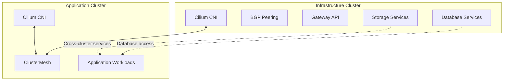
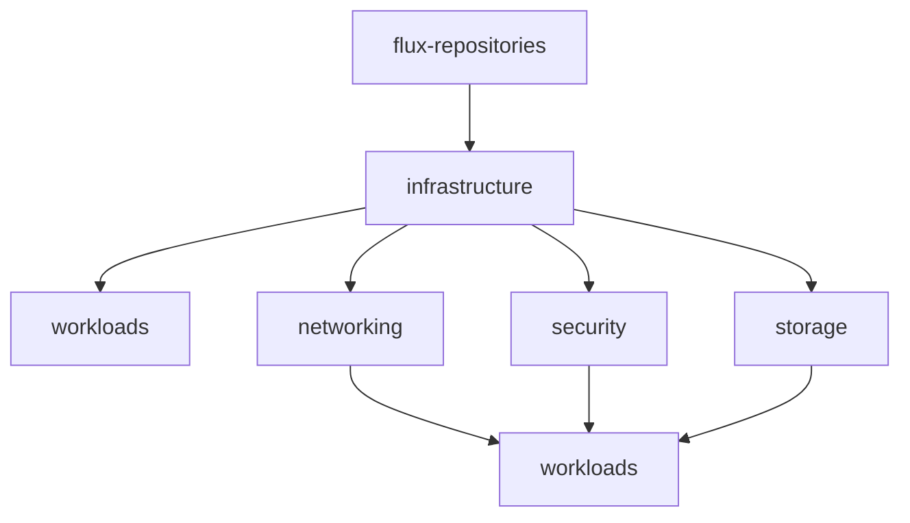
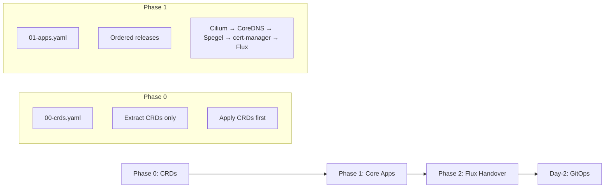
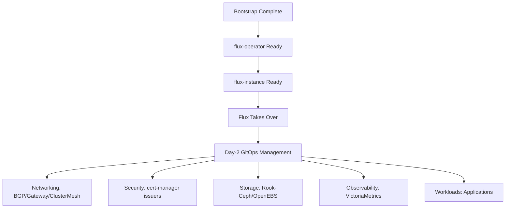
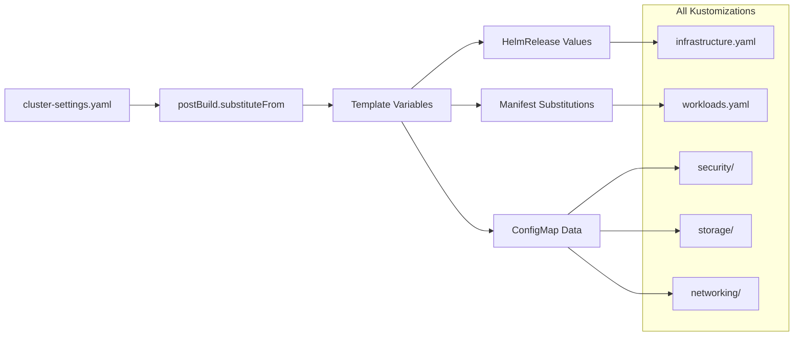
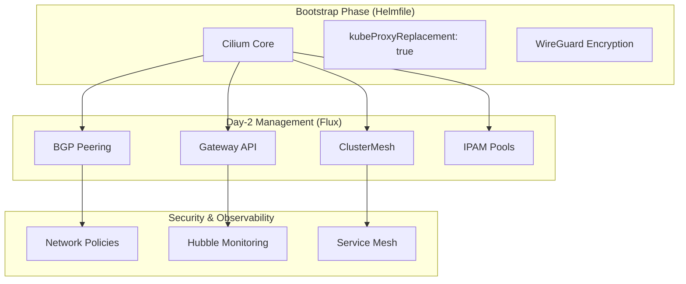
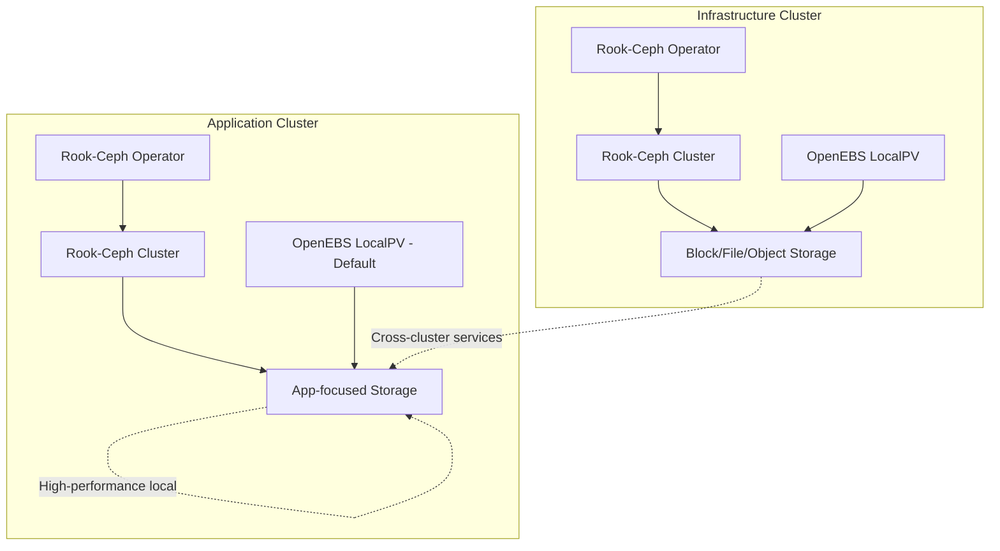
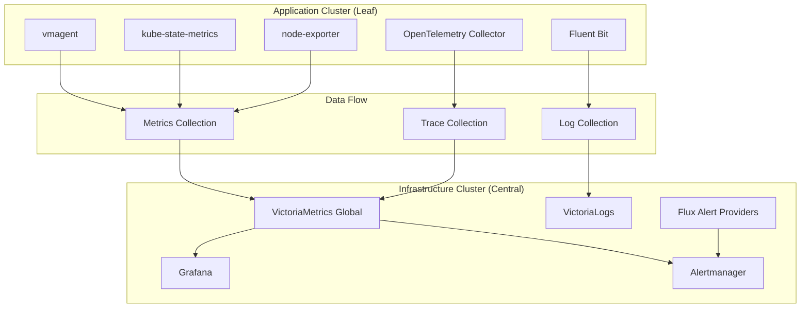
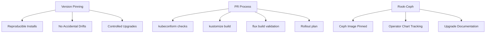
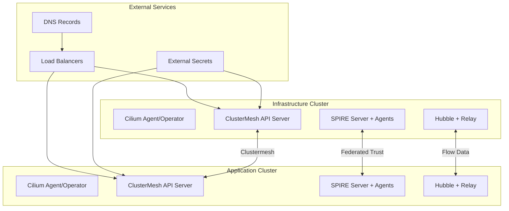

# 🏗️ Multi-Cluster GitOps Architecture (v4)

<div align="center">


**Modern cloud-native platform built on Talos Linux • GitOps-powered • Multi-cluster**

</div>

---

## 📋 Table of Contents

1. [📖 Context & Goals](#1-context--goals)
2. [🎯 Design Principles](#2-design-principles)
3. [🌐 Target Topology](#3-target-topology)
4. [📁 Repository Layout](#4-repository-layout)
5. [⚙️ Flux Model & Convergence](#5-flux-model--convergence)
6. [🚀 Bootstrap Architecture](#6-bootstrap-architecture)
7. [🔧 Cluster Settings & Substitution](#7-cluster-settings--substitution)
8. [🔐 Secrets Management](#8-secrets-management)
9. [🌐 Networking (Cilium)](#9-networking-cilium)
10. [💾 Storage](#10-storage)
11. [📊 Observability](#11-observability)
12. [🔄 CI/CD & Policy](#12-cicd--policy)
13. [🏢 Multi-Tenancy](#13-multi-tenancy)
14. [🔧 Operations & Runbooks](#14-operations--runbooks)
15. [📅 Phased Implementation](#15-phased-implementation)
16. [📝 Decisions & Rationale](#16-decisions--rationale)
17. [⚠️ Risks & Mitigations](#17-risks--mitigations)
18. [✅ Acceptance Criteria](#18-acceptance-criteria--metrics)
19. [🛠️ Workloads & Versions](#19-workloads--versions)
20. [🔗 Cilium ClusterMesh + SPIRE](#20-cilium-clustermesh--spire)
21. [🛡️ Security & Network Policy](#21-security--network-policy-baseline)
22. [🔄 Multi-Cluster Mesh Options](#22-multi-cluster-mesh-options---decision-matrix)

---

## 1. 📖 Context & Goals

> **🏛️ Overview**
>
> We run two Talos-based Kubernetes clusters – an infrastructure cluster ("infra") and an application cluster ("apps"). We manage the platform via GitOps using Flux, Helm, and Kustomize. This document defines the target multi-cluster architecture, repository structure, bootstrap approach, security posture, and phased rollout plan.

### 🎯 Objectives

| ✅ Primary Goals | ❌ Non-Goals |
| :--- | :--- |
| ⚡ **Repeatable, fast cluster bring-up** with minimal manual steps | 🔧 Managing Talos OS lifecycle (covered by Talos docs/scripts) |
| 🔄 **Clear separation of concerns** between infrastructure and workloads | 📚 Full application SRE runbooks (app teams own those) |
| ⚙️ **Deterministic ordering** using Flux `Kustomization.dependsOn`, health checks, and timeouts | |
| 🔐 **Zero plaintext secrets** via External Secrets (1Password Connect) | |
| 📈 **Scalable to additional environments** (apps-dev, apps-stg, apps-prod) and optional multi-tenancy | |

## 2. 🎯 Design Principles

> **🏛️ Core Philosophy**
>
> Our architecture follows GitOps best practices with security and reliability at the forefront.

| Principle | Description | Impact |
| :--- | :--- | :--- |
| 🔄 **Git as Single Source of Truth** | Controllers converge the desired state from Git repository | Eliminates configuration drift |
| 🏗️ **Hierarchical Flux Structure** | One entry Kustomization per cluster, fanning into ordered Kustomizations with `dependsOn` | Ensures deterministic deployment order |
| 🔒 **Hermetic Builds** | Avoid remote bases; prefer local Git/OCI sources. No cross-namespace references for multi-tenant areas | Improves security and reproducibility |
| ✅ **Complete Kustomization Settings** | All `Kustomization` have `prune: true`, `wait: true`, `timeout`, `healthChecks`/`healthCheckExprs` | Ensures reliable deployments |
| 🔐 **Secure Secrets Management** | External Secrets with 1Password Connect for all secrets (bootstrap and runtime) | Zero plaintext secrets in Git |
| 🚀 **Minimal Bootstrap** | Bootstrap installs only what is required to let Flux take over; day-2 config lives in Git managed by Flux | Fast, reliable cluster bring-up |

---

## 3. 🌐 Target Topology

> **🏗️ Multi-Cluster Architecture**
>
> Our platform consists of two specialized clusters designed for optimal performance and separation of concerns.

### 🏭 Cluster Overview

| Cluster | Purpose | Key Components | Network Features |
| :--- | :--- | :--- | :--- |
| **🏭 infra** | Platform services & storage | 🗄️ Rook-Ceph • 🐘 CloudNativePG • 📊 VictoriaMetrics/Logs • 🔐 Security • 📦 Registry | Core Cilium + BGP + Gateway API |
| **🎯 apps** | Application workloads | ⚡ User applications • 🚀 CI/CD runners • 📬 Messaging systems | Core Cilium + ClusterMesh connectivity |

### 🌐 Network Architecture



**Key Network Features:**
- 🌐 **Cilium as CNI** - Core installed via Helmfile during bootstrap
- 🔄 **Day‑2 Features** - BGP, Gateway API, ClusterMesh secrets, IPAM pools managed by Flux
- 🔗 **ClusterMesh** - Secure cross-cluster connectivity for service discovery

### 💾 Storage Architecture

| Cluster | Storage Solution | Use Case | Performance |
| :--- | :--- | :--- | :--- |
| **🏭 infra** | 🗄️ Rook-Ceph + OpenEBS LocalPV | Block/file storage, databases | High throughput NVMe |
| **🎯 apps** | 🗄️ Dedicated Rook-Ceph + OpenEBS LocalPV (default) | Application storage, local workloads | Multi‑GB/s NVMe local |

**Why Dedicated Storage for Apps Cluster?**
- 🚫 **Avoids 1 Gbps router bottleneck** - Keeps Ceph traffic local to apps cluster
- ⚡ **Better performance** - Local replication/backfill within cluster
- 🔧 **Operational simplicity** - Aligned Ceph versions across clusters

### 📊 Observability Strategy

| Cluster | Stack Components | Data Flow |
| :--- | :--- | :--- |
| **🏭 infra** | 📈 VictoriaMetrics global • 📝 VictoriaLogs • 📊 Exporters • 🚨 Flux Alerts/Receivers | Full observability stack |
| **🎯 apps** | 📡 vmagent • 📊 kube-state-metrics • 📋 node-exporter • 📤 Fluent Bit | **Remote write/export to infra only** |

**Benefits:**
- 💰 **Cost efficient** - Single observability stack
- 🚀 **High performance** - Local aggregation, remote forwarding
- 🔧 **Simplified operations** - Centralized monitoring and logging

## 4. 📁 Repository Layout (End‑State)

> **🏛️ Flux-Optimized Structure**
>
> We keep the established `kubernetes/` layout and align it with Flux best practices for optimal GitOps workflows.

### 📂 Directory Structure

```
📦 k8s-gitops/
┣━ 📁 kubernetes/
┃  ┣━ 📁 clusters/
┃  ┃  ┣━ 🏭 infra/
┃  ┃  ┃  ┣━ 🔄 flux-system/               # GitRepository + cluster Kustomizations (entrypoint)
┃  ┃  ┃  ┣━ ⚙️ cluster-settings.yaml      # ConfigMap; used by postBuild.substituteFrom
┃  ┃  ┃  ┣━ 🏗️ infrastructure.yaml        # Ordered platform Kustomizations for infra cluster
┃  ┃  ┃  ┗━ 🚀 workloads.yaml             # Platform workloads (observability, registry, etc.)
┃  ┃  ┣━ 🎯 apps/
┃  ┃  ┃  ┣━ 🔄 flux-system/
┃  ┃  ┃  ┣━ ⚙️ cluster-settings.yaml
┃  ┃  ┃  ┣━ 🏗️ infrastructure.yaml        # Platform needed on apps cluster (e.g., external-secrets, issuers)
┃  ┃  ┃  ┗━ 🚀 workloads.yaml             # Tenants/platform apps on apps cluster
┃  ┃  ┗━ 🌐 apps-dev/, apps-stg/, apps-prod/ (optional overlays)
┃  ┣━ 📁 infrastructure/
┃  ┃  ┣━ 🌐 networking/                  # day‑2 Cilium features (bgp, gateway, clustermesh, ipam)
┃  ┃  ┣━ 🔐 security/                    # external-secrets, cert-manager issuers, RBAC bundles
┃  ┃  ┣━ 💾 storage/                     # rook-ceph, openebs (infra cluster only)
┃  ┃  ┗━ 🔄 gitops/                      # legacy flux-operator/instance charts (reference only)
┃  ┣━ 📁 workloads/
┃  ┃  ┣━ 🏗️ platform/                    # platform apps (observability, registry, CICD, databases)
┃  ┃  ┗━ 👥 tenants/                     # optional multi‑tenant applications
┣━ 📁 bootstrap/
┃  ┣━ 📄 helmfile.d/00-crds.yaml       # CRD-only phase
┃  ┣━ 📄 helmfile.d/01-apps.yaml       # ordered bootstrap charts (cilium→coredns→spegel→cert-manager→flux-operator→flux-instance)
┃  ┣━ 📄 helmfile.d/templates/values.yaml.gotmpl  # reads HelmRelease .spec.values to keep one source of truth
┃  ┗━ 📄 resources.yaml                # namespaces + initial Secret(s) for secret-store
┗━ 📁 .taskfiles/
   ┣━ 📄 bootstrap/Taskfile.yaml       # task bootstrap:talos, bootstrap:apps
   ┗━ 📄 talos/Taskfile.yaml           # node lifecycle helpers
```

### 🎯 Key Design Decisions

| Decision | Rationale | Impact |
| :--- | :--- | :--- |
| **🚫 Removed aggregator `ks.yaml`** | Avoid duplicating cluster wiring | Cleaner, more direct Flux reconciliations |
| **🔧 Helmfile bootstrap** | Predictable, idempotent installation | Reliable cluster bring-up |
| **📁 Cluster-specific settings** | `cluster-settings.yaml` per cluster | Environment-specific configuration |
| **🔄 Git as source of truth** | Flux reconciles directories directly | No configuration drift |

### 🔧 Bootstrap vs Day‑2 Management

| Phase | Tool | Responsibility |
| :--- | :--- | :--- |
| **🚀 Bootstrap** | Helmfile + Task | Core infrastructure installation (Cilium, Flux) |
| **📅 Day‑2** | Flux | All ongoing configuration management via Git |

---

## 5. ⚙️ Flux Model & Convergence

> **🔄 Declarative GitOps Engine**
>
> Flux ensures reliable, ordered deployment of infrastructure and workloads with built-in health checking.

### 🎯 Entry Kustomization (Per Cluster)

Each cluster has a single entry point that orchestrates the entire platform:

```yaml
# kubernetes/clusters/<cluster>/flux-system/kustomization.yaml
apiVersion: kustomize.toolkit.fluxcd.io/v1
kind: Kustomization
metadata:
  name: cluster-<name>
  namespace: flux-system
spec:
  interval: 10m
  path: ./kubernetes/clusters/<name>
  prune: true
  wait: true
  timeout: 15m
  sourceRef:
    kind: GitRepository
    name: flux-system
```

**Key Features:**
- 📁 **Reconciles cluster directory** - Includes `cluster-settings.yaml`, `infrastructure.yaml`, and `workloads.yaml`
- 🔧 **Variable substitution** - Uses `postBuild.substituteFrom` to inject cluster-specific settings
- ✅ **Health validation** - Built-in health checks ensure reliable deployments

### 🔄 Ordering & Dependencies



**Dependency Chain:**
1. **🔄 flux-repositories** - Helm repositories and OCI sources
2. **🏗️ infrastructure** - Core platform components (networking, security, storage)
3. **🚀 workloads** - Applications and services

### ✅ Health Checking Strategy

| Component | Health Check | Timeout | Success Criteria |
|---|---|---|---|
| **ClusterIssuer** | Ready condition | 5m | Certificate authority ready |
| **DaemonSet** | Available pods | 10m | All nodes running pods |
| **Deployment** | Available replicas | 5m | Desired replicas ready |
| **StatefulSet** | Ready replicas | 15m | All replicas ready |
| **PVC** | Bound status | 2m | Volume successfully bound |

**Configuration Example:**
```yaml
spec:
  dependsOn:
    - name: flux-repositories
  interval: 10m
  path: ./kubernetes/infrastructure
  prune: true
  wait: true
  timeout: 10m
  healthChecks:
    - apiVersion: apps/v1
      kind: Deployment
      name: external-secrets
      namespace: external-secrets
  postBuild:
    substituteFrom:
      - kind: ConfigMap
        name: cluster-settings
```

Example (trimmed)
```yaml
apiVersion: kustomize.toolkit.fluxcd.io/v1
kind: Kustomization
metadata:
  name: cluster-infra-infrastructure
  namespace: flux-system
spec:
  dependsOn:
    - name: flux-repositories
  interval: 10m
  path: ./kubernetes/infrastructure
  prune: true
  wait: false
  sourceRef:
    kind: GitRepository
    name: flux-system
  postBuild:
    substituteFrom:
      - kind: ConfigMap
        name: cluster-settings
```

## 6. 🚀 Bootstrap Architecture (Helmfile + Task)

> **🏗️ Two-Phase Bootstrap Strategy**
>
> We use Helmfile for predictable, idempotent bootstrap before Flux controllers exist. This ensures consistent cluster bring-up every time.

### 🎯 Why Helmfile?

| Benefit | Description | Impact |
|---|---|---|
| **🔄 Idempotent** | Same result every run | Reliable bootstrap process |
| **⚡ Fast** | Direct cluster installation | No waiting for controllers |
| **📝 Consistent values** | Reuses same values as Flux `HelmRelease` | Zero configuration drift |
| **🔧 Two-phase approach** | CRDs first, then apps | Proper dependency ordering |

### 🔄 Bootstrap Phases



#### Phase 0: CRD Foundation (`bootstrap/helmfile.d/00-crds.yaml`)

```bash
helmfile -f bootstrap/helmfile.d/00-crds.yaml -e <cluster> template \
  | yq ea 'select(.kind == "CustomResourceDefinition")' \
  | kubectl apply -f -
```

**Key Features:**
- 🔧 **`helmDefaults.args: [--include-crds, --no-hooks]`** - Clean CRD extraction
- 📋 **PostRenderer with `yq`** - Filters CRDs only
- ✅ **Prerequisite validation** - Ensures CRDs exist before consumers

#### Phase 1: Core Applications (`bootstrap/helmfile.d/01-core.yaml.gotmpl`)

**🔗 Dependency Chain:**
```
Cilium (CNI) → CoreDNS (DNS) → Spegel (Image Mirror) → cert-manager (TLS) → flux-operator → flux-instance
```

**🎯 Key Features:**
- 📋 **Ordered releases with `needs`** - Proper startup sequence
- 🔄 **Template values from Git** - `values.yaml.gotmpl` reads `HelmRelease` specs
- 📝 **Single source of truth** - Same values for bootstrap and Flux

### 🔐 Early Secrets & Namespaces

**Bootstrap Resources (`bootstrap/resources.yaml`):**

| Resource | Purpose | Created When |
|---|---|---|
| **external-secrets namespace** | Secret management operator | Bootstrap Phase 1 |
| **1Password Connect Secret** | External secrets access | Before Flux starts |
| **1Password Connect token** | Bootstrap access token for External Secrets | Bootstrap Phase 0 |

### 🛠️ Bootstrap Tasks (Taskfile Canonical)

| Task | Command | Function |
|---|---|---|
| **🔧 Talos Bootstrap (Phase −1)** | `task bootstrap:talos` | Apply first control plane, `talosctl bootstrap`, remaining CPs, export kubeconfig |
| **📦 Prereqs (Phase 0)** | `task :bootstrap:phase:0 CLUSTER=<cluster>` | Namespaces and initial secrets (e.g., 1Password) |
| **🔧 CRDs (Phase 1)** | `task :bootstrap:phase:1 CLUSTER=<cluster>` | Install CRDs only (extracted from charts) |
| **🚀 Core (Phase 2)** | `task :bootstrap:phase:2 CLUSTER=<cluster>` | Cilium, CoreDNS, cert‑manager (CRDs disabled), External Secrets (CRDs disabled), Flux |
| **✅ Validate (Phase 3)** | `task :bootstrap:phase:3 CLUSTER=<cluster>` | Readiness, Flux health, status summary |

### ✅ Phase Guards
- Phase 0 must emit only CustomResourceDefinition kinds; audit with kinds filter.
- Phase 1 installs controllers with CRD installation disabled in chart values (CRDs were pre‑installed in Phase 0).

### 🧭 Handover Criteria (Authoritative)
- flux‑operator Ready; flux‑instance Ready; GitRepository source connected; all initial Kustomizations Ready; `kustomize build` + `kubeconform` clean for the cluster root.

### 🧩 Talos Role‑Aware Convention (optional)
```
talos/
 └─ <cluster>/
     ├─ controlplane/   # first CP used for etcd bootstrap; then remaining CPs
     └─ worker/         # workers joined after API is responding
```
Behavior:
- Prefer `controlplane/*.yaml` first; then remaining CPs in `<cluster>/*.yaml`.
- After API is Ready, apply `worker/*.yaml` using `:talos:apply-node ... MACHINE_TYPE=worker`.
- Safe detector: if first CP already healthy (`talosctl get machineconfig` and `etcd status` OK), skip `talosctl bootstrap`.

### 🧪 CI Dry‑Run (non‑blocking to start)
- Run `task bootstrap:dry-run CLUSTER=infra` in validation CI to surface template/values drift. Emit a short summary. Can become gating later.

### ⏱️ Time‑to‑Ready Targets (baseline)
- Talos control plane ≤ 7 minutes; CRDs ≤ 2 minutes; Core ≤ 6 minutes; total ≤ 20 minutes per cluster.

### 🔄 Handover to GitOps



**✅ Handover Criteria:**
- 🟢 **flux-operator** controllers running and ready
- 🟢 **flux-instance** cluster reconciliation active
- 🟢 **GitRepository** source connected and syncing
- 🟢 **Initial Kustomizations** reconciling successfully

**🔄 Day-2 Management:**
All ongoing configuration changes happen through Git commits, with Flux automatically applying them to the cluster.

---

## 7. ⚙️ Cluster Settings & Substitution

> **🔧 Centralized Configuration Management**
>
> Each cluster has a dedicated `cluster-settings.yaml` ConfigMap that contains all environment-specific values used throughout the platform.

### 📋 Configuration Examples (real values from this repo)

Infra cluster (kubernetes/clusters/infra/cluster-settings.yaml)
```yaml
apiVersion: v1
kind: ConfigMap
metadata:
  name: cluster-settings
  namespace: flux-system
  labels:
    app.kubernetes.io/managed-by: flux
    cluster: infra
data:
  # Cluster Identity
  CLUSTER: infra
  CLUSTER_ID: "1"

  # Network Configuration
  POD_CIDR: '["10.244.0.0/16"]'
  POD_CIDR_STRING: "10.244.0.0/16"
  SERVICE_CIDR: '["10.245.0.0/16"]'
  K8S_SERVICE_HOST: "infra-k8s.monosense.io"

  # Cilium Configuration
  CLUSTERMESH_IP: "10.25.11.100"
  CILIUM_GATEWAY_LB_IP: "10.25.11.120"
  CILIUM_BGP_LOCAL_ASN: "64512"
  CILIUM_BGP_PEER_ASN: "64501"
  CILIUM_BGP_PEER_ADDRESS: "10.25.11.1/32"

  # CoreDNS Configuration
  COREDNS_CLUSTER_IP: "10.245.0.10"
  COREDNS_REPLICAS: "2"

  # External Secrets Configuration
  EXTERNAL_SECRET_STORE: "onepassword"
  ONEPASSWORD_CONNECT_HOST: "http://opconnect.monosense.dev"
  ONEPASSWORD_CONNECT_TOKEN_SECRET: "onepassword-connect-token"
  CILIUM_CLUSTERMESH_SECRET_PATH: "kubernetes/infra/cilium-clustermesh"
  CERTMANAGER_CLOUDFLARE_SECRET_PATH: "kubernetes/infra/cert-manager/cloudflare"

  # Domain Configuration
  SECRET_DOMAIN: "monosense.io"

  # GitHub Actions Configuration
  GITHUB_CONFIG_URL: "https://github.com/monosense-io/k8s-gitops"

  # Rook-Ceph Configuration
  ROOK_CEPH_NAMESPACE: "rook-ceph"
  ROOK_CEPH_CLUSTER_NAME: "rook-ceph"
  ROOK_CEPH_BLOCKPOOL_NAME: "rook-ceph-block"
  ROOK_CEPH_IMAGE_TAG: v19.2.3
  ROOK_CEPH_OSD_DEVICE_CLASS: "ssd"
  ROOK_CEPH_MON_COUNT: "3"
  CEPH_BLOCK_STORAGE_CLASS: "rook-ceph-block"

  # OpenEBS Configuration
  OPENEBS_BASEPATH: "/var/mnt/openebs"
  OPENEBS_STORAGE_CLASS: "openebs-local-nvme"

  # Observability Configuration
  OBSERVABILITY_BLOCK_SC: "rook-ceph-block"
  OBSERVABILITY_METRICS_RETENTION: "30d"
  OBSERVABILITY_LOGS_RETENTION: "14d"
  OBSERVABILITY_LOG_ENDPOINT_HOST: "victorialogs-vmauth.observability.svc.cluster.local"
  OBSERVABILITY_LOG_ENDPOINT_PORT: "9428"
  OBSERVABILITY_LOG_ENDPOINT_PATH: "/insert"
  OBSERVABILITY_LOG_ENDPOINT_TLS: "Off"
  OBSERVABILITY_LOG_TENANT: "infra"
  OBSERVABILITY_GRAFANA_SECRET_PATH: "kubernetes/infra/grafana-admin"

  # Global Monitoring Configuration (for cross-cluster federation)
  GLOBAL_VM_INSERT_ENDPOINT: "victoria-metrics-global-vminsert.observability.svc.cluster.local:8480"
  GLOBAL_VM_SELECT_ENDPOINT: "victoria-metrics-global-vmselect.observability.svc.cluster.local:8481"
  GLOBAL_ALERTMANAGER_ENDPOINT: "victoria-metrics-global-alertmanager.observability.svc.cluster.local:9093"

  # CloudNative-PG Configuration
  CNPG_OPERATOR_VERSION: "0.25.0"
  CNPG_POSTGRES_VERSION: "16.8"
  CNPG_STORAGE_CLASS: "openebs-local-nvme"
  CNPG_DATA_SIZE: "80Gi"
  CNPG_WAL_SIZE: "20Gi"
  CNPG_INSTANCES: "3"
  CNPG_SHARED_CLUSTER_NAME: "shared-postgres"
  CNPG_BACKUP_BUCKET: "monosense-cnpg"
  CNPG_BACKUP_SCHEDULE: "0 2 * * *"
  CNPG_MINIO_ENDPOINT_URL: "http://10.25.11.3:9000"
  CNPG_MINIO_SECRET_PATH: "kubernetes/infra/cloudnative-pg/minio"
  CNPG_SUPERUSER_SECRET_PATH: "kubernetes/infra/cloudnative-pg/superuser"

  # Dragonfly Configuration
  DRAGONFLY_STORAGE_CLASS: "openebs-local-nvme"
  DRAGONFLY_DATA_SIZE: "30Gi"
  DRAGONFLY_AUTH_SECRET_PATH: "kubernetes/infra/dragonfly/auth"
```

Apps cluster (kubernetes/clusters/apps/cluster-settings.yaml)
```yaml
apiVersion: v1
kind: ConfigMap
metadata:
  name: cluster-settings
  namespace: flux-system
  labels:
    app.kubernetes.io/managed-by: flux
    cluster: apps
data:
  # Cluster Identity
  CLUSTER: apps
  CLUSTER_ID: "2"

  # Network Configuration
  POD_CIDR: '["10.246.0.0/16"]'
  POD_CIDR_STRING: "10.246.0.0/16"
  SERVICE_CIDR: '["10.247.0.0/16"]'
  K8S_SERVICE_HOST: "apps-k8s.monosense.io"

  # Cilium Configuration
  CLUSTERMESH_IP: "10.25.11.101"
  CILIUM_GATEWAY_LB_IP: "10.25.11.121"
  CILIUM_BGP_LOCAL_ASN: "64513"
  CILIUM_BGP_PEER_ASN: "64501"
  CILIUM_BGP_PEER_ADDRESS: "10.25.11.1/32"

  # CoreDNS Configuration
  COREDNS_CLUSTER_IP: "10.247.0.10"
  COREDNS_REPLICAS: "2"

  # External Secrets Configuration
  EXTERNAL_SECRET_STORE: "onepassword"
  ONEPASSWORD_CONNECT_HOST: "http://opconnect.monosense.dev"
  ONEPASSWORD_CONNECT_TOKEN_SECRET: "onepassword-connect-token"
  CILIUM_CLUSTERMESH_SECRET_PATH: "kubernetes/apps/cilium-clustermesh"
  CERTMANAGER_CLOUDFLARE_SECRET_PATH: "kubernetes/apps/cert-manager/cloudflare"

  # Domain Configuration
  SECRET_DOMAIN: "monosense.io"

  # Rook-Ceph Configuration (apps cluster)
  ROOK_CEPH_NAMESPACE: "rook-ceph"
  ROOK_CEPH_CLUSTER_NAME: "rook-ceph"
  ROOK_CEPH_BLOCKPOOL_NAME: "rook-ceph-block"
  ROOK_CEPH_IMAGE_TAG: v19.2.3
  ROOK_CEPH_OSD_DEVICE_CLASS: "ssd"
  ROOK_CEPH_MON_COUNT: "3"
  CEPH_BLOCK_STORAGE_CLASS: "rook-ceph-block"

  # OpenEBS Configuration
  OPENEBS_BASEPATH: "/var/mnt/openebs"
  OPENEBS_STORAGE_CLASS: "openebs-local-nvme"

  # Observability Configuration
  OBSERVABILITY_BLOCK_SC: "rook-ceph-block"
  OBSERVABILITY_METRICS_RETENTION: "30d"
  OBSERVABILITY_LOGS_RETENTION: "14d"
  OBSERVABILITY_LOG_ENDPOINT_HOST: "victorialogs-vmauth.observability.svc.cluster.local"
  OBSERVABILITY_LOG_ENDPOINT_PORT: "9428"
  OBSERVABILITY_LOG_ENDPOINT_PATH: "/insert"
  OBSERVABILITY_LOG_ENDPOINT_TLS: "Off"
  OBSERVABILITY_LOG_TENANT: "apps"
  OBSERVABILITY_GRAFANA_SECRET_PATH: "kubernetes/apps/grafana-admin"

  # Dragonfly Configuration
  DRAGONFLY_STORAGE_CLASS: "openebs-local-nvme"
  DRAGONFLY_DATA_SIZE: "50Gi"
  DRAGONFLY_AUTH_SECRET_PATH: "kubernetes/apps/dragonfly/auth"

  # GitLab Configuration
  GITLAB_DB_SECRET_PATH: "kubernetes/apps/gitlab/db"
  GITLAB_REDIS_SECRET_PATH: "kubernetes/apps/gitlab/redis"
  GITLAB_S3_SECRET_PATH: "kubernetes/apps/gitlab/s3"
  GITLAB_ROOT_SECRET_PATH: "kubernetes/apps/gitlab/root"
```

### 🔧 Variable Substitution Flow



### 📝 Usage Examples

| Component | Variable Used | Example |
|---|---|---|
| **Cilium BGP** | `${CILIUM_BGP_ASN}` | `localAsn: ${CILIUM_BGP_ASN}` |
| **Storage Class** | `${DEFAULT_STORAGE_CLASS}` | `storageClassName: ${DEFAULT_STORAGE_CLASS}` |
| **External Secret** | `${SECRET_STORE_PATH}` | `path: ${SECRET_STORE_PATH}/database` |
| **Victoria Metrics** | `${VICTORIA_METRICS_ENDPOINT}` | `remoteWrite: ${VICTORIA_METRICS_ENDPOINT}` |

### ✅ Benefits

| Benefit | Description |
|---|---|
| **🎯 Environment Isolation** | Each cluster has independent settings |
| **🔄 Single Source of Truth** | All variables in one ConfigMap |
| **🚀 Zero Drift** | Template substitutions at build time |
| **🔧 Easy Maintenance** | Update cluster settings in one place |
| **🛡️ Type Safety** | Explicit variable declarations |

### 🏗️ Implementation Pattern

```yaml
# Any Kustomization using cluster settings
apiVersion: kustomize.toolkit.fluxcd.io/v1
kind: Kustomization
metadata:
  name: my-app
spec:
  # ... other spec
  postBuild:
    substituteFrom:
      - kind: ConfigMap
        name: cluster-settings
        optional: false
```

## 8. 🔐 Secrets Management (1Password Only)

> **🛡️ Zero-Trust Secrets Architecture**
>
> We implement a defense-in-depth approach to secrets management, ensuring no plaintext secrets ever touch our Git repository.

### 🔧 Approach

All secrets are managed exclusively via External Secrets with 1Password Connect. No SOPS is used in this platform.

### 🏗️ Architecture Flow

```mermaid
graph TD
    A[1Password Vault] --> B[1Password Connect]
    B --> C[External Secrets Operator]
    C --> D[Kubernetes Secrets]
    D --> E[Applications]

    J[Bootstrap Secret (1Password token)] --> C
    K[Cluster Settings] --> C
```

### 🎯 Implementation Strategy

#### **Primary: External Secrets + 1Password Connect**

**🔧 Bootstrap Phase:**
```yaml
# bootstrap/resources.yaml - One-time setup
apiVersion: v1
kind: Secret
metadata:
  name: onepassword-connect
  namespace: external-secrets
type: Opaque
data:
  token: <base64-encoded-1password-token>
```

**🔄 Runtime Secret Sync:**
```yaml
# Example ExternalSecret
apiVersion: external-secrets.io/v1beta1
kind: ExternalSecret
metadata:
  name: database-credentials
spec:
  refreshInterval: 1h
  secretStoreRef:
    name: onepassword-store
    kind: SecretStore
  target:
    name: database-credentials
  dataFrom:
    - extract:
        key: kubernetes/infra/database
```

#### Notes
- Bootstrap writes the 1Password Connect token Secret and creates External Secret stores. Thereafter, all workload/application secrets are pulled at reconcile time.

### 🛡️ Security Standards

| Standard | Requirement | Implementation |
|---|---|---|
| **🚫 Zero Plaintext** | No secrets in clear text | External Secrets (1Password) only |
| **🔄 Automatic Rotation** | Regular secret updates | 1Password Connect with 1-hour refresh |
| **🚨 Alerting** | Failed sync notifications | Flux alerts on decryption/ES failures |
| **📝 Documentation** | Rotation runbooks | Standardized procedures for all secret types |
| **🔐 Access Control** | Least privilege access | 1Password RBAC, Kubernetes RBAC |

### 📊 Secret Categories

| Category | Storage Method | Rotation Frequency | Example |
|---|---|---|---|
| **🗄️ Database Credentials** | External Secrets | 90 days | PostgreSQL passwords |
| **🔑 TLS Certificates** | External Secrets | Auto-renewal | cert-managed certs |
| **🔌 API Keys** | External Secrets | 30-90 days | External service tokens |
| **🚀 Bootstrap Secrets** | External Secrets | 1Password token rotation via 1Password |
| **👥 Service Account Keys** | External Secrets | 365 days | CI/CD deployment keys |

### ⚡ Performance Optimizations

| Optimization | Description | Impact |
|---|---|---|
| **🔄 Refresh Interval** | 1-hour refresh for most secrets | Reduces 1Password API calls |
| **📦 Secret Caching** | External Secrets operator caching | Faster pod startup |
| **🎯 Selective Sync** | Only sync needed secrets per namespace | Reduced memory footprint |
| **🚀 Bulk Operations** | Batch secret operations where possible | Improved sync performance |

## 9. 🌐 Networking (Cilium)

> **🔗 High-Performance eBPF Networking**
>
> Cilium provides the foundation for our multi-cluster connectivity with advanced security and observability capabilities.

### 🏗️ Architecture Overview



### 🔧 Core Installation (Bootstrap)

| Component | Method | Key Settings | Purpose |
|---|---|---|---|
| **🌐 Cilium Agent** | Helmfile (DaemonSet) | `kubeProxyReplacement: true` | eBPF data plane, replaces kube-proxy |
| **⚙️ Cilium Operator** | Helmfile (Deployment) | WireGuard encryption enabled | Control plane management |
| **🔒 WireGuard** | Built-in | Transparent encryption | Node-to-node encryption |

### 📅 Day‑2 Features (Flux Managed)

Located in `kubernetes/infrastructure/networking/cilium/*`:

| Feature | Path | Component | Function |
|---|---|---|---|
| **🔗 BGP Peering** | `bgp/` | `CiliumBGPPeeringPolicy` | Pod/LB IP advertisement |
| **🌉 Gateway API** | `gateway/` | `GatewayClass` + `Gateways` | North-south traffic management |
| **🔗 ClusterMesh** | `clustermesh/` | `ExternalSecret` | Cross-cluster connectivity |
| **📊 IPAM** | `ipam/` | `CiliumIPAMPool` | L2/LB IP pool management |

Gateway policy note: This platform uses Cilium Gateway exclusively; Envoy Gateway is not part of this design.

### 🚀 Key Benefits

| Benefit | Description | Impact |
|---|---|---|
| **⚡ High Performance** | eBPF-based data plane | Near bare-metal network performance |
| **🔒 Security** | WireGuard + Network Policies | Defense-in-depth network security |
| **🔗 Multi-Cluster** | ClusterMesh integration | Seamless cross-cluster service discovery |
| **📊 Observability** | Hubble + Prometheus integration | Full network visibility and monitoring |
| **🎛️ Flexibility** | Gateway API + BGP support | Advanced traffic routing capabilities |

## 10. 💾 Storage Architecture

> **🗄️ High-Performance Distributed Storage**
>
> Our multi-cluster storage strategy provides optimal performance and isolation while maintaining operational simplicity.

### 🏗️ Storage Architecture Overview



### 📊 Cluster Storage Comparison

| Cluster | Storage Solution | Primary Use | Performance Target | Key Features |
|---|---|---|---|---|
| **🏭 Infra** | 🗄️ Rook-Ceph + OpenEBS | Platform services, databases | High throughput NVMe | Block/file/object, monitoring |
| **🎯 Apps** | 🗄️ Dedicated Rook-Ceph + OpenEBS | Application workloads | Multi-GB/s local NVMe | Isolated storage, default local PV |

### 🎯 Why Dedicated Storage for Apps Cluster?

| Challenge | Solution | Benefit |
|---|---|---|
| **🚫 Network Bottleneck** - 1 Gbps router cap | **Local Ceph cluster** on apps side | Eliminates cross-cluster I/O bottleneck |
| **⚡ Performance** - Latency sensitive workloads | **In-cluster replication** and backfill | Multi-GB/s NVMe-backed performance |
| **🔧 Operational Simplicity** | **Aligned Ceph versions** (v19.2.3) | Simplified management and tooling |
| **🛡️ Isolation** | Dedicated storage per cluster | Prevents noisy neighbor problems |

### 🗄️ Storage Classes & Usage

| Storage Class | Cluster | Type | Use Case | Performance |
|---|---|---|---|---|
| **rook-ceph-block** | Infra + Apps | Block storage | Databases, stateful apps | High IOPS, low latency |
| **rook-ceph-fs** | Infra | File storage | Shared file systems | Concurrent access |
| **openebs-local-nvme** | Infra + Apps | Local storage | High-performance workloads | NVMe speed, local only |
| **rook-ceph-object** | Infra | Object storage | S3-compatible storage | Scalable object access |

### 📈 Performance Optimizations

| Optimization | Implementation | Impact |
|---|---|---|
| **🔧 NVMe Device Class** | `ROOK_CEPH_OSD_DEVICE_CLASS: "ssd"` | Optimized SSD performance |
| **📊 Local NVMe Priority** | OpenEBS as default for apps | Maximum I/O performance |
| **🔄 Replication Strategy** | Local cluster replication | Minimal cross-cluster traffic |
| **📈 Monitoring** | Ceph metrics + alerts | Performance visibility |

### 🛠️ Operational Benefits

| Feature | Description | Operational Impact |
|---|---|---|
| **🔧 Version Alignment** | Same Ceph v19.2.3 across clusters | Simplified upgrades, tooling consistency |
| **📊 Integrated Monitoring** | Ceph + Prometheus + Grafana | Full storage observability |
| **🚨 Automated Alerts** | Storage health and performance alerts | Proactive issue detection |
| **📖 Standardized Runbooks** | Consistent operational procedures | Reduced operational complexity |

### 🎛️ Configuration Highlights

```yaml
# From cluster-settings.yaml
ROOK_CEPH_IMAGE_TAG: v19.2.3
ROOK_CEPH_OSD_DEVICE_CLASS: "ssd"
CEPH_BLOCK_STORAGE_CLASS: "rook-ceph-block"
OPENEBS_STORAGE_CLASS: "openebs-local-nvme"
OPENEBS_BASEPATH: "/var/mnt/openebs"
```

## 11. 📊 Observability Strategy

> **🔍 Centralized Monitoring & Logging**
>
> Our observability architecture provides comprehensive visibility across both clusters with centralized storage and distributed collection.

### 🏗️ Architecture Overview



### 🎯 Cluster Strategy

| Cluster | Role | Components | Data Flow |
|---|---|---|---|
| **🏭 Infra** | **Central Storage & Visualization** | VictoriaMetrics global, VictoriaLogs, Grafana, Alertmanager | Stores all cluster data, provides dashboards/alerts |
| **🎯 Apps** | **Lightweight Collection** | vmagent, kube-state-metrics, node-exporter, Fluent Bit | Forwards all data to infra cluster |

### 📱 Apps Cluster: Leaf Observability Pack

#### 🔄 Metrics Collection (Pull + Forward)

| Component | Purpose | Data Flow | Resource Usage |
|---|---|---|---|
| **📡 vmagent** | Discovers and scrapes targets | Remote write to infra vminsert via vmauth | 100-300m CPU / 256-512Mi RAM |
| **📊 kube-state-metrics** | Kubernetes object metrics | Scraped by vmagent | Lightweight |
| **🖥️ node-exporter** | OS/host metrics (CPU, memory, disk I/O, network) | Scraped by vmagent | Essential for host visibility |
| **🌐 Cilium/Hubble** | Network/L7 metrics (optional) | ServiceMonitors → vmagent | Network visibility |

#### 📝 Logs Collection (Push)

| Component | Function | Configuration | Resource Usage |
|---|---|---|---|
| **📋 Fluent Bit** | Ships container/kubelet/audit logs | Compression, batching, `cluster=apps` labels | 50-200m CPU / 128-256Mi RAM |
| **🔗 vmauth** | Multi-tenant routing | Insert endpoint with TLS/auth | Minimal overhead |

#### 🔍 Traces Collection (Optional)

| Component | Function | Integration | Notes |
|---|---|---|---|
| **🔍 OpenTelemetry Collector** | Receives OTLP from applications | Exports to infra tracing backend | DaemonSet or agent mode |

### 🤔 Why Keep node-exporter with vmagent?

| Component | Role | Complementarity |
|---|---|---|
| **📡 vmagent** | Prometheus-compatible scraper/forwarder | Discovers and pulls metrics, doesn't generate host metrics |
| **🖥️ node-exporter** | Canonical OS/host signals source | Provides CPU, filesystem saturation, network, thermal data |
| **💡 Synergy** | Complete visibility | kubelet/cAdvisor insufficient for host-level detail |

### ⚙️ Configuration Details (Apps → Infra)

#### 🔗 Endpoints (from cluster-settings)

```yaml
# Metrics Configuration
GLOBAL_VM_INSERT_ENDPOINT: "victoria-metrics-global-vminsert.observability.svc.cluster.local:8480"
OBSERVABILITY_LOG_ENDPOINT_HOST: "victorialogs-vmauth.observability.svc.cluster.local"
OBSERVABILITY_LOG_ENDPOINT_PORT: "9428"
OBSERVABILITY_LOG_TENANT: "apps"
```

#### 🛡️ NetworkPolicy Configuration

| Direction | Allowed Traffic | Ports | Purpose |
|---|---|---|---|
| **Egress** | DNS + kube-apiserver | 53, 443 | Cluster functionality |
| **Egress** | infra vmauth/vminsert | 8480/8427 | Metrics forwarding |
| **Egress** | VictoriaLogs insert | 9428 | Log forwarding |
| **Default** | Deny all other traffic | - | Security |

#### 🔐 Security Configuration

| Component | Secret Management | Access Pattern |
|---|---|---|
| **vmagent** | External Secrets | Client credentials + CA roots |
| **Fluent Bit** | External Secrets | TLS certs for log shipping |
| **OTel Collector** | External Secrets | Tracing backend access |

### 🚫 What We DON'T Run on Apps Cluster

| Component | Reason | Alternative |
|---|---|---|
| **📊 VictoriaMetrics TSDB** | Storage consolidation | Remote write to infra |
| **🚨 VMAlert/Alertmanager** | Centralized alerting | Infra cluster handles all alerts |
| **📈 Grafana** | Single visualization layer | Access infra Grafana via network |
| **💾 Long-term storage** | Cost efficiency | Central storage on infra |

### 📋 CRD Requirements for Apps Cluster

#### Required CRD Bundles

| CRD Set | Purpose | Examples |
|---|---|---|
| **📊 VictoriaMetrics Operator** | VM resource definitions | VMAgent, VMServiceScrape, VMRule, VMAuth, VMUser |
| **🔄 Prometheus Operator (Compatibility)** | Upstream chart support | ServiceMonitor, PodMonitor, PrometheusRule |

#### 🚀 Bootstrap Method

```bash
# Phase 0: Install CRDs on both clusters
helmfile -f bootstrap/helmfile.d/00-crds.yaml -e apps template \
  | yq ea 'select(.kind == "CustomResourceDefinition")' \
  | kubectl apply -f -
```

### 📈 Scaling & Performance

| Metric | Starting Point | Scaling Guidance |
|---|---|---|
| **vmagent CPU** | 100-300m | Scale with scrape cardinality |
| **vmagent Memory** | 256-512Mi | Scale with metric volume |
| **Fluent Bit CPU** | 50-200m | Scale with log throughput |
| **Fluent Bit Memory** | 128-256Mi | Scale with buffer size |
| **Network Bandwidth** | Depends on log/metric volume | Monitor compression ratios |

### ✅ Benefits of This Architecture

| Benefit | Description | Impact |
|---|---|---|
| **💰 Cost Efficiency** | Single storage backend | Reduced infrastructure costs |
| **⚡ Performance** | Local aggregation, remote forwarding | Low latency collection |
| **🔧 Simplicity** | Centralized management | Easier operations |
| **🛡️ Security** | Controlled egress paths | Reduced attack surface |
| **📈 Scalability** | Distributed collection | Linear scaling capability |


## 12. 🔄 CI/CD & Policy

| Component | Implementation | Details |
| :--- | :--- | :--- |
| **🔍 CI Validation** | Pipeline checks | `kubeconform` (strict), `kustomize build` for each cluster entry, `flux build`/`flux diff` |
| **🛡️ Policy Management** | Admission control | Start with audit-mode ValidatingAdmissionPolicy or Kyverno; then enforce baseline/restricted policies |
| **🔐 Image Security** | Provenance verification | Add image provenance (cosign/notation) where applicable |
| **🤖 Image Automation** | Selected apps | `ImageRepository`, `ImagePolicy`, `ImageUpdateAutomation` writing to staging branches |

## 13. 🏢 Multi‑Tenancy (optional)

| Aspect | Implementation | Details |
| :--- | :--- | :--- |
| **📁 Team Structure** | Directory layout | `workloads/tenants/<team>`: Namespace + ServiceAccount + RBAC |
| **🔧 Resource Management** | Team-scoped resources | `Kustomization`/`HelmRelease` with `serviceAccountName` specified |
| **🚫 Isolation Rules** | Namespace boundaries | Enforce: no cross-namespace refs; lock Flux flags (`--no-cross-namespace-refs`, `--no-remote-bases`) |
| **📈 Scaling Strategy** | Performance optimization | Scale via controller sharding and `--watch-label-selector` if needed |

## 14. 🔧 Operations & Runbooks (abridged)

| Operation | Command/Process | Description |
| :--- | :--- | :--- |
| **🚀 Fresh Cluster** | `task bootstrap:talos` → `task bootstrap:apps` → `flux get ks -A` | Complete cluster bootstrap sequence |
| **🔄 Bootstrap Re-run** | CRDs → `helmfile sync` → suspend Flux | Safe re-run of bootstrap phases with Flux suspension if necessary |
| **⏸️ Flux Control** | `flux suspend\|resume kustomization <name>` | Pause/resume specific Kustomizations |
| **🔙 Rollbacks** | `helm rollback` / Git revert | Bootstrap charts: `helm rollback`; GitOps resources: Git revert + Flux reconcile |
| **⬆️ Node Upgrades** | `.taskfiles/talos/upgrade-node` | Talos node upgrades with drain logic; verify Cilium + storage DaemonSets availability |

## 15. 📅 Phased Implementation Plan (Sprints)

| Sprint | Focus | Key Tasks |
| :--- | :--- | :--- |
| **Sprint 0** | 🏗️ Foundations | Lock controller flags; decide bootstrap ownership; add CI scaffolding |
| **Sprint 1** | 📁 Repo Skeleton | Create/normalize cluster entries; add `bootstrap/` and `.taskfiles/bootstrap`; ensure values reuse between Helmfile and Flux |
| **Sprint 2** | 🔐 Secrets & Decryption | Finalize External Secrets with 1Password for all secrets (bootstrap/runtime) |
| **Sprint 3** | ⚙️ Platform Controllers | External Secrets, cert-manager CRDs/issuers, CNPG (if used); health checks and ordering |
| **Sprint 4** | 🌐 Networking Day‑2 | Flux-manage BGP, Gateway API, ClusterMesh secret; health checks for Cilium |
| **Sprint 5** | 💾 Storage | Infra Ceph cluster; Apps client/operator (optional); PVC tests and monitoring |
| **Sprint 6** | 📊 Observability | VM global stack in infra; remote write from apps; Flux Alerts/Receivers |
| **Sprint 7** | 🔄 CI/CD & Policy | kubeconform/kustomize/flux build; policy audit→enforce; image automation (staging) |
| **Sprint 8** | 🚀 Workloads Migration | Normalize app bases/overlays; migrate an anchor app end‑to‑end; rollback test |
| **Sprint 9** | 🏢 Tenancy & RBAC (optional) | Team namespaces + RBAC; per‑team Kustomizations; isolation verification |
| **Sprint 10** | 🛡️ Reliability, DR, Hardening | Backups/restore drills; PodSecurity; image provenance; finalize runbooks |

## 16. 📝 Decisions & Rationale

| Decision | Rationale |
| :--- | :--- |
| **🔧 Flux Bootstrap Method** | Flux is bootstrapped via Helmfile, not self‑managed in this repo (simpler, deterministic bootstrap) |
| **🚫 Remove Aggregator** | Remove aggregator `ks.yaml` to avoid duplication; wire clusters directly to directories |
| **🌐 Cilium Management** | Keep Cilium core via Helmfile; manage day‑2 via Flux to separate infra provisioning from policy/config |
| **📁 Source Strategy** | Prefer local Git/OCI sources; avoid remote bases and cross‑namespace references |

## 17. ⚠️ Risks & Mitigations

| Risk | Mitigation Strategy |
| :--- | :--- |
| **📋 CRD Ordering Issues** | Two‑phase bootstrap; `--include-crds`, postRenderer filter |
| **🔐 Secret Store Outages** | Alert on ES sync; ensure 1Password Connect is HA |
| **🌐 Network Disruption** | Guard BGP/Gateway changes behind Kustomization toggles; staged rollouts |
| **⚙️ Controller Overload** | Shard controllers, use label selectors, tune reconcile intervals |

## 18. ✅ Acceptance Criteria & Metrics

### 🔬 Technical Criteria
- **📊 Health Status**: 100% of Kustomizations healthy; zero missing `dependsOn`; CI green on kubeconform/kustomize/flux build
- **⚡ Performance**: Mean reconciliation time within target; alert coverage for Flux, cert-manager, storage, and Cilium

### 📈 Process Metrics
- **🔄 Throughput**: PR throughput/predictability; change failure rate
- **🛡️ Reliability**: Successful restore drills; rollback MTTR |

---

## 19. 🛠️ Workloads & Versions

> **📅 Version Snapshot: 2025-10-20**
>
> The tables below list the platform workloads we deploy per cluster and the versions we will pin at bootstrap. Versions reflect the latest stable charts/releases available on October 20, 2025. We keep them explicit to ensure reproducible installs; upgrades follow our normal PR process.

### 🏭 Infrastructure Cluster - Platform Services

| Component | 🏷️ Version | 📦 Namespace | 🔧 Install Method | 📝 Purpose & Notes |
|---|---|---|---|---|
| **🌐 Cilium** | `1.18.2` | `kube-system` | Helm (OCI) | Core CNI; day‑2 features via Flux (bgp/gateway/clustermesh) |
| **🔍 CoreDNS** | `1.38.0` | `kube-system` | Helm (OCI) | Cluster DNS resolution |
| **🔐 External Secrets** | `0.20.3` | `external-secrets` | Helm (repo) | 1Password Connect integration |
| **🔒 cert-manager** | `v1.19.1` | `cert-manager` | Helm (OCI) | Cluster issuers + ACME automation |
| **🗄️ Rook‑Ceph Operator** | `latest` | `rook-ceph` | Helm (repo) | Storage operator; Ceph v19.2.3 pinned |
| **🗄️ Rook‑Ceph Cluster** | `latest` | `rook-ceph` | Helm (repo) | CephCluster + pools/SCs; Ceph v19.2.3 |
| **💾 OpenEBS LocalPV** | `4.3.x` | `openebs-system` | Helm (repo) | High-performance NVMe storage |
| **📊 VictoriaMetrics** | `0.61.8` | `observability` | Helm (repo/OCI) | Metrics stack (infra only) |
| **📝 VictoriaLogs** | `0.0.17` | `observability` | Helm (OCI) | Centralized logging |
| **📋 Fluent Bit** | `0.53.0` | `observability` | Helm (repo) | Log shipping to VictoriaLogs |
| **📦 Harbor Registry** | `1.18.0` | `harbor` | Helm (repo) | Container registry; app v2.14.0 |
| **🚀 Actions Runner** | `0.12.0` | `actions-runner-system` | Helm (OCI) | GitHub ARC controller |

### 🎯 Application Cluster - Workloads & Services

| Component | 🏷️ Version | 📦 Namespace | 🔧 Install Method | 📝 Purpose & Notes |
|---|---|---|---|---|
| **🌐 Cilium** | `1.18.2` | `kube-system` | Helm (OCI) | Core CNI; day‑2 features via Flux |
| **🔍 CoreDNS** | `1.38.0` | `kube-system` | Helm (OCI) | Cluster DNS resolution |
| **🔐 External Secrets** | `0.20.3` | `external-secrets` | Helm (repo) | 1Password Connect integration |
| **🔒 cert-manager** | `v1.19.1` | `cert-manager` | Helm (OCI) | Cluster issuers + ACME automation |
| **🗄️ Rook‑Ceph Operator** | `latest` | `rook-ceph` | Helm (repo) | Storage operator; Ceph v19.2.3 pinned |
| **🗄️ Rook‑Ceph Cluster** | `latest` | `rook-ceph` | Helm (repo) | Dedicated apps storage; Ceph v19.2.3 |
| **💾 OpenEBS LocalPV** | `4.3.x` | `openebs-system` | Helm (repo) | Default storage; openebs-local-nvme |
| **📬 Kafka Operator** | `0.48.0` | `messaging` | Helm (repo) | Strimzi Kafka platform |
| **🗂️ Schema Registry** | `latest` | `messaging` | Kustomize | Confluent Schema Registry |
| **🐘 PostgreSQL Operator** | `0.26.0` | `cnpg-system` | Helm (repo) | CloudNativePG for app databases |
| **📋 Fluent Bit** | `0.53.0` | `observability` | Helm (repo) | Ships logs/metrics to infra |
| **🚀 Actions Runner** | `0.12.0` | `actions-runner-system` | Helm (OCI) | GitHub ARC + scale sets |

### 🎛️ Optional/Edge Components

| Component | 🏷️ Version | ⚠️ Status | 📝 Notes |
|---|---|---|---|
| **🪞 Spegel** | `0.4.0` | 🟡 Conditional | Node image mirror; requires Talos compatibility validation |
<!-- Envoy Gateway removed: this platform uses Cilium Gateway exclusively -->

### 📋 Version Management Strategy



### 🎯 Version Stewardship Policies

| Policy | Implementation | Impact |
|---|---|---|
| **📌 Pin All Versions** | Helm chart versions + image tags in repo | Prevents accidental upgrades |
| **🔄 PR-Based Upgrades** | All version changes require PR + validation | Controlled rollout process |
| **📊 Validation Pipeline** | kubeconform + kustomize + flux build checks | Ensures compatibility |
| **📝 Change Tracking** | Document exact chart versions in changelogs | Full audit trail |
| **🗄️ Special Handling** | Rook‑Ceph: Ceph image v19.2.3 pinned separately | Complex dependency management |

### ⚡ Upgrade Process Flow

1. **📋 Planning** - Create upgrade plan with compatibility matrix
2. **🔧 Testing** - Validate in staging environment
3. **📝 PR Creation** - Include all validation checks
4. **✅ Review** - Architecture team approval
5. **🚀 Deployment** - Automated via Flux
6. **📊 Monitoring** - Post-upgrade health verification
7. **📖 Documentation** - Update changelog and runbooks

## 20. 🔗 Cilium ClusterMesh + SPIRE (Zero‑Trust, Multi‑Cluster)

> **🛡️ Secure Multi-Cluster Identity & Connectivity**
>
> This section describes how we achieve secure, multi‑cluster connectivity and identity with Cilium ClusterMesh and SPIRE, and how we operate it day‑to‑day.

### 🎯 Zero-Trust Goals

| Goal | Description | Implementation |
| :--- | :--- | :--- |
| **🌐 Seamless Connectivity** | L3/L4/L7 connectivity between clusters with native service discovery | Cilium ClusterMesh + Global Services |
| **🔐 Identity-Based Auth** | Mutual authentication and mTLS based on SPIFFE identities, not IPs | SPIRE + Cilium Auth Policies |
| **🛡️ Zero-Trust Policy** | Permit only authenticated/authorized traffic; deny by default | CiliumNetworkPolicy + CiliumAuthPolicy |
| **📊 Full Observability** | Complete flow visibility and metrics across clusters | Hubble + Hubble Relay |

### 🏗️ Component Architecture



### 📋 Component Roles & Responsibilities

| Component | Role | Key Features |
| :--- | :--- | :--- |
| **🌐 Cilium (agent/operator)** | CNI + Data Plane | eBPF acceleration, Gateway API, BGP control plane |
| **🔗 ClusterMesh API Server** | Cross-cluster control plane | Service discovery, identity exchange, LoadBalancer exposed |
| **🛡️ SPIRE (Server + Agent)** | Identity management | SPIFFE SVID issuance, short-lived certs, pod-level identity |
| **📊 Hubble + Relay** | Observability | Network flow visibility, metrics, security monitoring |
| **🔐 External Secrets** | Secret distribution | Secure ClusterMesh material distribution across clusters |

### 20.3 🔧 Control‑Plane Topology

| Configuration | Value/Setting | Purpose |
| :--- | :--- | :--- |
| **🏷️ Cluster Identity** | `cluster.name`: `infra` or `apps` | Unique cluster identification |
| **🔢 Cluster ID** | `cluster.id`: `1` (infra), `2` (apps) | Numeric ID unique per cluster |
| **🌐 ClusterMesh API** | `clustermesh.useAPIServer: true` | Enable ClusterMesh API server |
| **🔄 Load Balancer** | `clustermesh.apiserver.service.type: LoadBalancer` | Expose API server via LB with DNS |
| **🌐 DNS Records** | `infra-cilium-apiserver.<domain>` → infra LB<br>`apps-cilium-apiserver.<domain>` → apps LB | ClusterMesh endpoint resolution |
| **🔐 Secret Management** | ExternalSecret `kube-system/cilium-clustermesh` | Per‑peer CA, client/server certs, endpoints |

### 20.4 🛡️ Workload Identity & mTLS with SPIRE

| Component | Function | Configuration Details |
| :--- | :--- | :--- |
| **🔐 Authentication Provider** | SPIRE as Cilium auth provider | SPIRE server + agents installed; agents run on each node |
| **🎫 Identity Issuance** | SVID minting for pods | Based on k8s selectors; SPIFFE ID format: `spiffe://monosense.io/ns/<ns>/sa/<serviceaccount>` |
| **⏰ Rotation Management** | SVID TTL and rotation | Configurable; default frequent rotation (hours) to minimize key longevity |
| **🔗 Defense in Depth** | Multi-layer encryption | WireGuard (node‑to‑node) + SPIRE (workload identity + mTLS) |

### 20.5 🛡️ Policy Model

| Policy Aspect | 🔧 Implementation | 📋 Purpose |
| :--- | :--- | :--- |
| **🆔 Identity‑Centric Auth** | `CiliumNetworkPolicy`/`CiliumClusterwideNetworkPolicy` + `CiliumAuthPolicy` | Authorization based on workload identity, not IP |
| **🔐 mTLS Requirements** | Require mTLS between specific identities/namespaces | Secure communication with SPIFFE authentication |
| **🚫 Default Deny** | Baseline policy denies all traffic by default | Security-first approach with explicit allow rules |
| **🎯 L4/L7 Control** | Allow only intended directions and ports | Precise traffic control and attack surface reduction |

#### 🔐 SPIRE Authentication Example

**Require SPIRE authentication for traffic to a namespace:**
```yaml
apiVersion: cilium.io/v2
kind: CiliumAuthPolicy
metadata:
  name: require-mtls-to-synergyflow
  namespace: synergyflow
spec:
  selectors:
    - namespace: synergyflow
  requiredAuthentication:
    - type: spiffe
```

#### 🌍 Global Service Example

**Global service for cross‑cluster failover:**
```yaml
apiVersion: v1
kind: Service
metadata:
  name: schema-registry
  namespace: messaging
  annotations:
    io.cilium/global-service: "true"
spec:
  selector:
    app.kubernetes.io/name: schema-registry
  ports:
    - name: http
      port: 8081
      targetPort: 8081
```

### 20.6 🚀 Day‑0/Day‑1 Setup (per cluster)

| Phase | 🔧 Configuration Details | ✅ Outcome |
| :--- | :--- | :--- |
| **🔧 Phase 1**<br>*(Cilium Installation)* | **Helmfile installs Cilium with:**<br>• `cluster.name`, `cluster.id`, `ipv4NativeRoutingCIDR`<br>• `clustermesh.useAPIServer: true`<br>• `apiserver.service.type: LoadBalancer`<br>• `authentication.mutual.spire.enabled: true`<br>• `authentication.mutual.spire.install.enabled: true`<br>• `encryption.type: wireguard` (node‑to‑node)<br>• Hubble Relay/UI enabled with ServiceMonitor | Cilium core components installed with ClusterMesh and SPIRE capabilities |
| **🌐 Phase 2**<br>*(DNS Configuration)* | **DNS records created for:**<br>• Each cluster's clustermesh‑apiserver LB IP<br>• Values stored in `cluster-settings` | ClusterMesh endpoints resolvable via DNS |
| **🔐 Phase 3**<br>*(Secret Distribution)* | **ExternalSecret syncs:**<br>• `kube-system/cilium-clustermesh` from secret store<br>• Path specified in `cluster-settings` | ClusterMesh connection secrets available in each cluster |
| **🔗 Phase 4**<br>*(Mesh Establishment)* | **Cilium agents:**<br>• Observe the secret<br>• Connect to remote cluster's API server<br>• Establish the mesh | Cross-cluster connectivity established and operational |

### 20.7 🔧 Operations

| Operation Area | Commands/Checks | Purpose |
| :--- | :--- | :--- |
| **🌐 Connectivity** | `cilium status` • `cilium clustermesh status` • `hubble status` • `hubble observe --follow` | Verify peering, cluster visibility, and authenticated flows |
| **🛡️ Identity & Auth** | `kubectl -n spire get spireentries` • SPIRE CLI • Review `CiliumAuthPolicy` | Inspect SPIRE entries, validate policies, audit in non‑prod |
| **⬆️ Upgrades** | Sequential cluster upgrade • Verify WG tunnel • Check SPIRE health • Monitor Hubble metrics | Safe upgrade process with health verification |

### 20.8 🚨 Failure Modes & Troubleshooting

| Failure Mode | Troubleshooting Steps |
| :--- | :--- |
| **🔗 Peering Down** | Check LB/DNS for clustermesh‑apiserver, verify Secret freshness, review agent logs for TLS errors |
| **🛡️ Auth Failures** | Verify SPIRE SVID issuance (selectors), check clock skew, validate `CiliumAuthPolicy` matches traffic |
| **🌐 Routing Issues** | Ensure BGP peering is Established, verify Pod/LB CIDR route advertisement consistency |

### 20.9 🛡️ Security Posture

| Security Principle | Implementation |
| :--- | :--- |
| **🔐 Zero‑Trust Design** | Every connection authenticated (SPIRE) + encrypted (WireGuard) + authorized (Cilium policies) |
| **⏰ Credential Management** | Short‑lived SVIDs reduce blast radius; automated rotation |
| **🔒 Secret Security** | ClusterMesh secrets never stored in Git; pulled at reconcile time from secret store |

## 21. Security & Network Policy Baseline

This section defines the cluster‑wide network security posture and the policy building blocks teams use. We default‑deny all traffic and then explicitly allow the minimum required flows. Policies use a mix of Kubernetes `NetworkPolicy` and Cilium `CiliumNetworkPolicy`/`CiliumAuthPolicy` to enable SPIFFE/mTLS authorization.

### 21.1 🎯 Objectives

| Objective | Implementation Strategy |
| :--- | :--- |
| **🚫 Default Deny** | Deny all traffic by default; allow only minimum necessary ingress/egress |
| **🛡️ Identity‑Aware Auth** | SPIRE (SPIFFE) + Cilium Auth for mTLS between workloads |
| **🧩 Composable Policies** | Small, reusable allow patterns (DNS, API server, observability, gateway ingress, FQDN egress) |

### 21.2 📋 Namespace Baseline

Apply these policies in every application namespace:

| Policy | Purpose | Implementation |
| :--- | :--- | :--- |
| **🚫 Default Deny** | Block all traffic by default | Kubernetes `NetworkPolicy` with `podSelector: {}` |
| **🌐 DNS Access** | Allow DNS resolution | Cilium `CiliumNetworkPolicy` targeting kube-dns/CoreDNS |
| **🔑 API Server Access** | Allow k8s API communication | Cilium policy with `toEntities: [kube-apiserver]` |

**🚫 Default Deny Policy:**
```yaml
apiVersion: networking.k8s.io/v1
kind: NetworkPolicy
metadata:
  name: deny-all
spec:
  podSelector: {}
  policyTypes: [Ingress, Egress]
```

**🌐 DNS Allow Policy:**
```yaml
apiVersion: cilium.io/v2
kind: CiliumNetworkPolicy
metadata:
  name: allow-dns
spec:
  endpointSelector: {}
  egress:
    - toEndpoints:
        - matchLabels:
            k8s:io.kubernetes.pod.namespace: kube-system
            k8s-app: coredns
      toPorts:
        - ports:
            - port: "53"
              protocol: UDP
            - port: "53"
              protocol: TCP
```

**🔑 API Server Policy:**
```yaml
apiVersion: cilium.io/v2
kind: CiliumNetworkPolicy
metadata:
  name: allow-kube-apiserver
spec:
  endpointSelector: {}
  egress:
    - toEntities: [kube-apiserver]
      toPorts:
        - ports: [{ port: "443", protocol: TCP }]
```

### 21.3 🌍 FQDN Egress Allowlists

| Use Case | 🔧 Implementation | 📋 Allowed Destinations |
| :--- | :--- | :--- |
| **📦 Package Repositories** | Workload needs outbound internet access | Strict allowlist using `toFQDNs` |
| **🐳 OCI Registries** | Container image pulls | Pre-approved registry domains only |
| **🔒 Security Principle** | Default deny, explicit allow | Minimum required egress only |

**📋 Example Policy - FQDN Egress Allowlist:**
```yaml
apiVersion: cilium.io/v2
kind: CiliumNetworkPolicy
metadata:
  name: egress-allowlist-tofqdns
spec:
  endpointSelector: {}
  egress:
    - toFQDNs:
        - matchName: registry-1.docker.io
        - matchName: ghcr.io
        - matchName: quay.io
      toPorts:
        - ports:
            - { port: "80", protocol: TCP }
            - { port: "443", protocol: TCP }
```

### 21.4 🚪 Ingress via Gateway Only

| Security Principle | 🔧 Implementation | 📋 Traffic Control |
| :--- | :--- | :--- |
| **🛡️ Gateway-Only Access** | Expose applications through Cilium Gateway only | Single ingress point for all external traffic |
| **🔒 Source Verification** | Only accept traffic from Cilium Gateway dataplane pods | Prevents direct access to application pods |
| **🌐 Port Control** | Restrict to standard HTTP/HTTPS ports | Consistent port policies across services |

**📋 Example Policy - Gateway-Only Ingress:**
```yaml
apiVersion: cilium.io/v2
kind: CiliumNetworkPolicy
metadata:
  name: allow-from-gateway
spec:
  endpointSelector: {}
  ingress:
    - fromEndpoints:
        - matchLabels:
            k8s:io.kubernetes.pod.namespace: kube-system
            io.cilium.gateway: "true"
      toPorts:
        - ports: [{ port: "80", protocol: TCP }, { port: "443", protocol: TCP }]
```

### 21.5 📊 Observability Paths

| Observability Type | 🔧 Allowed Traffic | 📋 Implementation |
| :--- | :--- | :--- |
| **📈 Metrics Collection** | Scrape to metrics endpoints from vmagent/victoria | Use namespace/label selectors in NetworkPolicies |
| **📝 Log Shipping** | Allow logs egress to VictoriaLogs insert endpoint | Cross‑namespace: prefer Cilium policies over IP allowlists |
| **🔍 Policy Preference** | Avoid brittle IP allowlists | Use identity-based policies for reliability |

### 21.6 🛡️ SPIFFE/mTLS Authorization

| Security Requirement | 🔧 Implementation | 📋 Purpose |
| :--- | :--- | :--- |
| **🆔 Identity Verification** | Require SPIRE identities for sensitive paths | Zero-trust authentication based on workload identity |
| **🔐 mTLS Enforcement** | Use `CiliumAuthPolicy` for mutual TLS | Encrypted communication with identity verification |
| **🎯 Access Control** | Pair with L4/L7 `CiliumNetworkPolicy` | Granular control over ports and HTTP paths |

**📋 Example Policy - SPIFFE/mTLS Authorization:**
```yaml
apiVersion: cilium.io/v2
kind: CiliumAuthPolicy
metadata:
  name: require-spiffe-to-api
  namespace: my-namespace
spec:
  selectors:
    - namespace: my-namespace
      identities:
        - spiffe://monosense.io/ns/my-namespace/sa/backend
  requiredAuthentication:
    - type: spiffe
```

**🔗 Policy Layering:**
- **🛡️ Authentication**: SPIFFE identity verification via `CiliumAuthPolicy`
- **🎯 Authorization**: L4/L7 traffic control via `CiliumNetworkPolicy`

### 21.7 ✅ Application Policy Checklist

| ✅ Requirement | 📋 Description |
| :--- | :--- |
| **🚫 Default Deny** | Apply default deny policy (Ingress + Egress) |
| **🌐 DNS Access** | Allow DNS resolution |
| **🔑 API Access** | Allow egress to kube‑apiserver if needed (client‑go, discovery) |
| **🌍 External Egress** | Restrict external egress with `toFQDNs` |
| **🚪 Ingress Control** | Only allow ingress from Gateway (and same‑namespace where required) |
| **🛡️ mTLS Between Services** | Add SPIFFE `CiliumAuthPolicy` for mTLS between internal services |
| **📊 Observability** | Add observability egress/ingress as needed |

### 21.8 ⚠️ Exceptions

| Exception Type | Management |
| :--- | :--- |
| **📝 Temporary Allowances** | Document with owner and expiry date |
| **📁 Policy Tracking** | Separate policies per namespace |
| **📋 Central Logging** | Track in central `EXCEPTIONS.md` file |

### 21.9 🔍 Validation & Monitoring

| Validation Method | Purpose |
| :--- | :--- |
| **🔭 Flow Observation** | Use `hubble observe` to confirm policy hits and TLS status |
| **🚨 Alerting** | Add Prometheus alerts for denied flows above threshold |
| **🛡️ Identity Monitoring** | Monitor SPIRE SVID issuance failures |

### 21.10 ⬆️ Upgrades & Migration

| Migration Strategy | Implementation |
| :--- | :--- |
| **🔍 Audit Mode** | Introduce policies in audit mode first, validate flows |
| **✅ Enforcement** | Enforce policies after validation |
| **📝 Version Control** | Version policy docs with app releases to avoid drift |

## 22. Multi‑Cluster Mesh Options — Decision Matrix (as of 2025‑10‑20)

This section compares Cilium ClusterMesh with alternative meshes frequently used for cross‑cluster traffic (Istio, Linkerd, Kuma, Consul). It focuses on what matters operationally for Talos bare‑metal clusters.

22.1 Quick Comparison

| Dimension | 🌐 Cilium ClusterMesh | 🏗️ Istio (sidecar) | 🚀 Istio Ambient (multicluster) | ⚡ Linkerd | 🌍 Kuma | 🔗 Consul |
| :--- | :--- | :--- | :--- | :--- | :--- | :--- |
| **🌐 Network prereqs** | L3 pod/node reachability, non‑overlapping PodCIDRs | Gateways between clusters (no pod L3 required) | Gateways (alpha status for multicluster) | Gateways + Service mirror | Multi‑zone; zone/global CP; gateways | Mesh gateways; WAN/peering or cluster peering |
| **🛡️ Identity/mTLS across clusters** | In‑cluster SPIRE mTLS GA; cross‑cluster: app‑level TLS recommended | Mature SPIFFE/mTLS across clusters | Sidecar‑less model; multicluster alpha (early) | Mature automatic mTLS across clusters | Built‑in mTLS via Envoy | Built‑in mTLS via Envoy |
| **⚙️ L7 features** | L3/L4 eBPF, L7 via Cilium Service Mesh (HTTP), policy; cross‑cluster L7 limited | Deep L7 (traffic policy, resiliency, locality) | Emerging L7 (waypoints/ztunnel) | Simpler L7; SMI integrations | Envoy feature set; policy via CRDs | Envoy feature set; policy via Consul |
| **🔍 Service discovery** | Global Service annotations; MCS support (beta) | ServiceExport/Import or east‑west gateways; strong locality/failover | Same goals as sidecar path (alpha) | Service mirror + export | Zone/global discovery | Catalog + peering |
| **📈 Scale & topology** | 255 clusters (default), 511 with tuning; KVStoreMesh for scale | Proven large‑scale; multiple topologies (multi‑primary, primary‑remote) | Early for multicluster | Proven multi‑cluster via gateways | Multi‑zone hybrid K8s/VM | WAN/peering, hybrid |
| **🎛️ Control‑plane complexity** | Low (Cilium only) once underlay solved | Medium/High (Istio CP per cluster + gateways) | Medium (new components) | Low/Medium | Medium (global + zone CPs) | Medium (Consul servers + gateways) |
| **🎯 Best for** | Highest performance with eBPF; same policy model across clusters; simple east‑west LB | Rich L7 + cross‑cluster mTLS now | Sidecar‑less future; not production for multicluster yet | Lightweight secure multicluster | Hybrid environments, policy‑rich | Hybrid and multi‑platform estates |

### 22.2 🎯 When to Choose Which

| Solution | ✅ Choose When... | ❌ Avoid When... |
| :--- | :--- | :--- |
| **🌐 Cilium ClusterMesh** | L3 connectivity available; primary L3/L4 policy needs; simple service failover; want highest eBPF performance | Need mature cross‑cluster mTLS today; require advanced L7 traffic policies |
| **🏗️ Istio (sidecar)** | Need mature cross‑cluster mTLS + advanced L7 policies (retries, locality-aware failover, progressive delivery) | Want simple architecture; prefer sidecar‑less approach |
| **⚡ Linkerd** | Want lightweight, opinionated mesh; cross‑cluster mTLS via gateways and service mirroring | Need advanced L7 features; require complex routing |
| **🌍 Kuma/Consul** | Expect hybrid environments (K8s + VMs); need multi‑zone/global control‑plane | Pure K8s environment; want simpler setup |

### 22.3 🛣️ Recommended Path for Our Talos Greenfield

| Approach | 🎯 Strategy | 🔧 Key Configuration |
| :--- | :--- | :--- |
| **🌐 Primary** | Cilium ClusterMesh (now) + app‑level TLS cross‑cluster | Unique PodCIDRs; `clustermesh.useAPIServer: true`; WireGuard + SPIRE; Global Services; namespace policies |
| **🔄 Fallback** | Istio (sidecar) for selected namespaces only | Scope to specific apps; multi‑primary with east‑west gateways; policy layering with Cilium baseline |

**🌐 Primary Path Rationale:**
- **✅ Cilium Standardization**: Already standardized on Cilium, need high performance and unified eBPF policy
- **🎯 Use Case**: East‑west service reachability and failover
- **🌐 Network**: Non‑overlapping PodCIDRs and L3 routing (BGP or static) between clusters

**🔄 Fallback Strategy:**
- **📎 Scoped Deployment**: Only for apps requiring immediate mesh‑level cross‑cluster mTLS
- **🏗️ Architecture**: Cilium as CNI baseline, Istio for L7/mTLS and traffic shaping

**🚪 Exit Criteria to Revisit:**
- **🛡️ Cilium SPIRE Integration**: End‑to‑end ClusterMesh support with single/federated trust domain
- **📋 Production Guidance**: Documented production-ready implementation
- **🔄 Migration Plan**: Pilot to remove app‑level TLS and consolidate on Cilium mTLS |

### 22.4 📋 Migration & Validation Plan

| Phase | 🔄 Step | ✅ Validation |
| :--- | :--- | :--- |
| **🌐 Phase 1** | **Underlay Setup**<br>• Allocate PodCIDRs<br>• Enable BGP/static routes<br>• Verify pod‑to‑pod ping | Cross‑cluster L3 connectivity |
| **🚀 Phase 2** | **Cilium Bootstrap**<br>• Bootstrap Cilium per cluster<br>• Expose ClusterMesh API server via LoadBalancer<br>• Create DNS records | ClusterMesh API accessibility |
| **🔐 Phase 3** | **Secret Distribution**<br>• ExternalSecrets sync `cilium-clustermesh` secret<br>• Validate secret store connectivity | ClusterMesh secret availability |
| **🌍 Phase 4** | **Service Enablement**<br>• Enable Global Services (or MCS) for 1–2 anchor services<br>• Validate failover/locality behavior | Cross‑cluster service discovery |
| **🛡️ Phase 5** | **Security Hardening**<br>• Enforce namespace default‑deny<br>• Allow DNS + kube‑apiserver<br>• Add FQDN egress allowlists<br>• Require app‑level TLS for cross‑cluster flows | Policy enforcement and TLS validation |
| **📊 Phase 6** | **Observability**<br>• Validate Hubble flows across clusters<br>• Add alerts for denied cross‑cluster flows<br>• Monitor mesh peering health | Full visibility and monitoring |
| **🔄 Phase 7** | **Istio Fallback (if needed)**<br>• Deploy sidecar mesh to specific namespaces<br>• Export services<br>• Validate mTLS and traffic policies end‑to‑end | Istio integration validation |

Appendix A: Snippets

Kustomization with health checks
```yaml
spec:
  wait: true
  timeout: 10m
  healthChecks:
    - apiVersion: apps/v1
      kind: Deployment
      name: external-secrets
      namespace: external-secrets
```

## Appendix B: Consolidated Guides

### B.1 🚀 Bootstrap Details (Phased Helmfile)

| Phase | 📦 Components | 🔧 Commands |
| :--- | :--- | :--- |
| **Phase 0**<br>*(CRDs only)* | cert-manager CRDs<br>external-secrets CRDs<br>victoria-metrics-operator CRDs bundle<br>prometheus-operator CRDs | `helmfile -f bootstrap/helmfile.d/00-crds.yaml -e <cluster> template \| yq ea 'select(.kind == "CustomResourceDefinition")' \| kubectl apply -f -` |
| **Phase 1**<br>*(Core)* | Cilium<br>CoreDNS<br>Spegel (optional)<br>cert-manager (crds disabled)<br>external-secrets (crds disabled)<br>Flux Operator + Flux Instance | `helmfile -f bootstrap/helmfile.d/01-core.yaml.gotmpl -e <cluster> sync` |

### B.2 🔧 Cilium Bootstrap Fixes (Summary)

| Issue | 🔧 Solution | ✅ Verification |
| :--- | :--- | :--- |
| **🏗️ Controller Conflicts** | Install Cilium core by Helmfile; manage day‑2 via Flux | Avoids controller conflict and ordering issues |
| **🌐 Day‑2 Management** | BGP, gateway, clustermesh, IPAM via Flux | Clear separation of concerns |
| **✅ Health Checks** | `kubectl -n kube-system get ds cilium` | Verify Cilium DaemonSet status |
| **✅ Operator Status** | `kubectl -n kube-system get deploy cilium-operator` | Verify Cilium Operator deployment |

### B.3 🐘 CloudNativePG (CNPG) Quick Deployment Guide

| Configuration | 🔧 Details | ✅ Verification |
| :--- | :--- | :--- |
| **📍 Operator Location** | Present in infra cluster | Storage classes defined by cluster-settings |
| **🏗️ Typical Cluster** | 3 instances; WAL 20Gi; data 80Gi | StorageClass `openebs-local-nvme` |
| **🔍 Health Checks** | `kubectl -n cnpg-system get deploy` | Verify CNPG operator deployment |
| **📊 Cluster Status** | `kubectl -n cnpg-system get cluster` | Verify PostgreSQL cluster status |

### B.4 📊 Observability Strategy & Implementation

| Cluster | 🔧 Stack Components | 📡 Endpoints |
| :--- | :--- | :--- |
| **🏭 Infra** | VictoriaMetrics Global (vmcluster) + VictoriaLogs + vmauth + Alertmanager + Grafana | Central storage and visualization |
| **🎯 Apps** | vmagent + kube-state-metrics + node-exporter + Fluent Bit | Lightweight collection and forwarding |
| **📝 Remote Write** | `victoria-metrics-global-vminsert.observability.svc.cluster.local:8480` | Metrics forwarding endpoint |
| **🔍 Query** | `victoria-metrics-global-vmselect.observability.svc.cluster.local:8481` | Query and visualization endpoint |

### B.5 🚀 Workload Notes

| Workload | 🔧 Components | 🛡️ Security & Management |
| :--- | :--- | :--- |
| **🦊 GitLab (apps)** | CNPG pooler, Dragonfly, External Secrets | Reconciled by Flux |
| **🔑 Keycloak (identity)** | Policy enforcement, egress control | Cilium policies; observability egress only; SPIFFE/mTLS in-cluster |

### B.6 📋 Historical RCA (Highlights)

| Issue | 🔧 Resolution | ✅ Outcome |
| :--- | :--- | :--- |
| **🌐 Cilium Ownership Conflicts** | Bootstrap split implementation | Clear ownership separation |
| **📋 CRD Timing Issues** | Phase 0 CRD installation | Proper dependency ordering |

### B.7 🏗️ Platform Infrastructure Implementation (Consolidated)

| Component | 📍 Location | 📋 Status |
| :--- | :--- | :--- |
| **⚙️ Talos Configs** | Consolidated in relevant architecture sections | Integrated |
| **🌐 Cilium IPAM/BGP** | Networking section | Actionable |
| **🔐 RBAC** | Security section | Defined |
| **🔄 CI/CD Templates** | Observability & Bootstrap sections | Streamlined |
| **🛡️ Network/Security Policies** | Consolidated into architecture | Centralized |

**📝 Implementation Notes:**
- Detailed examples have been consolidated into relevant architecture sections
- Remaining deep dive templates intentionally omitted to keep document actionable
- **Live manifests under `kubernetes/` are the source of truth** |

HelmRelease (OCI-based chart)
```yaml
apiVersion: helm.toolkit.fluxcd.io/v2
kind: HelmRelease
spec:
  chart:
    spec:
      chart: harbor
      version: 1.16.0
      sourceRef:
        kind: HelmRepository
        name: harbor
        namespace: flux-system
  values: { ... }
```
