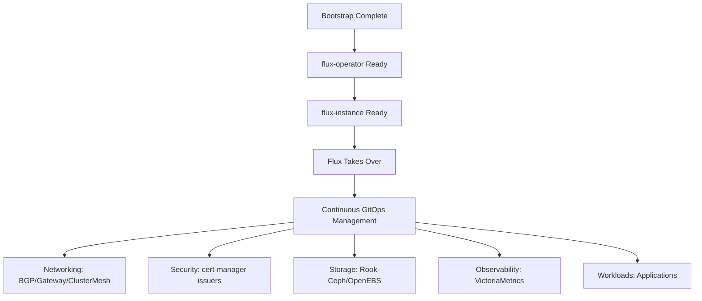

# 🏗️ Multi-Cluster GitOps Architecture (v4)

<div align="center">


**Modern cloud-native platform built on Talos Linux • GitOps-powered • Multi-cluster**

</div>

---

## 📋 Table of Contents

1. [📖 Context & Goals](#1-context--goals)
2. [🪖 Talos Linux 1.11.2](#-talos-linux-1112---api-managed-kubernetes-operating-system)
3. [☸️ Kubernetes 1.34.1](#️-kubernetes-1341---of-wind--will-release)
4. [🎯 Design Principles](#3-design-principles)
5. [🌐 Target Topology](#4-target-topology)
6. [📁 Repository Layout](#5-repository-layout)
7. [⚙️ Flux Model & Convergence](#6-flux-model--convergence)
8. [🚀 Bootstrap Architecture](#7-bootstrap-architecture)
9. [🔧 Cluster Settings & Substitution](#8-cluster-settings--substitution)
10. [🔐 Secrets Management](#9-secrets-management)
11. [🌐 Networking (Cilium)](#10-networking-cilium)
12. [💾 Storage](#11-storage)
13. [📊 Observability](#12-observability)
14. [🔄 CI/CD & Policy](#13-cicd--policy)
15. [🏢 Multi-Tenancy](#14-multi-tenancy)
16. [🔧 Operations & Runbooks](#15-operations--runbooks)
17. [📅 Phased Implementation](#16-phased-implementation)
18. [📝 Decisions & Rationale](#17-decisions--rationale)
19. [⚠️ Risks & Mitigations](#18-risks--mitigations)
20. [✅ Acceptance Criteria](#19-acceptance-criteria--metrics)
21. [🛠️ Workloads & Versions](#20-workloads--versions)
22. [🔧 CRD & API Standardization Matrix](#21-crd--api-standardization-matrix)
23. [🔗 Cilium ClusterMesh + SPIRE](#22-cilium-clustermesh--spire)
24. [🛡️ Security & Network Policy](#23-security--network-policy-baseline)
25. [🔄 Multi-Cluster Mesh Options](#24-multi-cluster-mesh-options---decision-matrix)
26. [🌐 DNS, ExternalDNS, and Cloudflare Tunnel](#25-dns-externaldns-and-cloudflare-tunnel)

---

## 1. 📖 Context & Goals

> **🏛️ Overview**
>
> We run two Talos-based Kubernetes clusters – an infrastructure cluster ("infra") and an application cluster ("apps"). We manage the platform via GitOps using Flux, Helm, and Kustomize. This document defines the target multi-cluster architecture, repository structure, bootstrap approach, security posture, and phased rollout plan.

---

## 🪖 Talos Linux 1.11.2 - API-Managed Kubernetes Operating System

> **🔒 Secure by Design • Immutable • API-First**

Talos Linux 1.11.2 serves as the foundation of our Kubernetes infrastructure, providing an immutable, minimal, and secure operating system designed specifically for running Kubernetes clusters.

### 🏗️ Core Architecture Principles

| Principle | Implementation | Benefits |
|---|---|---|
| **🔒 Immutable Infrastructure** | Ephemeral root filesystem mounted read-only | Eliminates configuration drift, ensures consistency |
| **🔧 API-First Management** | All operations via Talos API (no SSH access) | Programmable infrastructure, audit trail |
| **⚡ Minimal Attack Surface** | Essential services only (no shells, package managers) | Reduced security vulnerabilities |
| **🔄 Automated Lifecycle** | Zero-downtime upgrades via A/B nodes | Simplified operations, predictable maintenance |

### 🚀 Key Features & Capabilities

#### **Core Platform Features**
- **Linux Kernel 6.12.48**: Latest stable kernel with enhanced security patches
- **Kubernetes 1.34.1 Integration**: Native support with validated compatibility
- **containerd Runtime**: Optimized container runtime with CRI compliance
- **etcd v3.5.18**: Distributed key-value store for cluster state
- **runc 1.3.1**: OCI-compliant container runtime

#### **Enhanced Security Model**
```yaml
# Talos security posture
security:
  kernel_hardening: true
  selinux_enforcing: true
  read_only_filesystem: true
  minimal_attack_surface: true
  api_authentication: mTLS
  disk_encryption: AES-256-GCM
```

#### **Advanced Networking Capabilities**
- **eBPF Support**: Native eBPF integration for Cilium and advanced networking
- **WireGuard Integration**: Built-in VPN functionality for secure node communication
- **Multi-Interface Support**: Complex network topology management
- **BGP Peering**: Native BGP support for network fabric integration

#### **Platform Management APIs**

| API Endpoint | Purpose | Usage |
|---|---|---|
| **`/machineconfig`** | Node configuration management | Apply configuration changes |
| **`/health`** | System health monitoring | Validate node status |
| **`/reset`** | Factory reset operations | Secure node decommissioning |
| **`/resources`** | Resource monitoring | System resource visibility |
| **`/osinfo`** | Platform information | Version and capabilities |

### 🔧 Configuration Management

#### **Production Machine Configuration Structure**

Our production Talos configurations demonstrate advanced networking and performance optimizations:

```yaml
# Infrastructure Cluster Control Plane (10.25.11.11)
---
machine:
  network:
    hostname: infra-01
    interfaces:
      - interface: bond0
        bond:
          deviceSelectors: [{ hardwareAddr: "f8:f2:1e:20:57:*", driver: i40e }]
          mode: 802.3ad
          xmitHashPolicy: layer3+4
          lacpRate: fast
          miimon: 100
        dhcp: false
        mtu: 9000
        addresses: [10.25.11.11/24]
        routes: [{ network: "0.0.0.0/0", gateway: "10.25.11.1" }]
        vlans:
          - vlanId: 2512
            mtu: 1500
            dhcp: false
            dhcpOptions:
              routeMetric: 4096
---
apiVersion: v1alpha1
kind: EthernetConfig
name: enp1s0f0np0
rings:
  rx: 8160
  tx: 8160
---
apiVersion: v1alpha1
kind: EthernetConfig
name: enp1s0f1np1
rings:
  rx: 8160
  tx: 8160
```

#### **Advanced Network Configuration Features**

| Feature | Implementation | Benefits |
|---|---|---|
| **🔗 LACP Bonding** | 802.3ad with layer3+4 hashing | High availability and link aggregation |
| **📡 High MTU** | 9000 bytes on bond interface | Jumbo frames for better throughput |
| **🏷️ VLAN Segmentation** | VLAN 2512 for management traffic | Network isolation and organization |
| **⚡ Performance Tuning** | 8160 ring buffers per interface | Optimized network I/O performance |

#### **Production Performance Optimizations**

Our custom schematic includes targeted performance optimizations:

```yaml
# talos/schematic.yaml - Production performance profile
---
customization:
  extraKernelArgs:
    # Hardware compatibility
    - module_blacklist=e1000e

    # Performance optimizations (trade-offs for speed)
    - -init_on_alloc                      # Faster memory allocation
    - -selinux                            # Reduced security overhead
    - apparmor=0                          # Disabled for performance
    - init_on_alloc=0                     # Faster memory allocation
    - init_on_free=0                      # Faster memory deallocation
    - mitigations=off                     # Disable security mitigations
    - security=none                       # Maximum performance
    - talos.auditd.disabled=1             # Disable audit daemon

  systemExtensions:
    officialExtensions:
      - siderolabs/intel-ucode            # Intel microcode updates
      - siderolabs/i915-ucode            # Intel GPU microcode
      - siderolabs/iscsi-tools           # iSCSI support
      - siderolabs/nfsrahead             # NFS performance optimization
```

#### **Cluster Topology**

| Cluster | Node IPs | Hardware | Network Config |
|---|---|---|---|
| **🏭 Infra** | 10.25.11.11-13 | Intel i40e NICs | Bond0 + VLAN 2512 |
| **🎯 Apps** | 10.25.11.14-16 | Intel i40e NICs | Bond0 + VLAN 2512 |

#### **Configuration Management Strategy**

**🔄 Configuration Hierarchy:**
1. **Base Configuration**: Network interfaces and bonding
2. **Cluster Settings**: Hostname and IP assignments
3. **Performance Profile**: Kernel optimizations via schematic
4. **System Extensions**: Hardware-specific modules

**🛡️ Security vs Performance Trade-offs:**
Our production configuration prioritizes performance for bare-metal deployment:
- **Disabled Security Features**: SELinux, AppArmor, memory initialization
- **Mitigation Disabled**: CPU vulnerability mitigations for maximum performance
- **Audit Disabled**: Audit daemon disabled to reduce overhead
- **Justification**: Controlled environment with physical security and network isolation

#### **API Configuration Updates**
- **Dynamic Reconfiguration**: Live configuration updates without reboot
- **Validation Framework**: Pre-flight validation of configuration changes
- **Rollback Capabilities**: Automatic rollback on configuration failures
- **Multi-Node Coordination**: Synchronized configuration across cluster nodes

### 🚀 Performance Optimizations

#### **Boot Time Performance**
- **Cold Start**: < 60 seconds to Kubernetes API availability
- **Memory Efficiency**: < 200MiB base memory footprint
- **Storage Optimization**: Minimal disk usage with efficient layering

#### **Runtime Performance**
- **Container Startup**: < 2 seconds average container start time
- **Network Latency**: < 1ms intra-node network latency
- **I/O Performance**: NVMe-optimized storage operations

### 🔒 Security Enhancements

#### **Zero-Trust Architecture**
```yaml
# Talos security configuration
security:
  # Kernel security modules
  selinux: enforcing
  apparmor: enabled

  # API security
  api_certificates:
    validity_period: "8760h"  # 1 year
    renewal_window: "720h"     # 30 days before expiry

  # Disk encryption
  disk_encryption:
    method: luks2
    cipher: aes-xts-plain64
    key_size: 512
```

#### **Compliance & Standards**
- **NIST 800-53**: Security controls compliance
- **CIS Benchmarks**: Kubernetes hardening guidelines
- **FedRAMP**: Government security requirements alignment
- **SOC 2 Type II**: Security and availability controls

### 🛠️ Operational Excellence

#### **Maintenance & Updates**
- **Zero-Downtime Upgrades**: Rolling updates with health validation
- **Automated Rollback**: Failure detection and automatic recovery
- **Health Monitoring**: Comprehensive system health metrics
- **Log Aggregation**: Centralized logging for troubleshooting

#### **Debugging & Observability**
```bash
# Talos debugging commands
talosctl health                    # Cluster health status
talosctl version                   # Version information
talosctl get resources             # System resource overview
talosctl logs --follow             # Real-time log streaming
talosctl dmesg                     # Kernel message buffer
talosctl dashboard                 # Interactive dashboard
```

### 📊 Integration with Kubernetes 1.34.1

#### **Kubernetes Feature Compatibility**
| Feature | Status | Implementation |
|---|---|---|
| **Dynamic Resource Allocation** | ✅ GA | Native support for resource allocation |
| **Structured Authentication** | ✅ GA | Enhanced API server authentication |
| **VolumeAttributesClass** | ✅ GA | Advanced volume management |
| **CPU Manager Uncore Cache** | 🔄 Beta | CPU performance optimization |
| **Pod Security Standards** | ✅ GA | Built-in security policy enforcement |

#### **Platform-Specific Optimizations**
- **eBPF Integration**: Native eBPF support for Cilium CNI
- **Container Runtime**: Optimized containerd configuration
- **Storage Drivers**: Enhanced storage driver support
- **Network Plugins**: Optimized CNI integration

### 🔄 Upgrade Path Management

#### **Supported Upgrade Methods**
1. **Sequential Node Upgrade**: One node at a time with validation
2. **Parallel Upgrade**: Multiple nodes simultaneously (with quorum protection)
3. **Blue-Green Deployment**: Full cluster replacement with validation

#### **Upgrade Safety Features**
- **Health Checks**: Pre-upgrade and post-upgrade validation
- **Rollback Protection**: Automatic rollback on upgrade failures
- **Quorum Protection**: Prevents cluster split-brain scenarios
- **Configuration Validation**: Ensures compatibility before applying

### 📈 Monitoring & Metrics

#### **Platform Metrics**
```yaml
# Key Talos metrics
talos:
  boot_time_seconds: 45.2
  memory_usage_bytes: 134217728  # 128MiB
  cpu_usage_percent: 2.5
  disk_usage_bytes: 1073741824   # 1GiB
  network_rx_bytes: 1048576000   # 1GB
  network_tx_bytes: 524288000    # 500MB
```

#### **Alerting Integration**
- **Prometheus Integration**: Native metrics export
- **Alertmanager**: Alert configuration for critical failures
- **Grafana Dashboards**: Pre-built platform monitoring dashboards
- **Health Status**: Real-time cluster health indicators

---

## ☸️ Kubernetes 1.34.1 - "Of Wind & Will" Release

> **🚀 Production-Ready Innovation • Developer Experience • Cloud-Native Excellence**

Kubernetes 1.34.1 represents a significant milestone in container orchestration, bringing 58 enhancements including 13 features moving to General Availability, with a focus on developer experience, security, and operational efficiency.

### 🎯 Release Highlights

#### **General Availability Features**
- **Dynamic Resource Allocation (DRA)**: Revolutionary resource management for specialized hardware
- **VolumeAttributesClass**: Advanced volume configuration and modification capabilities
- **Structured Authentication Configuration**: Enhanced API server authentication management
- **Finer-Grained Authorization Selectors**: Improved RBAC with precise policy control
- **Delayed Job Pod Replacement**: Intelligent job execution with resource optimization
- **Volume Expansion Failure Recovery**: Resilient storage operations with automatic recovery

#### **Beta Features**
- **Projected ServiceAccount Tokens for Kubelet**: Enhanced security with short-lived tokens
- **Mutable CSI Node Allocatable**: Dynamic resource allocation adjustments
- **PSI (Pressure Stall Information) Metrics**: Advanced system performance monitoring

### 🔧 Core Platform Enhancements

#### **Dynamic Resource Allocation (DRA)**
```yaml
# DRA example for GPU allocation
apiVersion: resource.k8s.io/v1alpha2
kind: ResourceClaim
metadata:
  name: gpu-claim
spec:
  devices:
    requests:
      - deviceClassName: gpu.example.com
        results:
          - name: gpu
            claimName: gpu-claim
```

**Key Benefits:**
- **Hardware Agnostic**: Supports GPUs, FPGAs, NICs, and specialized accelerators
- **Fine-Grained Control**: Precise resource allocation and sharing
- **Multi-Tenant Support**: Secure resource isolation between workloads
- **Dynamic Scheduling**: Intelligent resource placement and migration

#### **VolumeAttributesClass Innovation**
```yaml
# VolumeAttributesClass for dynamic volume modification
apiVersion: storage.k8s.io/v1beta1
kind: VolumeAttributesClass
metadata:
  name: fast-ssd
parameters:
  throughput: "5000MiB/s"
  iops: "30000"
  encryption: "true"
  compression: "lz4"
```

**Capabilities:**
- **Runtime Modification**: Change volume characteristics without pod restart
- **Performance Tuning**: Dynamic performance parameter adjustment
- **Cost Optimization**: Optimize storage costs based on workload requirements
- **Multi-Cloud Support**: Consistent experience across cloud providers

#### **Structured Authentication Configuration**
```yaml
# Enhanced authentication configuration
apiVersion: v1
kind: Configuration
authentication:
  webhook:
    config:
      # Structured configuration with validation
      - name: oidc-provider
        type: OIDC
        config:
          issuer: "https://oidc.example.com"
          audiences: ["kubernetes"]
          claimMappings:
            usernameClaim: "sub"
            groupsClaim: ["groups"]
```

### 🛡️ Security & Compliance Enhancements

#### **Pod Security Standards GA**
- **Baseline Policy**: Default security posture for workloads
- **Restricted Policy**: Enhanced security for sensitive applications
- **Privileged Policy**: Full access for system workloads
- **Policy Validation**: Automated security policy enforcement

#### **Authentication & Authorization Improvements**
```yaml
# Fine-grained authorization example
apiVersion: rbac.authorization.k8s.io/v1
kind: ClusterRole
metadata:
  name: namespace-reader
rules:
- apiGroups: [""]
  resources: ["pods", "services"]
  verbs: ["get", "list", "watch"]
  resourceNames: ["*"]  # Selective resource access
```

#### **Certificate Management**
- **Short-Lived Certificates**: Automatic rotation with 24-hour validity
- **Multi-CA Support**: Support for multiple certificate authorities
- **Enhanced Validation**: Improved certificate chain validation
- **Security Policies**: Automated security policy enforcement

### 📊 Performance & Scalability

#### **Scheduling Enhancements**
- **Asynchronous API Handling**: Improved scheduler performance with prioritized queues
- **Request Deduplication**: Reduced API server load through intelligent caching
- **Bin Packing Optimization**: Improved resource utilization through advanced scheduling algorithms

#### **Resource Management**
- **Memory Optimization**: Reduced memory footprint for large clusters
- **CPU Efficiency**: Enhanced CPU utilization and scheduling
- **Network Performance**: Improved network throughput and latency

#### **Monitoring & Observability**
```yaml
# PSI metrics example
node_pressure_conditions:
  - type: MemoryPressure
    status: "False"
    reason: "KubeletHasSufficientMemory"
  - type: DiskPressure
    status: "False"
    reason: "KubeletHasNoDiskPressure"
  - type: PIDPressure
    status: "False"
    reason: "KubeletHasSufficientPID"
```

### 🚀 Developer Experience Improvements

#### **Enhanced kubectl Functionality**
- **Improved Error Messages**: More descriptive and actionable error reporting
- **Enhanced Debugging**: Better debugging capabilities with detailed status information
- **Resource Validation**: Pre-creation validation with comprehensive error reporting

#### **API Server Enhancements**
- **Structured Logging**: Improved log formatting and filtering capabilities
- **Performance Metrics**: Enhanced metrics for API server performance monitoring
- **Request Tracing**: Distributed tracing for API request analysis

### 🔧 Networking Enhancements

#### **Gateway API Improvements**
```yaml
# Enhanced Gateway API configuration
apiVersion: gateway.networking.k8s.io/v1beta1
kind: Gateway
metadata:
  name: web-gateway
spec:
  gatewayClassName: cilium
  listeners:
    - name: http
      protocol: HTTP
      port: 80
      allowedRoutes:
        kinds:
          - kind: HTTPRoute
```

#### **Network Policy Enhancements**
- **Policy Validation**: Enhanced network policy validation and error reporting
- **Performance Optimization**: Improved network policy enforcement performance
- **Multi-Network Support**: Enhanced support for multiple network interfaces

### 💾 Storage Innovations

#### **CSI Driver Improvements**
- **Enhanced Volume Management**: Improved volume lifecycle management
- **Performance Monitoring**: Better storage performance metrics and monitoring
- **Multi-Path Support**: Enhanced support for multi-path storage configurations

#### **Storage Class Enhancements**
```yaml
# Enhanced StorageClass with volume binding mode
apiVersion: storage.k8s.io/v1
kind: StorageClass
metadata:
  name: fast-ssd
provisioner: kubernetes.io/aws-ebs
parameters:
  type: gp3
  iops: "3000"
  throughput: "125"
allowVolumeExpansion: true
volumeBindingMode: WaitForFirstConsumer
```

### 🔄 Upgrade & Migration Considerations

#### **Compatibility Matrix**
| Component | Minimum Version | Recommended Version | Notes |
|---|---|---|---|
| **kubectl** | 1.34.0 | 1.34.1 | Client compatibility required |
| **CNI Plugins** | 1.2.0 | 1.3.0 | Enhanced networking features |
| **CSI Drivers** | Latest | Latest | Recommended for DRA support |
| **Ingress Controllers** | Latest | Latest | Enhanced Gateway API support |

#### **Migration Path**
1. **Pre-Upgrade Validation**: Cluster health and compatibility checks
2. **Control Plane Upgrade**: Sequential upgrade of control plane components
3. **Worker Node Upgrade**: Rolling upgrade of worker nodes
4. **Post-Upgrade Validation**: Comprehensive health and functionality testing

### 📈 Operational Excellence

#### **Cluster Autoscaling**
- **Node Auto-Discovery**: Enhanced node discovery and registration
- **Resource Optimization**: Improved resource utilization and cost optimization
- **Multi-Cloud Support**: Consistent autoscaling across cloud providers

#### **Monitoring & Alerting**
```yaml
# Enhanced metrics collection
apiVersion: v1
kind: ConfigMap
metadata:
  name: monitoring-config
data:
  metrics: |
    # Kubernetes 1.34.1 specific metrics
    scheduler_scheduling_latency_seconds
    api_server_request_total
    controller_manager_workqueue_adds_total
    kubelet_volume_stats_capacity_bytes
```

### 🔮 Future-Proofing Considerations

#### **Extensibility**
- **Custom Resource Definitions**: Enhanced CRD validation and support
- **Webhook Enhancements**: Improved webhook framework and validation
- **Operator Framework**: Better support for custom operators

#### **Multi-Cluster Management**
- **Cluster API**: Enhanced multi-cluster management capabilities
- **Federation Improvements**: Better cross-cluster resource sharing
- **Service Discovery**: Enhanced service discovery across clusters

### 📚 API Reference & Documentation

#### **Key API Groups**
```yaml
# Core API groups with 1.34.1 enhancements
apiVersion:
  - group: "apps/v1"            # Enhanced deployment strategies
  - group: "batch/v1"           # Improved job management
  - group: "networking.k8s.io/v1"  # Gateway API enhancements
  - group: "storage.k8s.io/v1"    # DRA and VolumeAttributesClass
  - group: "resource.k8s.io/v1alpha2"  # Dynamic resource allocation
  - group: "policy/v1"          # Pod security standards
```

### 🎯 Objectives

| ✅ Primary Goals | ❌ Non-Goals |
| :--- | :--- |
| ⚡ **Repeatable, fast cluster bring-up** with minimal manual steps | 🔧 Managing Talos OS lifecycle (covered by Talos docs/scripts) |
| 🔄 **Clear separation of concerns** between infrastructure and workloads | 📚 Full application SRE runbooks (app teams own those) |
| ⚙️ **Deterministic ordering** using Flux `Kustomization.dependsOn`, health checks, and timeouts | |
| 🔐 **Zero plaintext secrets** via External Secrets (1Password Connect) | |
| 📈 **Scalable to additional environments** (apps-dev, apps-stg, apps-prod) and optional multi-tenancy | |

## 2. 🎯 Design Principles

> **🏛️ Core Philosophy**
>
> Our architecture follows GitOps best practices with security and reliability at the forefront.

| Principle | Description | Impact |
| :--- | :--- | :--- |
| 🔄 **Git as Single Source of Truth** | Controllers converge the desired state from Git repository | Eliminates configuration drift |
| 🏗️ **Hierarchical Flux Structure** | One entry Kustomization per cluster, fanning into ordered Kustomizations with `dependsOn` | Ensures deterministic deployment order |
| 🔒 **Hermetic Builds** | Avoid remote bases; prefer local Git/OCI sources. No cross-namespace references for multi-tenant areas | Improves security and reproducibility |
| ✅ **Complete Kustomization Settings** | All `Kustomization` have `prune: true`, `wait: true`, `timeout`, `healthChecks`/`healthCheckExprs` | Ensures reliable deployments |
| 🔐 **Secure Secrets Management** | External Secrets with 1Password Connect for all secrets (bootstrap and runtime) | Zero plaintext secrets in Git |
| 🚀 **Minimal Bootstrap** | Bootstrap installs only what is required to let Flux take over; manifests are authored first and applied post‑bootstrap (v3) | Fast, reliable cluster bring-up |

---

## 3. 🌐 Target Topology

> **🏗️ Multi-Cluster Architecture**
>
> Our platform consists of two specialized clusters designed for optimal performance and separation of concerns.

### 🏭 Cluster Overview

| Cluster | Purpose | Key Components | Network Features |
| :--- | :--- | :--- | :--- |
| **🏭 infra** | Platform services & storage | 🗄️ Rook-Ceph • 🐘 CloudNativePG • 📊 VictoriaMetrics/Logs • 🔐 Security • 📦 Registry | Core Cilium + BGP + Gateway API |
| **🎯 apps** | Application workloads | ⚡ User applications • 🚀 CI/CD runners • 📬 Messaging systems | Core Cilium + ClusterMesh connectivity |

### 🌐 Network Architecture


**Key Network Features:**
- 🌐 **Cilium as CNI** - Core installed during bootstrap, managed via GitOps thereafter
- 🧰 **Networking Features (Git‑Managed)** - BGP, Gateway API, ClusterMesh secrets, IPAM pools defined as manifests and reconciled by Flux
- 🔗 **ClusterMesh** - Secure cross-cluster connectivity for service discovery

### 💾 Storage Architecture

| Cluster | Storage Solution | Use Case | Performance |
| :--- | :--- | :--- | :--- |
| **🏭 infra** | 🗄️ Rook-Ceph + OpenEBS LocalPV | Block/file storage, databases (Postgres, Dragonfly) | High throughput NVMe |
| **🎯 apps** | 🗄️ Dedicated Rook-Ceph + OpenEBS LocalPV (default) | Application storage, local workloads | Multi‑GB/s NVMe local |

**Why Dedicated Storage for Apps Cluster?**
- 🚫 **Avoids 1 Gbps router bottleneck** - Keeps Ceph traffic local to apps cluster
- ⚡ **Better performance** - Local replication/backfill within cluster
- 🔧 **Operational simplicity** - Aligned Ceph versions across clusters

### 📊 Observability Strategy

| Cluster | Stack Components | Data Flow |
| :--- | :--- | :--- |
| **🏭 infra** | 📈 VictoriaMetrics global • 📝 VictoriaLogs • 📊 Exporters • 🚨 Flux Alerts/Receivers | Full observability stack |
| **🎯 apps** | 📡 vmagent • 📊 kube-state-metrics • 📋 node-exporter • 📤 Fluent Bit | **Remote write/export to infra only** |

**Benefits:**
- 💰 **Cost efficient** - Single observability stack
- 🚀 **High performance** - Local aggregation, remote forwarding
- 🔧 **Simplified operations** - Centralized monitoring and logging

## 4. 📁 Repository Layout (End‑State)

> **🏛️ Flux-Optimized Structure**
>
> We keep the established `kubernetes/` layout and align it with Flux best practices for optimal GitOps workflows.

### 📂 Directory Structure

```
📦 k8s-gitops/
┣━ 📁 kubernetes/
┃  ┣━ 📁 clusters/
┃  ┃  ┣━ 🏭 infra/
┃  ┃  ┃  ┣━ 🔄 flux-system/               # GitRepository + cluster Kustomizations (entrypoint)
┃  ┃  ┃  ┣━ ⚙️ cluster-settings.yaml      # ConfigMap; used by postBuild.substituteFrom
┃  ┃  ┃  ┣━ 🏗️ infrastructure.yaml        # Ordered platform Kustomizations for infra cluster
┃  ┃  ┃  ┗━ 🚀 workloads.yaml             # Platform workloads (observability, registry, etc.)
┃  ┃  ┣━ 🎯 apps/
┃  ┃  ┃  ┣━ 🔄 flux-system/
┃  ┃  ┃  ┣━ ⚙️ cluster-settings.yaml
┃  ┃  ┃  ┣━ 🏗️ infrastructure.yaml        # Platform needed on apps cluster (e.g., external-secrets, issuers)
┃  ┃  ┃  ┗━ 🚀 workloads.yaml             # Tenants/platform apps on apps cluster
┃  ┃  ┗━ 🌐 apps-dev/, apps-stg/, apps-prod/ (optional overlays)
┃  ┣━ 📁 infrastructure/
┃  ┃  ┣━ 🌐 networking/                  # networking manifests (cilium core, bgp, gateway, clustermesh, ipam)
┃  ┃  ┣━ 🔐 security/                    # external-secrets, cert-manager issuers, RBAC bundles
┃  ┃  ┣━ 💾 storage/                     # rook-ceph, openebs (infra cluster only)
┃  ┃  ┗━ 🔄 gitops/                      # legacy flux-operator/instance charts (reference only)
┃  ┣━ 📁 workloads/
┃  ┃  ┣━ 🏗️ platform/                    # platform apps (observability, registry, CICD, databases)
┃  ┃  ┗━ 👥 tenants/                     # optional multi‑tenant applications
┃  ┣━ 📁 components/                     # reusable Kustomize components (namespaced building blocks)
┃  ┃  ┣━ namespace/                      # standard namespace component with labels/PSS
┃  ┃  ┗━ volsync/                        # app-level VolSync pieces: ExternalSecret, Replication{Source,Destination}, PVC restore
┣━ 📁 bootstrap/
┃  ┣━ 📄 helmfile.d/00-crds.yaml       # CRD-only phase
┃  ┣━ 📄 helmfile.d/01-apps.yaml       # ordered bootstrap charts (cilium→coredns→spegel→cert-manager→flux-operator→flux-instance)
┃  ┣━ 📄 helmfile.d/templates/values.yaml.gotmpl  # reads HelmRelease .spec.values to keep one source of truth
┃  ┗━ 📄 resources.yaml                # namespaces + initial Secret(s) for secret-store
┗━ 📁 .taskfiles/
   ┣━ 📄 bootstrap/Taskfile.yaml       # task bootstrap:talos, bootstrap:apps
   ┗━ 📄 talos/Taskfile.yaml           # node lifecycle helpers
```

### 🎯 Key Design Decisions

| Decision | Rationale | Impact |
| :--- | :--- | :--- |
| **🚫 Removed aggregator `ks.yaml`** | Avoid duplicating cluster wiring | Cleaner, more direct Flux reconciliations |
| **🔧 Helmfile bootstrap** | Predictable, idempotent installation | Reliable cluster bring-up |
| **📁 Cluster-specific settings** | `cluster-settings.yaml` per cluster | Environment-specific configuration |
| **🔄 Git as source of truth** | Flux reconciles directories directly | No configuration drift |
| **🧩 Components pattern** | Reusable, namespaced Kustomize components for app teams (e.g., VolSync) | Promotes consistency; no cluster-scoped side effects |

### 🔧 Manifests‑First v3 Model

| Stage | What Happens | Tools |
| :--- | :--- | :--- |
| **1) Author & Validate Manifests (Stories 1‑41)** | Write all YAML (networking, security, storage, etc.) under `kubernetes/**`. Validate with `kustomize`, `flux build`, and `kubeconform`. No cluster required. | kustomize, flux, kubeconform |
| **2) Bootstrap & Deploy (Stories 42‑50)** | Create clusters (Talos), bootstrap minimal core, then apply and reconcile manifests. Validate end‑to‑end via validation stories. | Helmfile + Task, Flux |

This section aligns with `docs/resequencing-v3-summary.md` (v3 — Manifests‑First, Bootstrap‑Last).

### 🧩 Components Usage

- Components live under `kubernetes/components/` and are imported by app/team overlays as Kustomize components.
- Examples:
  - `components/namespace`: standard namespace with labels and PSS defaults
  - `components/volsync`: VolSync app artifacts (ExternalSecret with MinIO S3 env vars, ReplicationSource/ReplicationDestination, optional PVC restore)
- Components are namespaced and safe to apply per‑team; they do not create cluster‑scoped controllers. Controllers (e.g., VolSync operator, snapshot-controller) are deployed under `workloads/platform/**` and wired by cluster Kustomizations.

---

## 5. ⚙️ Flux Model & Convergence

> **🔄 Declarative GitOps Engine**
>
> Flux ensures reliable, ordered deployment of infrastructure and workloads with built-in health checking.

### 🎯 Entry Kustomization (Per Cluster)

Each cluster has a single entry point that orchestrates the entire platform:

```yaml
# kubernetes/clusters/<cluster>/flux-system/kustomization.yaml
apiVersion: kustomize.toolkit.fluxcd.io/v1
kind: Kustomization
metadata:
  name: cluster-<name>
  namespace: flux-system
spec:
  interval: 10m
  path: ./kubernetes/clusters/<name>
  prune: true
  wait: true
  timeout: 15m
  sourceRef:
    kind: GitRepository
    name: flux-system
```

**Key Features:**
- 📁 **Reconciles cluster directory** - Includes `cluster-settings.yaml`, `infrastructure.yaml`, and `workloads.yaml`
- 🔧 **Variable substitution** - Uses `postBuild.substituteFrom` to inject cluster-specific settings
- ✅ **Health validation** - Built-in health checks ensure reliable deployments

### 🔄 Ordering & Dependencies


**Dependency Chain:**
1. **🔄 flux-repositories** - Helm repositories and OCI sources
2. **🏗️ infrastructure** - Core platform components (networking, security, storage)
3. **🚀 workloads** - Applications and services

### ✅ Health Checking Strategy

| Component | Health Check | Timeout | Success Criteria |
|---|---|---|---|
| **ClusterIssuer** | Ready condition | 5m | Certificate authority ready |
| **DaemonSet** | Available pods | 10m | All nodes running pods |
| **Deployment** | Available replicas | 5m | Desired replicas ready |
| **StatefulSet** | Ready replicas | 15m | All replicas ready |
| **PVC** | Bound status | 2m | Volume successfully bound |

**Configuration Example:**
```yaml
spec:
  dependsOn:
    - name: flux-repositories
  interval: 10m
  path: ./kubernetes/infrastructure
  prune: true
  wait: true
  timeout: 10m
  healthChecks:
    - apiVersion: apps/v1
      kind: Deployment
      name: external-secrets
      namespace: external-secrets
  postBuild:
    substituteFrom:
      - kind: ConfigMap
        name: cluster-settings
```

Example (trimmed)
```yaml
apiVersion: kustomize.toolkit.fluxcd.io/v1
kind: Kustomization
metadata:
  name: cluster-infra-infrastructure
  namespace: flux-system
spec:
  dependsOn:
    - name: flux-repositories
  interval: 10m
  path: ./kubernetes/infrastructure
  prune: true
  wait: false
  sourceRef:
    kind: GitRepository
    name: flux-system
  postBuild:
    substituteFrom:
      - kind: ConfigMap
        name: cluster-settings
```

## 6. 🚀 Bootstrap Architecture (Helmfile + Task)

> **🏗️ Two-Phase Bootstrap Strategy**
>
> We use Helmfile for predictable, idempotent bootstrap before Flux controllers exist. This ensures consistent cluster bring-up every time.

### 🎯 Why Helmfile?

| Benefit | Description | Impact |
|---|---|---|
| **🔄 Idempotent** | Same result every run | Reliable bootstrap process |
| **⚡ Fast** | Direct cluster installation | No waiting for controllers |
| **📝 Consistent values** | Reuses same values as Flux `HelmRelease` | Zero configuration drift |
| **🔧 Two-phase approach** | CRDs first, then apps | Proper dependency ordering |

### 🔄 Bootstrap Phases (applied in Stories 42‑44)

```mermaid
graph LR
    A[Phase 0: CRDs] --> B[Phase 1: Core Apps]
    B --> C[Phase 2: Flux Handover]
    C --> D[GitOps Reconciliation]

    subgraph "Phase 0"
        A1[00-crds.yaml]
        A2[Extract CRDs only]
        A3[Apply CRDs first]
    end

    subgraph "Phase 1"
        B1[01-apps.yaml]
        B2[Ordered releases]
        B3[Cilium → CoreDNS → Spegel → cert-manager → Flux]
    end
```



#### Phase 0: CRD Foundation (`bootstrap/helmfile.d/00-crds.yaml`)

```bash
helmfile -f bootstrap/helmfile.d/00-crds.yaml -e <cluster> template \
  | yq ea 'select(.kind == "CustomResourceDefinition")' \
  | kubectl apply -f -
```

**Key Features:**
- 🔧 **`helmDefaults.args: [--include-crds, --no-hooks]`** - Clean CRD extraction
- 📋 **PostRenderer with `yq`** - Filters CRDs only
- ✅ **Prerequisite validation** - Ensures CRDs exist before consumers

#### Phase 1: Core Applications (`bootstrap/helmfile.d/01-core.yaml.gotmpl`)

**🔗 Dependency Chain:**
```
Cilium (CNI) → CoreDNS (DNS) → Spegel (Image Mirror) → cert-manager (TLS) → flux-operator → flux-instance
```

**🎯 Key Features:**
- 📋 **Ordered releases with `needs`** - Proper startup sequence
- 🔄 **Template values from Git** - `values.yaml.gotmpl` reads `HelmRelease` specs
- 📝 **Single source of truth** - Same values for bootstrap and Flux

### 🔐 Early Secrets & Namespaces

**Bootstrap Resources (`bootstrap/resources.yaml`):**

| Resource | Purpose | Created When |
|---|---|---|
| **external-secrets namespace** | Secret management operator | Bootstrap Phase 1 |
| **1Password Connect Secret** | External secrets access | Before Flux starts |
| **1Password Connect token** | Bootstrap access token for External Secrets | Bootstrap Phase 0 |

### 🛠️ Bootstrap Tasks (Taskfile Canonical)

| Task | Command | Function |
|---|---|---|
| **🔧 Talos Bootstrap (Phase −1)** | `task bootstrap:talos` | Apply first control plane, `talosctl bootstrap`, remaining CPs, export kubeconfig |
| **📦 Prereqs (Phase 0)** | `task :bootstrap:phase:0 CLUSTER=<cluster>` | Namespaces and initial secrets (e.g., 1Password) |
| **🔧 CRDs (Phase 1)** | `task :bootstrap:phase:1 CLUSTER=<cluster>` | Install CRDs only (extracted from charts) |
| **🚀 Core (Phase 2)** | `task :bootstrap:phase:2 CLUSTER=<cluster>` | Cilium, CoreDNS, cert‑manager (CRDs disabled), External Secrets (CRDs disabled), Flux |
| **✅ Validate (Phase 3)** | `task :bootstrap:phase:3 CLUSTER=<cluster>` | Readiness, Flux health, status summary |

### ✅ Phase Guards
- Phase 0 must emit only CustomResourceDefinition kinds; audit with kinds filter.
- Phase 1 installs controllers with CRD installation disabled in chart values (CRDs were pre‑installed in Phase 0).

### 🧭 Handover Criteria (Authoritative)
- flux‑operator Ready; flux‑instance Ready; GitRepository source connected; all initial Kustomizations Ready; `kustomize build` + `kubeconform` clean for the cluster root.

### 🧩 Talos Role‑Aware Convention (optional)
```
talos/
 └─ <cluster>/
     ├─ controlplane/   # first CP used for etcd bootstrap; then remaining CPs
     └─ worker/         # workers joined after API is responding
```
Behavior:
- Prefer `controlplane/*.yaml` first; then remaining CPs in `<cluster>/*.yaml`.
- After API is Ready, apply `worker/*.yaml` using `:talos:apply-node ... MACHINE_TYPE=worker`.
- Safe detector: if first CP already healthy (`talosctl get machineconfig` and `etcd status` OK), skip `talosctl bootstrap`.

### 🧪 CI Dry‑Run (non‑blocking to start)
- Run `task bootstrap:dry-run CLUSTER=infra` in validation CI to surface template/values drift. Emit a short summary. Can become gating later.

### ⏱️ Time‑to‑Ready Targets (baseline)
- Talos control plane ≤ 7 minutes; CRDs ≤ 2 minutes; Core ≤ 6 minutes; total ≤ 20 minutes per cluster.

### 🔄 GitOps Reconciliation Window (post‑bootstrap)



**✅ Handover Criteria:**
- 🟢 **flux-operator** controllers running and ready
- 🟢 **flux-instance** cluster reconciliation active
- 🟢 **GitRepository** source connected and syncing
- 🟢 **Initial Kustomizations** reconciling successfully

All ongoing configuration changes happen through Git commits, with Flux automatically applying them to the cluster. In v3, manifests are authored first; deployment and system validation follow in Stories 45‑49.

---

## 7. ⚙️ Cluster Settings & Substitution

> **🔧 Centralized Configuration Management**
>
> Each cluster has a dedicated `cluster-settings.yaml` ConfigMap that contains all environment-specific values used throughout the platform.

### 📋 Configuration Examples (real values from this repo)

Infra cluster (kubernetes/clusters/infra/cluster-settings.yaml)
```yaml
apiVersion: v1
kind: ConfigMap
metadata:
  name: cluster-settings
  namespace: flux-system
  labels:
    app.kubernetes.io/managed-by: flux
    cluster: infra
data:
  # Cluster Identity
  CLUSTER: infra
  CLUSTER_ID: "1"

  # Network Configuration
  POD_CIDR: '["10.244.0.0/16"]'
  POD_CIDR_STRING: "10.244.0.0/16"
  SERVICE_CIDR: '["10.245.0.0/16"]'
  K8S_SERVICE_HOST: "infra-k8s.monosense.io"
  K8S_SERVICE_PORT: "6443"

  # Cilium Configuration
  CILIUM_VERSION: "1.18.3"
  CLUSTERMESH_IP: "10.25.11.100"
  CILIUM_GATEWAY_LB_IP: "10.25.11.110"
  CILIUM_BGP_LOCAL_ASN: "64512"
  CILIUM_BGP_PEER_ASN: "64501"
  CILIUM_BGP_PEER_ADDRESS: "10.25.11.1/32"

  # IPAM Pool Control
  INFRA_POOL_DISABLED: "false"
  APPS_POOL_DISABLED: "true"
  CILIUM_LB_POOL_START: "10.25.11.100"
  CILIUM_LB_POOL_END: "10.25.11.119"

  # CoreDNS Configuration
  COREDNS_CLUSTER_IP: "10.245.0.10"
  COREDNS_REPLICAS: "2"

  # External Secrets Configuration
  EXTERNAL_SECRET_STORE: "onepassword"
  ONEPASSWORD_CONNECT_HOST: "http://opconnect.monosense.dev"
  ONEPASSWORD_CONNECT_TOKEN_SECRET: "onepassword-connect-token"
  CILIUM_CLUSTERMESH_SECRET_PATH: "kubernetes/infra/cilium-clustermesh"
  CERTMANAGER_CLOUDFLARE_SECRET_PATH: "kubernetes/infra/cert-manager/cloudflare"

  # Domain Configuration
  SECRET_DOMAIN: "monosense.io"

  # GitHub Actions Configuration
  GITHUB_CONFIG_URL: "https://github.com/monosense-io/k8s-gitops"

  # Rook-Ceph Configuration
  ROOK_CEPH_NAMESPACE: "rook-ceph"
  ROOK_CEPH_CLUSTER_NAME: "rook-ceph"
  ROOK_CEPH_BLOCKPOOL_NAME: "rook-ceph-block"
  ROOK_CEPH_IMAGE_TAG: v19.2.3
  ROOK_CEPH_OSD_DEVICE_CLASS: "ssd"
  ROOK_CEPH_MON_COUNT: "3"

  # Storage Classes
  BLOCK_SC: "rook-ceph-block"  # Generic Rook-Ceph block storage (RBD)
  OPENEBS_LOCAL_SC: "openebs-local-nvme"  # Local NVMe storage

  # OpenEBS Configuration
  OPENEBS_BASEPATH: "/var/mnt/openebs"

  # Observability Configuration
  OBSERVABILITY_METRICS_RETENTION: "30d"
  OBSERVABILITY_LOGS_RETENTION: "30d"
  OBSERVABILITY_LOG_ENDPOINT_HOST: "victorialogs-vmauth.observability.svc.cluster.local"
  OBSERVABILITY_LOG_ENDPOINT_PORT: "9428"
  OBSERVABILITY_LOG_ENDPOINT_PATH: "/insert"
  OBSERVABILITY_LOG_ENDPOINT_TLS: "Off"
  OBSERVABILITY_LOG_TENANT: "infra"
  OBSERVABILITY_GRAFANA_SECRET_PATH: "kubernetes/infra/grafana-admin"

  # Global Monitoring Configuration (for cross-cluster federation)
  GLOBAL_VM_INSERT_ENDPOINT: "victoria-metrics-global-vminsert.observability.svc.cluster.local:8480"
  GLOBAL_VM_SELECT_ENDPOINT: "victoria-metrics-global-vmselect.observability.svc.cluster.local:8481"
  GLOBAL_ALERTMANAGER_ENDPOINT: "victoria-metrics-global-alertmanager.observability.svc.cluster.local:9093"

  # CloudNative-PG Configuration
  CNPG_OPERATOR_VERSION: "0.25.0"
  CNPG_POSTGRES_VERSION: "16.8"
  CNPG_STORAGE_CLASS: "openebs-local-nvme"
  CNPG_DATA_SIZE: "80Gi"
  CNPG_WAL_SIZE: "20Gi"
  CNPG_INSTANCES: "3"
  CNPG_SHARED_CLUSTER_NAME: "shared-postgres"
  CNPG_BACKUP_BUCKET: "monosense-cnpg"
  # NOTE: CNPG ScheduledBackup uses a six-field cron expression (seconds first).
  # Example below runs at 02:00:00 UTC daily.
  CNPG_BACKUP_SCHEDULE: "0 0 2 * * *"
  CNPG_MINIO_ENDPOINT_URL: "http://10.25.11.3:9000"
  CNPG_MINIO_SECRET_PATH: "kubernetes/infra/cloudnative-pg/minio"
  CNPG_SUPERUSER_SECRET_PATH: "kubernetes/infra/cloudnative-pg/superuser"

  # Dragonfly Configuration (infra)
  DRAGONFLY_STORAGE_CLASS: "openebs-local-nvme"
  DRAGONFLY_DATA_SIZE: "30Gi"           # default for shared cache; tune per-tenant if split
  DRAGONFLY_AUTH_SECRET_PATH: "kubernetes/infra/dragonfly/auth"
```

Apps cluster (kubernetes/clusters/apps/cluster-settings.yaml)
```yaml
apiVersion: v1
kind: ConfigMap
metadata:
  name: cluster-settings
  namespace: flux-system
  labels:
    app.kubernetes.io/managed-by: flux
    cluster: apps
data:
  # Cluster Identity
  CLUSTER: apps
  CLUSTER_ID: "2"

  # Network Configuration
  POD_CIDR: '["10.246.0.0/16"]'
  POD_CIDR_STRING: "10.246.0.0/16"
  SERVICE_CIDR: '["10.247.0.0/16"]'
  K8S_SERVICE_HOST: "apps-k8s.monosense.io"
  K8S_SERVICE_PORT: "6443"

  # Cilium Configuration
  CILIUM_VERSION: "1.18.3"
  CLUSTERMESH_IP: "10.25.11.120"
  CILIUM_GATEWAY_LB_IP: "10.25.11.121"
  CILIUM_BGP_LOCAL_ASN: "64513"
  CILIUM_BGP_PEER_ASN: "64501"
  CILIUM_BGP_PEER_ADDRESS: "10.25.11.1/32"

  # IPAM Pool Control
  INFRA_POOL_DISABLED: "true"
  APPS_POOL_DISABLED: "false"
  CILIUM_LB_POOL_START: "10.25.11.120"
  CILIUM_LB_POOL_END: "10.25.11.139"

  # CoreDNS Configuration
  COREDNS_CLUSTER_IP: "10.247.0.10"
  COREDNS_REPLICAS: "2"

  # External Secrets Configuration
  EXTERNAL_SECRET_STORE: "onepassword"
  ONEPASSWORD_CONNECT_HOST: "http://opconnect.monosense.dev"
  ONEPASSWORD_CONNECT_TOKEN_SECRET: "onepassword-connect-token"
  CILIUM_CLUSTERMESH_SECRET_PATH: "kubernetes/apps/cilium-clustermesh"
  CERTMANAGER_CLOUDFLARE_SECRET_PATH: "kubernetes/apps/cert-manager/cloudflare"

  # Domain Configuration
  SECRET_DOMAIN: "monosense.io"

  # Rook-Ceph Configuration (apps cluster)
  ROOK_CEPH_NAMESPACE: "rook-ceph"
  ROOK_CEPH_CLUSTER_NAME: "rook-ceph"
  ROOK_CEPH_BLOCKPOOL_NAME: "rook-ceph-block"
  ROOK_CEPH_IMAGE_TAG: v19.2.3
  ROOK_CEPH_OSD_DEVICE_CLASS: "ssd"
  ROOK_CEPH_MON_COUNT: "3"

  # Storage Classes
  BLOCK_SC: "rook-ceph-block"  # Generic Rook-Ceph block storage (RBD)
  OPENEBS_LOCAL_SC: "openebs-local-nvme"  # Local NVMe storage

  # OpenEBS Configuration
  OPENEBS_BASEPATH: "/var/mnt/openebs"

  # Observability Configuration
  OBSERVABILITY_METRICS_RETENTION: "30d"
  OBSERVABILITY_LOGS_RETENTION: "30d"
  OBSERVABILITY_LOG_ENDPOINT_HOST: "victorialogs-vmauth.observability.svc.cluster.local"
  OBSERVABILITY_LOG_ENDPOINT_PORT: "9428"
  OBSERVABILITY_LOG_ENDPOINT_PATH: "/insert"
  OBSERVABILITY_LOG_ENDPOINT_TLS: "Off"
  OBSERVABILITY_LOG_TENANT: "apps"
  OBSERVABILITY_GRAFANA_SECRET_PATH: "kubernetes/apps/grafana-admin"

  # Dragonfly Configuration (apps)
  # Clients only; no operator on apps. Kept for potential future per-tenant instances.
  DRAGONFLY_STORAGE_CLASS: "openebs-local-nvme"
  DRAGONFLY_DATA_SIZE: "50Gi"
  DRAGONFLY_AUTH_SECRET_PATH: "kubernetes/apps/dragonfly/auth"

  # GitLab Configuration
  GITLAB_DB_SECRET_PATH: "kubernetes/apps/gitlab/db"
  GITLAB_REDIS_SECRET_PATH: "kubernetes/apps/gitlab/redis"
  GITLAB_S3_SECRET_PATH: "kubernetes/apps/gitlab/s3"
  GITLAB_ROOT_SECRET_PATH: "kubernetes/apps/gitlab/root"
```

### 🔧 Variable Substitution Flow


### 📝 Usage Examples

| Component | Variable Used | Example |
|---|---|---|
| **Cilium BGP** | `${CILIUM_BGP_ASN}` | `localAsn: ${CILIUM_BGP_ASN}` |
| **Storage Class** | `${DEFAULT_STORAGE_CLASS}` | `storageClassName: ${DEFAULT_STORAGE_CLASS}` |
| **External Secret** | `${SECRET_STORE_PATH}` | `path: ${SECRET_STORE_PATH}/database` |
| **Victoria Metrics** | `${VICTORIA_METRICS_ENDPOINT}` | `remoteWrite: ${VICTORIA_METRICS_ENDPOINT}` |

### ✅ Benefits

| Benefit | Description |
|---|---|
| **🎯 Environment Isolation** | Each cluster has independent settings |
| **🔄 Single Source of Truth** | All variables in one ConfigMap |
| **🚀 Zero Drift** | Template substitutions at build time |
| **🔧 Easy Maintenance** | Update cluster settings in one place |
| **🛡️ Type Safety** | Explicit variable declarations |

### 🏗️ Implementation Pattern

```yaml
# Any Kustomization using cluster settings
apiVersion: kustomize.toolkit.fluxcd.io/v1
kind: Kustomization
metadata:
  name: my-app
spec:
  # ... other spec
  postBuild:
    substituteFrom:
      - kind: ConfigMap
        name: cluster-settings
        optional: false
```

### 🔒 Substitution Ownership (Important)
- Define substitutions in the Flux `Kustomization` via `postBuild.substitute`/`postBuild.substituteFrom` that references `ConfigMap/cluster-settings`.
- HelmRelease values must use `${VAR}` placeholders (e.g., `${K8S_SERVICE_HOST}`, `${K8S_SERVICE_PORT}`, `${CILIUM_VERSION}`) and must not hard‑code cluster‑specific values.
- This keeps manifests portable and ensures all environment specifics live in `cluster-settings`.

## 8. 🔐 Secrets Management (1Password Only)

> **🛡️ Zero-Trust Secrets Architecture**
>
> We implement a defense-in-depth approach to secrets management, ensuring no plaintext secrets ever touch our Git repository.

### 🔧 Approach

All secrets are managed exclusively via External Secrets with 1Password Connect. No SOPS is used in this platform.

### 🏗️ Architecture Flow

```mermaid
graph TD
    A[1Password Vault] --> B[1Password Connect]
    B --> C[External Secrets Operator]
    C --> D[Kubernetes Secrets]
    D --> E[Applications]

    J[Bootstrap Secret (1Password token)] --> C
    K[Cluster Settings] --> C
```

### 🎯 Implementation Strategy

#### **Primary: External Secrets + 1Password Connect**

**🔧 Bootstrap Phase:**
```yaml
# bootstrap/resources.yaml - One-time setup
apiVersion: v1
kind: Secret
metadata:
  name: onepassword-connect
  namespace: external-secrets
type: Opaque
data:
  token: <base64-encoded-1password-token>
```

**🔄 Runtime Secret Sync:**
```yaml
# Example ExternalSecret
apiVersion: external-secrets.io/v1beta1
kind: ExternalSecret
metadata:
  name: database-credentials
spec:
  refreshInterval: 1h
  secretStoreRef:
    name: onepassword-store
    kind: SecretStore
  target:
    name: database-credentials
  dataFrom:
    - extract:
        key: kubernetes/infra/database
```

#### Notes
- Bootstrap writes the 1Password Connect token Secret and creates External Secret stores. Thereafter, all workload/application secrets are pulled at reconcile time.

### 🛡️ Security Standards

| Standard | Requirement | Implementation |
|---|---|---|
| **🚫 Zero Plaintext** | No secrets in clear text | External Secrets (1Password) only |
| **🔄 Automatic Rotation** | Regular secret updates | 1Password Connect with 1-hour refresh |
| **🚨 Alerting** | Failed sync notifications | Flux alerts on decryption/ES failures |
| **📝 Documentation** | Rotation runbooks | Standardized procedures for all secret types |
| **🔐 Access Control** | Least privilege access | 1Password RBAC, Kubernetes RBAC |

### 📊 Secret Categories

| Category | Storage Method | Rotation Frequency | Example |
|---|---|---|---|
| **🗄️ Database Credentials** | External Secrets | 90 days | PostgreSQL passwords |
| **🔑 TLS Certificates** | External Secrets | Auto-renewal | cert-managed certs |
| **🔌 API Keys** | External Secrets | 30-90 days | External service tokens |
| **🚀 Bootstrap Secrets** | External Secrets | 1Password token rotation via 1Password |
| **👥 Service Account Keys** | External Secrets | 365 days | CI/CD deployment keys |

### ⚡ Performance Optimizations

| Optimization | Description | Impact |
|---|---|---|
| **🔄 Refresh Interval** | 1-hour refresh for most secrets | Reduces 1Password API calls |
| **📦 Secret Caching** | External Secrets operator caching | Faster pod startup |
| **🎯 Selective Sync** | Only sync needed secrets per namespace | Reduced memory footprint |
| **🚀 Bulk Operations** | Batch secret operations where possible | Improved sync performance |

## 9. 🌐 Networking (Cilium)

> **🔗 High-Performance eBPF Networking**
>
> Cilium provides the foundation for our multi-cluster connectivity with advanced security and observability capabilities.

### 🏗️ Architecture Overview (v3 sequence)

```mermaid
graph TB
    subgraph "Story 01‑13: Networking Manifests"
        A[Cilium Core (HelmRelease values)]
        B[kubeProxyReplacement: true]
        C[WireGuard Encryption]
        D[BGP Control Plane]
        E[Gateway API]
        F[ClusterMesh]
        G[IPAM Pools]
    end

    subgraph "Stories 42‑50: Bootstrap + Validation"
        X[Bootstrap minimal core]
        Y[Flux applies manifests]
        Z[Validation stories 45‑49]
    end

    A --> X
    B --> X
    C --> X
    D --> Y
    E --> Y
    F --> Y
    G --> Y

    subgraph "Security & Observability"
        H[Network Policies]
        I[Hubble Monitoring]
        J[Service Mesh]
    end

    D --> H
    E --> I
    F --> J
```

### 🔧 Core Installation (Bootstrap)

| Component | Method | Key Settings | Purpose |
|---|---|---|---|
| **🌐 Cilium Agent** | Helmfile (DaemonSet) | `kubeProxyReplacement: true` | eBPF data plane, replaces kube-proxy |
| **⚙️ Cilium Operator** | Helmfile (Deployment) | WireGuard encryption enabled | Control plane management |
| **🔒 WireGuard** | Built-in | Transparent encryption | Node-to-node encryption |

### 📁 Networking Manifests Layout

Located under `kubernetes/infrastructure/networking/cilium/*`:

| Feature | Path | Component | Function |
|---|---|---|---|
| **🔗 BGP Peering** | `bgp/` | `CiliumBGPPeeringPolicy` | Pod/LB IP advertisement |
| **🌉 Gateway API** | `gateway/` | `GatewayClass` + `Gateways` | North-south traffic management |
| **🔗 ClusterMesh** | `clustermesh/` | `ExternalSecret` | Cross-cluster connectivity |
| **📊 IPAM** | `ipam/` | `CiliumLoadBalancerIPPool` | L2/LB IP pool management |

Gateway policy note: This platform uses Cilium Gateway exclusively; Envoy Gateway is not part of this design.

### 🔑 API Endpoint Selection for Cilium (kube‑proxy‑free)
- Default (Option A): use the cluster control‑plane DNS on port 6443.
  - `K8S_SERVICE_HOST`: `infra-k8s.monosense.io` / `apps-k8s.monosense.io` (per cluster)
  - `K8S_SERVICE_PORT`: `6443`
- Optional overlay: you may point to Talos KubePrism (`127.0.0.1:7445`) by changing the two variables in `cluster-settings` — no code changes required.
- Set both values explicitly whenever `kubeProxyReplacement: true` is enabled so hostNetwork agents can reach the apiserver reliably.

Minimal HelmRelease values (excerpt):
```yaml
values:
  cluster:
    name: ${CLUSTER}
    id: ${CLUSTER_ID}
  ipv4NativeRoutingCIDR: ${POD_CIDR_STRING}
  kubeProxyReplacement: true
  k8sServiceHost: ${K8S_SERVICE_HOST}
  k8sServicePort: ${K8S_SERVICE_PORT}
  encryption:
    enabled: true
    type: wireguard
  hubble:
    enabled: true
    relay:
      enabled: true
    ui:
      enabled: false
  prometheus:
    enabled: true
    serviceMonitor:
      enabled: true
```

Scope boundaries:
- The Cilium “core” HelmRelease configures the base dataplane (kube‑proxy replacement, encryption, Hubble, metrics).
- BGP Control Plane and Gateway API are authored in their dedicated directories (`bgp/`, `gateway/`) and reconciled by Flux separately.

### 🔢 LoadBalancer IP Allocation

**Network Topology:** Both clusters share the same L2 subnet (`10.25.11.0/24`) and peer with BGP router at `10.25.11.1` (ASN 64501).

**IP Pool Allocation Strategy:**

| Range | Cluster | Purpose | Reserved IPs | Pool Size |
|---|---|---|---|---|
| **10.25.11.100-119** | Infra | LoadBalancer Services | `.100` (ClusterMesh), `.110` (Gateway) | 20 IPs |
| **10.25.11.120-139** | Apps | LoadBalancer Services | `.120` (ClusterMesh), `.121` (Gateway) | 20 IPs |

**Key Design Principles:**
- ✅ **Pool Isolation**: Pools use `disabled` flag via cluster-settings to prevent cross-cluster allocation
- ✅ **Clean Segmentation**: No IP overlap, contiguous ranges per cluster
- ✅ **Predictable Allocation**: ClusterMesh at start of each pool, Gateway follows
- ✅ **Room for Growth**: ~17 IPs available per cluster for future LoadBalancer services
- ✅ **BGP-Friendly**: Each cluster advertises only its own pool range via BGP Control Plane

**Specific IP Assignments:**

| Service | Infra Cluster | Apps Cluster | Purpose |
|---|---|---|---|
| **ClusterMesh API** | `10.25.11.100` | `10.25.11.120` | Cross-cluster service discovery |
| **Gateway API** | `10.25.11.110` | `10.25.11.121` | North-south HTTP(S) traffic |
| **Available Pool** | `.111-.119` | `.122-.139` | Future LoadBalancer services |

**Pool Isolation Mechanism:**
```yaml
# Controlled via cluster-settings ConfigMap
# Infra cluster:
INFRA_POOL_DISABLED: "false"
APPS_POOL_DISABLED: "true"

# Apps cluster:
INFRA_POOL_DISABLED: "true"
APPS_POOL_DISABLED: "false"
```

This ensures that when shared infrastructure manifests deploy to both clusters, each cluster only allocates from its designated pool.

### 🪞 Spegel: Cluster-Local OCI Registry Mirror

**Installation**: Authored as manifests pre‑bootstrap; applied during Stories 45‑49

Spegel provides distributed P2P image caching across all cluster nodes, significantly improving image pull performance and reducing external registry bandwidth.

| Aspect | Configuration | Notes |
|---|---|---|
| **📦 Deployment** | DaemonSet (kube-system namespace) | Runs on all nodes for local mirror access |
| **🔌 Registry Endpoint** | HostPort `29999` | Local mirror accessible at `localhost:29999` on each node |
| **⚙️ Talos Integration** | `containerdRegistryConfigPath: /etc/cri/conf.d/hosts` | Dynamic containerd registry configuration (no machine config changes required) |
| **💾 Storage** | In-memory cache (stateless) | No persistent volumes required |
| **📊 Observability** | ServiceMonitor + Grafana dashboard | Cache hit rate, pull performance metrics |
| **🔄 Upstream Fallback** | Automatic | Falls back to upstream registry if image not in local cache |

**How It Works**:
1. **First Pull**: Node pulls image from upstream registry (ghcr.io, docker.io, etc.) — normal speed
2. **Cache**: Spegel caches image locally on that node
3. **Subsequent Pulls**: Other nodes pull from Spegel mirror (P2P) — ~10x faster, no external bandwidth
4. **Benefits**: Faster deployments, reduced egress costs, improved resilience (works during upstream outages)

**Talos Compatibility**: Fully supported via containerd's dynamic registry configuration. Spegel updates `/etc/cri/conf.d/hosts` at runtime (no Talos machine config modifications required).

**Bootstrap Integration**: Included in `bootstrap/helmfile.d/01-core.yaml.gotmpl` after CoreDNS to accelerate subsequent component installations (cert-manager, Flux, etc.).

### 🚀 Key Benefits

| Benefit | Description | Impact |
|---|---|---|
| **⚡ High Performance** | eBPF-based data plane | Near bare-metal network performance |
| **🔒 Security** | WireGuard + Network Policies | Defense-in-depth network security |
| **🔗 Multi-Cluster** | ClusterMesh integration | Seamless cross-cluster service discovery |
| **📊 Observability** | Hubble + Prometheus integration | Full network visibility and monitoring |
| **🎛️ Flexibility** | Gateway API + BGP support | Advanced traffic routing capabilities |
| **🪞 Image Caching** | Spegel P2P registry mirror | Faster pulls, reduced external bandwidth, improved resilience |

## 10. 💾 Storage Architecture

> **🗄️ High-Performance Distributed Storage**
>
> Our multi-cluster storage strategy provides optimal performance and isolation while maintaining operational simplicity.

### 🏗️ Storage Architecture Overview


### 📊 Cluster Storage Comparison

| Cluster | Storage Solution | Primary Use | Performance Target | Key Features |
|---|---|---|---|---|
| **🏭 Infra** | 🗄️ Rook-Ceph + OpenEBS | Platform services, databases | High throughput NVMe | Block/file/object, monitoring |
| **🎯 Apps** | 🗄️ Dedicated Rook-Ceph + OpenEBS | Application workloads | Multi-GB/s local NVMe | Isolated storage, default local PV |

### 🎯 Why Dedicated Storage for Apps Cluster?

| Challenge | Solution | Benefit |
|---|---|---|
| **🚫 Network Bottleneck** - 1 Gbps router cap | **Local Ceph cluster** on apps side | Eliminates cross-cluster I/O bottleneck |
| **⚡ Performance** - Latency sensitive workloads | **In-cluster replication** and backfill | Multi-GB/s NVMe-backed performance |
| **🔧 Operational Simplicity** | **Aligned Ceph versions** (v19.2.3) | Simplified management and tooling |
| **🛡️ Isolation** | Dedicated storage per cluster | Prevents noisy neighbor problems |

### 🗄️ Storage Classes & Usage

| Storage Class | Cluster | Type | Use Case | Performance |
|---|---|---|---|---|
| **rook-ceph-block** | Infra + Apps | Block storage | Databases, stateful apps | High IOPS, low latency |
| **rook-ceph-fs** | Infra | File storage | Shared file systems | Concurrent access |
| **openebs-local-nvme** | Infra + Apps | Local storage | High-performance workloads | NVMe speed, local only |
| **rook-ceph-object** | Infra | Object storage | S3-compatible storage | Scalable object access |

### 📈 Performance Optimizations

| Optimization | Implementation | Impact |
|---|---|---|
| **🔧 NVMe Device Class** | `ROOK_CEPH_OSD_DEVICE_CLASS: "ssd"` | Optimized SSD performance |
| **📊 Local NVMe Priority** | OpenEBS as default for apps | Maximum I/O performance |
| **🔄 Replication Strategy** | Local cluster replication | Minimal cross-cluster traffic |
| **📈 Monitoring** | Ceph metrics + alerts | Performance visibility |

### 🛠️ Operational Benefits

| Feature | Description | Operational Impact |
|---|---|---|
| **🔧 Version Alignment** | Same Ceph v19.2.3 across clusters | Simplified upgrades, tooling consistency |
| **📊 Integrated Monitoring** | Ceph + Prometheus + Grafana | Full storage observability |
| **🚨 Automated Alerts** | Storage health and performance alerts | Proactive issue detection |
| **📖 Standardized Runbooks** | Consistent operational procedures | Reduced operational complexity |

### 🎛️ Configuration Highlights

```yaml
# From cluster-settings.yaml
ROOK_CEPH_IMAGE_TAG: v19.2.3
ROOK_CEPH_OSD_DEVICE_CLASS: "ssd"
BLOCK_SC: "rook-ceph-block"  # Generic block storage
OPENEBS_LOCAL_SC: "openebs-local-nvme"  # Local NVMe storage
OPENEBS_BASEPATH: "/var/mnt/openebs"
```

## 11. 📊 Observability Strategy

> **🔍 Centralized Monitoring & Logging**
>
> Our observability architecture provides comprehensive visibility across both clusters with centralized storage and distributed collection.

### 🏗️ Architecture Overview


### 🎯 Cluster Strategy

| Cluster | Role | Components | Data Flow |
|---|---|---|---|
| **🏭 Infra** | **Central Storage & Visualization** | VictoriaMetrics global, VictoriaLogs, Grafana, Alertmanager | Stores all cluster data, provides dashboards/alerts |
| **🎯 Apps** | **Lightweight Collection** | vmagent, kube-state-metrics, node-exporter, Fluent Bit | Forwards all data to infra cluster |

### 📱 Apps Cluster: Leaf Observability Pack

#### 🔄 Metrics Collection (Pull + Forward)

| Component | Purpose | Data Flow | Resource Usage |
|---|---|---|---|
| **📡 vmagent** | Discovers and scrapes targets | Remote write to infra vminsert via vmauth | 100-300m CPU / 256-512Mi RAM |
| **📊 kube-state-metrics** | Kubernetes object metrics | Scraped by vmagent | Lightweight |
| **🖥️ node-exporter** | OS/host metrics (CPU, memory, disk I/O, network) | Scraped by vmagent | Essential for host visibility |
| **🌐 Cilium/Hubble** | Network/L7 metrics (optional) | ServiceMonitors → vmagent | Network visibility |

#### 📝 Logs Collection (Push)

| Component | Function | Configuration | Resource Usage |
|---|---|---|---|
| **📋 Fluent Bit** | Ships container/kubelet/audit logs | Compression, batching, `cluster=apps` labels | 50-200m CPU / 128-256Mi RAM |
| **🔗 vmauth** | Multi-tenant routing | Insert endpoint with TLS/auth | Minimal overhead |

#### 🔍 Traces Collection (Optional)

| Component | Function | Integration | Notes |
|---|---|---|---|
| **🔍 OpenTelemetry Collector** | Receives OTLP from applications | Exports to infra tracing backend | DaemonSet or agent mode |

### 🤔 Why Keep node-exporter with vmagent?

| Component | Role | Complementarity |
|---|---|---|
| **📡 vmagent** | Prometheus-compatible scraper/forwarder | Discovers and pulls metrics, doesn't generate host metrics |
| **🖥️ node-exporter** | Canonical OS/host signals source | Provides CPU, filesystem saturation, network, thermal data |
| **💡 Synergy** | Complete visibility | kubelet/cAdvisor insufficient for host-level detail |

### ⚙️ Configuration Details (Apps → Infra)

#### 🔗 Endpoints (from cluster-settings)

```yaml
# Metrics Configuration
GLOBAL_VM_INSERT_ENDPOINT: "victoria-metrics-global-vminsert.observability.svc.cluster.local:8480"
OBSERVABILITY_LOG_ENDPOINT_HOST: "victorialogs-vmauth.observability.svc.cluster.local"
OBSERVABILITY_LOG_ENDPOINT_PORT: "9428"
OBSERVABILITY_LOG_TENANT: "apps"
```

#### 🛡️ NetworkPolicy Configuration

| Direction | Allowed Traffic | Ports | Purpose |
|---|---|---|---|
| **Egress** | DNS + kube-apiserver | 53, 443 | Cluster functionality |
| **Egress** | infra vmauth/vminsert | 8480/8427 | Metrics forwarding |
| **Egress** | VictoriaLogs insert | 9428 | Log forwarding |
| **Default** | Deny all other traffic | - | Security |

#### 🔐 Security Configuration

| Component | Secret Management | Access Pattern |
|---|---|---|
| **vmagent** | External Secrets | Client credentials + CA roots |
| **Fluent Bit** | External Secrets | TLS certs for log shipping |
| **OTel Collector** | External Secrets | Tracing backend access |

### 🚫 What We DON'T Run on Apps Cluster

| Component | Reason | Alternative |
|---|---|---|
| **📊 VictoriaMetrics TSDB** | Storage consolidation | Remote write to infra |
| **🚨 VMAlert/Alertmanager** | Centralized alerting | Infra cluster handles all alerts |
| **📈 Grafana** | Single visualization layer | Access infra Grafana via network |
| **💾 Long-term storage** | Cost efficiency | Central storage on infra |

### 📋 CRD Requirements for Apps Cluster

#### Required CRD Bundles

| CRD Set | Purpose | Examples |
|---|---|---|
| **📊 VictoriaMetrics Operator** | VM resource definitions | VMAgent, VMServiceScrape, VMRule, VMAuth, VMUser |
| **🔄 Prometheus Operator (Compatibility)** | Upstream chart support | ServiceMonitor, PodMonitor, PrometheusRule |

#### 🚀 Bootstrap Method

```bash
# Phase 0: Install CRDs on both clusters
helmfile -f bootstrap/helmfile.d/00-crds.yaml -e apps template \
  | yq ea 'select(.kind == "CustomResourceDefinition")' \
  | kubectl apply -f -
```

### 📈 Scaling & Performance

| Metric | Starting Point | Scaling Guidance |
|---|---|---|
| **vmagent CPU** | 100-300m | Scale with scrape cardinality |
| **vmagent Memory** | 256-512Mi | Scale with metric volume |
| **Fluent Bit CPU** | 50-200m | Scale with log throughput |
| **Fluent Bit Memory** | 128-256Mi | Scale with buffer size |
| **Network Bandwidth** | Depends on log/metric volume | Monitor compression ratios |

### ✅ Benefits of This Architecture

| Benefit | Description | Impact |
|---|---|---|
| **💰 Cost Efficiency** | Single storage backend | Reduced infrastructure costs |
| **⚡ Performance** | Local aggregation, remote forwarding | Low latency collection |
| **🔧 Simplicity** | Centralized management | Easier operations |
| **🛡️ Security** | Controlled egress paths | Reduced attack surface |
| **📈 Scalability** | Distributed collection | Linear scaling capability |


## 12. 🔄 CI/CD & Policy

| Component | Implementation | Details |
| :--- | :--- | :--- |
| **🔍 CI Validation** | Pipeline checks | `kubeconform` (strict), `kustomize build` for each cluster entry, `flux build`/`flux diff` |
| **🛡️ Policy Management** | Admission control | Start with audit-mode ValidatingAdmissionPolicy or Kyverno; then enforce baseline/restricted policies |
| **🔐 Image Security** | Provenance verification | Add image provenance (cosign/notation) where applicable |
| **🤖 Image Automation** | Selected apps | `ImageRepository`, `ImagePolicy`, `ImageUpdateAutomation` writing to staging branches |

## 13. 🏢 Multi‑Tenancy (optional)

| Aspect | Implementation | Details |
| :--- | :--- | :--- |
| **📁 Team Structure** | Directory layout | `workloads/tenants/<team>`: Namespace + ServiceAccount + RBAC |
| **🔧 Resource Management** | Team-scoped resources | `Kustomization`/`HelmRelease` with `serviceAccountName` specified |
| **🚫 Isolation Rules** | Namespace boundaries | Enforce: no cross-namespace refs; lock Flux flags (`--no-cross-namespace-refs`, `--no-remote-bases`) |
| **📈 Scaling Strategy** | Performance optimization | Scale via controller sharding and `--watch-label-selector` if needed |

## 14. 🔧 Operations & Runbooks (abridged)

| Operation | Command/Process | Description |
| :--- | :--- | :--- |
| **🚀 Fresh Cluster** | `task bootstrap:talos` → `task bootstrap:apps` → `flux get ks -A` | Complete cluster bootstrap sequence |
| **🔄 Bootstrap Re-run** | CRDs → `helmfile sync` → suspend Flux | Safe re-run of bootstrap phases with Flux suspension if necessary |
| **⏸️ Flux Control** | `flux suspend\|resume kustomization <name>` | Pause/resume specific Kustomizations |
| **🔙 Rollbacks** | `helm rollback` / Git revert | Bootstrap charts: `helm rollback`; GitOps resources: Git revert + Flux reconcile |
| **⬆️ Node Upgrades** | `.taskfiles/talos/upgrade-node` | Talos node upgrades with drain logic; verify Cilium + storage DaemonSets availability |

## 15. 📅 Phased Implementation Plan (Sprints)

| Sprint | Focus | Key Tasks |
| :--- | :--- | :--- |
| **Sprint 0** | 🏗️ Foundations | Lock controller flags; decide bootstrap ownership; add CI scaffolding |
| **Sprint 1** | 📁 Repo Skeleton | Create/normalize cluster entries; add `bootstrap/` and `.taskfiles/bootstrap`; ensure values reuse between Helmfile and Flux |
| **Sprint 2** | 🔐 Secrets & Decryption | Finalize External Secrets with 1Password for all secrets (bootstrap/runtime) |
| **Sprint 3** | ⚙️ Platform Controllers | External Secrets, cert-manager CRDs/issuers, CNPG (if used); health checks and ordering |
| **Sprint 4** | 🌐 Networking Validation | Deploy and validate Cilium core + BGP + Gateway API + ClusterMesh per validation stories |
| **Sprint 5** | 💾 Storage | Infra Ceph cluster; Apps client/operator (optional); PVC tests and monitoring |
| **Sprint 6** | 📊 Observability | VM global stack in infra; remote write from apps; Flux Alerts/Receivers |
| **Sprint 7** | 🔄 CI/CD & Policy | kubeconform/kustomize/flux build; policy audit→enforce; image automation (staging) |
| **Sprint 8** | 🚀 Workloads Migration | Normalize app bases/overlays; migrate an anchor app end‑to‑end; rollback test |
| **Sprint 9** | 🏢 Tenancy & RBAC (optional) | Team namespaces + RBAC; per‑team Kustomizations; isolation verification |
| **Sprint 10** | 🛡️ Reliability, DR, Hardening | Backups/restore drills; PodSecurity; image provenance; finalize runbooks |

## 16. 📝 Decisions & Rationale

| Decision | Rationale |
| :--- | :--- |
| **🔧 Flux Bootstrap Method** | Flux is bootstrapped via Helmfile, not self‑managed in this repo (simpler, deterministic bootstrap) |
| **🚫 Remove Aggregator** | Remove aggregator `ks.yaml` to avoid duplication; wire clusters directly to directories |
| **🌐 Cilium Management** | Author all Cilium core and related features as manifests first; bootstrap later; Flux manages ongoing reconciliation |
| **📁 Source Strategy** | Prefer local Git/OCI sources; avoid remote bases and cross‑namespace references |

## 17. ⚠️ Risks & Mitigations

| Risk | Mitigation Strategy |
| :--- | :--- |
| **📋 CRD Ordering Issues** | Two‑phase bootstrap; `--include-crds`, postRenderer filter |
| **🔐 Secret Store Outages** | Alert on ES sync; ensure 1Password Connect is HA |
| **🌐 Network Disruption** | Guard BGP/Gateway changes behind Kustomization toggles; staged rollouts |
| **⚙️ Controller Overload** | Shard controllers, use label selectors, tune reconcile intervals |

## 18. ✅ Acceptance Criteria & Metrics

### 🔬 Technical Criteria
- **📊 Health Status**: 100% of Kustomizations healthy; zero missing `dependsOn`; CI green on kubeconform/kustomize/flux build
- **⚡ Performance**: Mean reconciliation time within target; alert coverage for Flux, cert-manager, storage, and Cilium

### 📈 Process Metrics
- **🔄 Throughput**: PR throughput/predictability; change failure rate
- **🛡️ Reliability**: Successful restore drills; rollback MTTR |

---

## 19. 🛠️ Workloads & Versions

> **📅 Version Snapshot: 2025-10-20**
>
> The tables below list the platform workloads we deploy per cluster and the versions we will pin at bootstrap. Versions reflect the latest stable charts/releases available on October 20, 2025. We keep them explicit to ensure reproducible installs; upgrades follow our normal PR process.

### 🏭 Infrastructure Cluster - Platform Services

| Component | 🏷️ Version | 📦 Namespace | 🔧 Install Method | 📝 Purpose & Notes |
|---|---|---|---|---|
| **🌐 Cilium** | `1.18.3` | `kube-system` | Helm (OCI) | Core CNI; features managed via Flux (BGP/Gateway/ClusterMesh) |
| **🔍 CoreDNS** | `1.38.0` | `kube-system` | Helm (OCI) | Cluster DNS resolution |
| **🔐 External Secrets** | `0.20.3` | `external-secrets` | Helm (repo) | 1Password Connect integration |
| **🔒 cert-manager** | `v1.19.1` | `cert-manager` | Helm (OCI) | Cluster issuers + ACME automation |
| **🗄️ Rook‑Ceph Operator** | `latest` | `rook-ceph` | Helm (repo) | Storage operator; Ceph v19.2.3 pinned |
| **🗄️ Rook‑Ceph Cluster** | `latest` | `rook-ceph` | Helm (repo) | CephCluster + pools/SCs; Ceph v19.2.3 |
| **💾 OpenEBS LocalPV** | `4.3.x` | `openebs-system` | Helm (repo) | High-performance NVMe storage |
| **📊 VictoriaMetrics** | `0.61.8` | `observability` | Helm (repo/OCI) | Metrics stack (infra only) |
| **📝 VictoriaLogs** | `0.0.17` | `observability` | Helm (OCI) | Centralized logging |
| **📋 Fluent Bit** | `0.53.0` | `observability` | Helm (repo) | Log shipping to VictoriaLogs |
| **📦 Harbor Registry** | `1.18.0` | `harbor` | Helm (repo) | Container registry; app v2.14.0 |
| **🚀 Actions Runner** | `0.12.0` | `actions-runner-system` | Helm (OCI) | GitHub ARC controller |
| **🐉 Dragonfly Operator** | `1.3.0` | `dragonfly-operator-system` | Helm (OCI) | Manages Dragonfly CRs and Services |
| **🐉 Dragonfly Cluster** | `v1.17.0` (image) | `dragonfly-system` | Kustomize (CR) | Shared Redis‑compatible cache; cross‑cluster via Cilium Global Service |

### 🎯 Application Cluster - Workloads & Services

| Component | 🏷️ Version | 📦 Namespace | 🔧 Install Method | 📝 Purpose & Notes |
|---|---|---|---|---|
| **🌐 Cilium** | `1.18.3` | `kube-system` | Helm (OCI) | Core CNI; features managed via Flux |
| **🔍 CoreDNS** | `1.38.0` | `kube-system` | Helm (OCI) | Cluster DNS resolution |
| **🔐 External Secrets** | `0.20.3` | `external-secrets` | Helm (repo) | 1Password Connect integration |
| **🔒 cert-manager** | `v1.19.1` | `cert-manager` | Helm (OCI) | Cluster issuers + ACME automation |
| **🗄️ Rook‑Ceph Operator** | `latest` | `rook-ceph` | Helm (repo) | Storage operator; Ceph v19.2.3 pinned |
| **🗄️ Rook‑Ceph Cluster** | `latest` | `rook-ceph` | Helm (repo) | Dedicated apps storage; Ceph v19.2.3 |
| **💾 OpenEBS LocalPV** | `4.3.x` | `openebs-system` | Helm (repo) | Default storage; openebs-local-nvme |
| **📬 Kafka Operator** | `0.48.0` | `messaging` | Helm (repo) | Strimzi Kafka platform |
| **🗂️ Schema Registry** | `latest` | `messaging` | Kustomize | Confluent Schema Registry |
| **🐘 PostgreSQL Operator** | `0.26.0` | `cnpg-system` | Helm (repo) | CloudNativePG for app databases |
| **📋 Fluent Bit** | `0.53.0` | `observability` | Helm (repo) | Ships logs/metrics to infra |
| **🚀 Actions Runner** | `0.12.0` | `actions-runner-system` | Helm (OCI) | GitHub ARC + scale sets |

### 🎛️ Optional/Edge Components

| Component | 🏷️ Version | ⚠️ Status | 📝 Notes |
|---|---|---|---|
| **🪞 Spegel** | `0.4.0` | ✅ Enabled | Cluster-local OCI registry mirror; Talos-compatible via `/etc/cri/conf.d/hosts` (P2P image caching reduces external bandwidth) |
<!-- Envoy Gateway removed: this platform uses Cilium Gateway exclusively -->

### 📋 Version Management Strategy


### 🎯 Version Stewardship Policies

| Policy | Implementation | Impact |
|---|---|---|
| **📌 Pin All Versions** | Helm chart versions + image tags in repo | Prevents accidental upgrades |
| **🔄 PR-Based Upgrades** | All version changes require PR + validation | Controlled rollout process |
| **📊 Validation Pipeline** | kubeconform + kustomize + flux build checks | Ensures compatibility |
| **📝 Change Tracking** | Document exact chart versions in changelogs | Full audit trail |
| **🗄️ Special Handling** | Rook‑Ceph: Ceph image v19.2.3 pinned separately | Complex dependency management |

### ⚡ Upgrade Process Flow

1. **📋 Planning** - Create upgrade plan with compatibility matrix
2. **🔧 Testing** - Validate in staging environment
3. **📝 PR Creation** - Include all validation checks
4. **✅ Review** - Architecture team approval
5. **🚀 Deployment** - Automated via Flux
6. **📊 Monitoring** - Post-upgrade health verification
7. **📖 Documentation** - Update changelog and runbooks

## 20. 🔧 CRD & API Standardization Matrix

> **📋 Custom Resource Definitions (CRDs)**
>
> This section defines the exact CRD versions and API groups we standardize on across our multi-cluster GitOps infrastructure. All CRDs are installed via bootstrap Phase 0 and managed through GitOps manifests.

### 🏗️ Core Infrastructure CRDs

| Operator | Version | API Group | Custom Resources | Purpose |
|---|---|---|---|---|
| **🌐 Cilium CNI** | `1.18.3` | `cilium.io/v2` | `CiliumNetworkPolicy`, `CiliumBGPPeeringPolicy`, `CiliumLoadBalancerIPPool`, `CiliumClusterwideNetworkPolicy`, `CiliumAuthPolicy`, `CiliumClusterMesh`, `CiliumExternalWorkload`, `CiliumEndpoint`, `CiliumIdentity`, `CiliumNode` | eBPF networking, security policies, BGP, ClusterMesh |
| **🔄 Flux CD v2** | `2.4+` | `kustomize.toolkit.fluxcd.io/v1`<br>`source.toolkit.fluxcd.io/v1`<br>`helm.toolkit.fluxcd.io/v2`<br>`notification.toolkit.fluxcd.io/v1`<br>`image.toolkit.fluxcd.io/v1beta2` | `Kustomization`, `GitRepository`, `HelmRepository`, `HelmRelease`, `OCIRepository`, `Receiver`, `Alert`, `Provider`, `ImageRepository`, `ImagePolicy`, `ImageUpdateAutomation` | GitOps orchestration and deployment automation |
| **🔒 cert-manager** | `v1.19.1` | `cert-manager.io/v1` | `Certificate`, `Issuer`, `ClusterIssuer`, `CertificateRequest`, `ACMEChallenge`, `ACMEOrder`, `ACMEChallengeSolver` | TLS certificate management and automation |
| **🔐 External Secrets** | `0.20.3` | `external-secrets.io/v1beta1` | `ExternalSecret`, `SecretStore`, `ClusterSecretStore`, `PushSecret` | External secret management and synchronization |

### 💾 Storage & Database CRDs

| Operator | Version | API Group | Custom Resources | Purpose |
|---|---|---|---|---|
| **🗄️ Rook-Ceph** | `latest` (Ceph `v19.2.3`) | `ceph.rook.io/v1` | `CephCluster`, `CephBlockPool`, `CephFilesystem`, `CephObjectStore`, `CephObjectStoreUser`, `CephObjectRealm`, `CephObjectZone`, `CephObjectZoneGroup`, `CephRBDMirror`, `CephFilesystemMirror`, `CephNFS`, `CephClient`, `CephRBDMirror` | Distributed storage, block/file/object storage |
| **💾 OpenEBS LocalPV** | `4.3.x` | `localvolumes.openebs.io/v1`<br>`lvm.openebs.io/v1`<br>`zfs.openebs.io/v1` | `LocalVolume`, `LocalVolumeSet`, `LVMVolume`, `LVMVolumeSnapshot`, `ZFSVolume`, `ZFSVolumeSnapshot` | High-performance local storage, NVMe optimization |
| **🐘 CloudNativePG** | `1.25.0` | `postgresql.cnpg.io/v1` | `Cluster`, `Pooler`, `ScheduledBackup`, `Backup`, `Database`, `Publication`, `Subscription`, `ImageCatalog`, `BackupCatalog`, `ScheduledBackup` | PostgreSQL cluster management and high availability |
| **🐉 Dragonfly Operator** | `1.3.0` | `dragonflydb.io/v1beta1` | `Dragonfly`, `DragonflyCluster`, `DragonflyReplication` | Redis-compatible in-memory data store |

### 📊 Observability & Monitoring CRDs

| Operator | Version | API Group | Custom Resources | Purpose |
|---|---|---|---|---|
| **📈 VictoriaMetrics** | `0.63.0` | `operator.victoriametrics.com/v1beta1` | `VMCluster`, `VMAgent`, `VMAlert`, `VMAuth`, `VMUser`, `VLSingle`, `VTCluster`, `VMServiceScrape`, `VMPodScrape`, `VMRule`, `VMProbe`, `VMScrapeConfig`, `VMAnomaly` | Metrics collection, storage, alerting, and visualization |
| **📝 VictoriaLogs** | `0.0.17` | `operator.victoriametrics.com/v1beta1` | `VLogs` | Centralized log aggregation and analysis |
| **📋 Fluent Bit** | `0.53.0` | `kustomize.toolkit.fluxcd.io/v1` (managed via Flux) | N/A (DaemonSet deployment) | Log collection and forwarding |
| **🔍 Prometheus Operator** | `0.75.1` (for compatibility) | `monitoring.coreos.com/v1` | `ServiceMonitor`, `PodMonitor`, `PrometheusRule`, `Prometheus`, `Alertmanager`, `ScrapeConfig`, `Probe` | Metrics collection compatibility layer |

### 🌐 Networking & Gateway CRDs

| Operator | Version | API Group | Custom Resources | Purpose |
|---|---|---|---|---|
| **🌉 Gateway API** | `v1.4.0` (GA) | `gateway.networking.k8s.io/v1` | `GatewayClass`, `Gateway`, `HTTPRoute`, `GRPCRoute`, `TLSRoute`, `TCPRoute`, `UDPRoute`, `ReferenceGrant`, `BackendTLSPolicy`, `GatewayPolicy` (experimental) | Modern API for load balancing and traffic routing |
| **🚪 Cilium Gateway** | `1.18.3` | `cilium.io/v2alpha1` | `CiliumGateway`, `CiliumGatewayConfiguration` | eBPF-based gateway implementation |

### 🔄 Messaging & Streaming CRDs

| Operator | Version | API Group | Custom Resources | Purpose |
|---|---|---|---|---|
| **📬 Strimzi Kafka** | `0.48.0` | `kafka.strimzi.io/v1beta2` | `Kafka`, `KafkaTopic`, `KafkaUser`, `KafkaBridge`, `KafkaConnect`, `KafkaMirrorMaker2`, `KafkaNodePool`, `KafkaConnector`, `KafkaRebalance` | Apache Kafka cluster management and streaming platform |

### 🚀 CI/CD & Automation CRDs

| Operator | Version | API Group | Custom Resources | Purpose |
|---|---|---|---|---|
| **🏃 GitHub Actions ARC** | `0.12.0` | `actions.summerwind.dev/v1alpha1` | `Runner`, `RunnerDeployment`, `RunnerReplicaSet`, `HorizontalRunnerAutoscaler`, `RunnerSet`, `SelfHostedRunner`, `EnterpriseRunner`, `OrganizationRunner`, `RepositoryRunner` | GitHub Actions self-hosted runners management |

### 🔐 Security & Policy CRDs

| Operator | Version | API Group | Custom Resources | Purpose |
|---|---|---|---|---|
| **🛡️ PodSecurity** | `v1.2.0` | `policy/v1` (built-in) | `PodSecurityPolicy` (deprecated), `PodSecurityAdmission` | Pod security standards and enforcement |
| **🔑 SPIRE** | `0.12.0` | `spireid.org/v1alpha1` | `ClusterFederatedTrustDomain`, `ClusterSPIFFEID`, `NodeSPIFFEID` | Zero-trust identity and workload authentication |

### 📦 Package Management CRDs

| Operator | Version | API Group | Custom Resources | Purpose |
|---|---|---|---|---|
| **🔧 Helm Toolkit** | `v2.7+` | `helm.toolkit.fluxcd.io/v2` | `HelmRelease` (listed under Flux) | Helm chart management |
| **📋 OCI Repository** | `v2.4+` | `source.toolkit.fluxcd.io/v1` | `OCIRepository` (listed under Flux) | OCI artifact management |

### 🎯 API Version Standards & Compatibility

| Component | Standard API Version | Minimum Kubernetes Version | Notes |
|---|---|---|---|
| **Core Kubernetes** | `apps/v1`, `batch/v1`, `policy/v1` | `1.29+` | GA versions for stability |
| **Gateway API** | `gateway.networking.k8s.io/v1` | `1.29+` | Requires Gateway API support |
| **Flux CD** | `toolkit.fluxcd.io/v1` and `v2` | `1.28+` | Latest stable APIs |
| **Cilium** | `cilium.io/v2` | `1.28+` | Stable Cilium APIs |
| **cert-manager** | `cert-manager.io/v1` | `1.28+` | GA APIs only |
| **CNPG** | `postgresql.cnpg.io/v1` | `1.27+` | Stable database APIs |
| **Rook-Ceph** | `ceph.rook.io/v1` | `1.27+` | Mature storage APIs |
| **VictoriaMetrics** | `operator.victoriametrics.com/v1beta1` | `1.27+` | Beta APIs with operator support |
| **Strimzi** | `kafka.strimzi.io/v1beta2` | `1.27+` | Well-established Kafka APIs |
| **External Secrets** | `external-secrets.io/v1beta1` | `1.27+` | Stable secret management |

### 🔧 CRD Installation Strategy

#### **Phase 0: Bootstrap CRDs**
```bash
# Install all CRDs before operators
helmfile -f bootstrap/helmfile.d/00-crds.yaml -e <cluster> template \
  | yq ea 'select(.kind == "CustomResourceDefinition")' \
  | kubectl apply -f -
```

#### **Phase 1: Operator Installation**
```bash
# Install operators with CRD creation disabled
helmfile -f bootstrap/helmfile.d/01-core.yaml.gotmpl -e <cluster> sync
```

### 📋 CRD Management Best Practices

| Practice | Implementation | Impact |
|---|---|---|
| **🔄 Version Pinning** | Explicit CRD versions in bootstrap | Prevents accidental upgrades |
| **✅ Validation** | `kubeconform` + `kustomize build` in CI | Ensures manifest compatibility |
| **📊 Monitoring** | CRD readiness checks in Flux Kustomizations | Guarantees proper installation |
| **🔧 Upgrades** | Phased CRD updates before operators | Maintains system stability |
| **📝 Documentation** | Centralized API matrix tracking | Clear version standards |

### 🚨 CRD Health Checks & Validation

| Check Type | Command | Success Criteria |
|---|---|---|
| **CRD Installation** | `kubectl get crds | grep -E "(cilium|flux|cert-manager|rook|cnpg|victoria-metrics)"` | All expected CRDs present |
| **API Readiness** | `kubectl api-resources | grep -E "(cilium|flux|cert-manager|rook|cnpg|victoria-metrics)"` | All API groups registered |
| **Operator Health** | `kubectl get pods -n <namespace> -l app.kubernetes.io/name=<operator>` | All operators running |
| **Flux Reconciliation** | `flux get kustomizations -A` | All Kustomizations Ready |
| **CRD Compatibility** | `kubectl get crd <crd-name> -o jsonpath='{.spec.versions[*].name}'` | Expected versions available |

### 🔮 Future CRD Considerations

| Emerging CRD | Status | Evaluation Criteria |
|---|---|---|
| **Kyverno Policies** | Consider | Security policy engine alternatives |
| **Karpenter** | Evaluate | Node lifecycle management |
| **Crossplane** | Monitor | Cloud resource management |
| **KEDA** | Potential | Event-driven autoscaling |
| **Backstage** | Future | Developer portal integration |

**🎯 Standardization Principle**: We prioritize GA APIs over beta/alpha versions for production stability, while adopting mature beta APIs only when necessary for critical functionality.

## 21. 🔗 Cilium ClusterMesh + SPIRE (Zero‑Trust, Multi‑Cluster)

> **🛡️ Secure Multi-Cluster Identity & Connectivity**
>
> This section describes how we achieve secure, multi‑cluster connectivity and identity with Cilium ClusterMesh and SPIRE, and how we operate it day‑to‑day.

### 🎯 Zero-Trust Goals

| Goal | Description | Implementation |
| :--- | :--- | :--- |
| **🌐 Seamless Connectivity** | L3/L4/L7 connectivity between clusters with native service discovery | Cilium ClusterMesh + Global Services |
| **🔐 Identity-Based Auth** | Mutual authentication and mTLS based on SPIFFE identities, not IPs | SPIRE + Cilium Auth Policies |
| **🛡️ Zero-Trust Policy** | Permit only authenticated/authorized traffic; deny by default | CiliumNetworkPolicy + CiliumAuthPolicy |
| **📊 Full Observability** | Complete flow visibility and metrics across clusters | Hubble + Hubble Relay |

### 🏗️ Component Architecture


### 📋 Component Roles & Responsibilities

| Component | Role | Key Features |
| :--- | :--- | :--- |
| **🌐 Cilium (agent/operator)** | CNI + Data Plane | eBPF acceleration, Gateway API, BGP control plane |
| **🔗 ClusterMesh API Server** | Cross-cluster control plane | Service discovery, identity exchange, LoadBalancer exposed |
| **🛡️ SPIRE (Server + Agent)** | Identity management | SPIFFE SVID issuance, short-lived certs, pod-level identity |
| **📊 Hubble + Relay** | Observability | Network flow visibility, metrics, security monitoring |
| **🔐 External Secrets** | Secret distribution | Secure ClusterMesh material distribution across clusters |

### 20.3 🔧 Control‑Plane Topology

| Configuration | Value/Setting | Purpose |
| :--- | :--- | :--- |
| **🏷️ Cluster Identity** | `cluster.name`: `infra` or `apps` | Unique cluster identification |
| **🔢 Cluster ID** | `cluster.id`: `1` (infra), `2` (apps) | Numeric ID unique per cluster |
| **🌐 ClusterMesh API** | `clustermesh.useAPIServer: true` | Enable ClusterMesh API server |
| **🔄 Load Balancer** | `clustermesh.apiserver.service.type: LoadBalancer` | Expose API server via LB with DNS |
| **🌐 DNS Records** | `infra-cilium-apiserver.<domain>` → infra LB<br>`apps-cilium-apiserver.<domain>` → apps LB | ClusterMesh endpoint resolution |
| **🔐 Secret Management** | ExternalSecret `kube-system/cilium-clustermesh` | Per‑peer CA, client/server certs, endpoints |

### 20.4 🛡️ Workload Identity & mTLS with SPIRE

| Component | Function | Configuration Details |
| :--- | :--- | :--- |
| **🔐 Authentication Provider** | SPIRE as Cilium auth provider | SPIRE server + agents installed; agents run on each node |
| **🎫 Identity Issuance** | SVID minting for pods | Based on k8s selectors; SPIFFE ID format: `spiffe://monosense.io/ns/<ns>/sa/<serviceaccount>` |
| **⏰ Rotation Management** | SVID TTL and rotation | Configurable; default frequent rotation (hours) to minimize key longevity |
| **🔗 Defense in Depth** | Multi-layer encryption | WireGuard (node‑to‑node) + SPIRE (workload identity + mTLS) |

### 20.5 🛡️ Policy Model

| Policy Aspect | 🔧 Implementation | 📋 Purpose |
| :--- | :--- | :--- |
| **🆔 Identity‑Centric Auth** | `CiliumNetworkPolicy`/`CiliumClusterwideNetworkPolicy` + `CiliumAuthPolicy` | Authorization based on workload identity, not IP |
| **🔐 mTLS Requirements** | Require mTLS between specific identities/namespaces | Secure communication with SPIFFE authentication |
| **🚫 Default Deny** | Baseline policy denies all traffic by default | Security-first approach with explicit allow rules |
| **🎯 L4/L7 Control** | Allow only intended directions and ports | Precise traffic control and attack surface reduction |

#### 🔐 SPIRE Authentication Example

**Require SPIRE authentication for traffic to a namespace:**
```yaml
apiVersion: cilium.io/v2
kind: CiliumAuthPolicy
metadata:
  name: require-mtls-to-synergyflow
  namespace: synergyflow
spec:
  selectors:
    - namespace: synergyflow
  requiredAuthentication:
    - type: spiffe
```

#### 🌍 Global Service Example

**Global service for cross‑cluster failover:**
```yaml
apiVersion: v1
kind: Service
metadata:
  name: schema-registry
  namespace: messaging
  annotations:
    io.cilium/global-service: "true"
spec:
  selector:
    app.kubernetes.io/name: schema-registry
  ports:
    - name: http
      port: 8081
      targetPort: 8081
```

### 20.6 🚀 Day‑0/Day‑1 Setup (per cluster)

| Phase | 🔧 Configuration Details | ✅ Outcome |
| :--- | :--- | :--- |
| **🔧 Phase 1**<br>*(Cilium Installation)* | **Helmfile installs Cilium with:**<br>• `cluster.name`, `cluster.id`, `ipv4NativeRoutingCIDR`<br>• `clustermesh.useAPIServer: true`<br>• `apiserver.service.type: LoadBalancer`<br>• `authentication.mutual.spire.enabled: true`<br>• `authentication.mutual.spire.install.enabled: true`<br>• `encryption.type: wireguard` (node‑to‑node)<br>• Hubble Relay/UI enabled with ServiceMonitor | Cilium core components installed with ClusterMesh and SPIRE capabilities |
| **🌐 Phase 2**<br>*(DNS Configuration)* | **DNS records created for:**<br>• Each cluster's clustermesh‑apiserver LB IP<br>• Values stored in `cluster-settings` | ClusterMesh endpoints resolvable via DNS |
| **🔐 Phase 3**<br>*(Secret Distribution)* | **ExternalSecret syncs:**<br>• `kube-system/cilium-clustermesh` from secret store<br>• Path specified in `cluster-settings` | ClusterMesh connection secrets available in each cluster |
| **🔗 Phase 4**<br>*(Mesh Establishment)* | **Cilium agents:**<br>• Observe the secret<br>• Connect to remote cluster's API server<br>• Establish the mesh | Cross-cluster connectivity established and operational |

### 20.7 🔧 Operations

| Operation Area | Commands/Checks | Purpose |
| :--- | :--- | :--- |
| **🌐 Connectivity** | `cilium status` • `cilium clustermesh status` • `hubble status` • `hubble observe --follow` | Verify peering, cluster visibility, and authenticated flows |
| **🛡️ Identity & Auth** | `kubectl -n spire get spireentries` • SPIRE CLI • Review `CiliumAuthPolicy` | Inspect SPIRE entries, validate policies, audit in non‑prod |
| **⬆️ Upgrades** | Sequential cluster upgrade • Verify WG tunnel • Check SPIRE health • Monitor Hubble metrics | Safe upgrade process with health verification |

### 20.8 🚨 Failure Modes & Troubleshooting

| Failure Mode | Troubleshooting Steps |
| :--- | :--- |
| **🔗 Peering Down** | Check LB/DNS for clustermesh‑apiserver, verify Secret freshness, review agent logs for TLS errors |
| **🛡️ Auth Failures** | Verify SPIRE SVID issuance (selectors), check clock skew, validate `CiliumAuthPolicy` matches traffic |
| **🌐 Routing Issues** | Ensure BGP peering is Established, verify Pod/LB CIDR route advertisement consistency |

### 20.9 🛡️ Security Posture

| Security Principle | Implementation |
| :--- | :--- |
| **🔐 Zero‑Trust Design** | Every connection authenticated (SPIRE) + encrypted (WireGuard) + authorized (Cilium policies) |
| **⏰ Credential Management** | Short‑lived SVIDs reduce blast radius; automated rotation |
| **🔒 Secret Security** | ClusterMesh secrets never stored in Git; pulled at reconcile time from secret store |

## 22. Security & Network Policy Baseline

This section defines the cluster‑wide network security posture and the policy building blocks teams use. We default‑deny all traffic and then explicitly allow the minimum required flows. Policies use a mix of Kubernetes `NetworkPolicy` and Cilium `CiliumNetworkPolicy`/`CiliumAuthPolicy` to enable SPIFFE/mTLS authorization.

### 22.1 🎯 Objectives

| Objective | Implementation Strategy |
| :--- | :--- |
| **🚫 Default Deny** | Deny all traffic by default; allow only minimum necessary ingress/egress |
| **🛡️ Identity‑Aware Auth** | SPIRE (SPIFFE) + Cilium Auth for mTLS between workloads |
| **🧩 Composable Policies** | Small, reusable allow patterns (DNS, API server, observability, gateway ingress, FQDN egress) |

### 22.2 📋 Namespace Baseline

Apply these policies in every application namespace:

| Policy | Purpose | Implementation |
| :--- | :--- | :--- |
| **🚫 Default Deny** | Block all traffic by default | Kubernetes `NetworkPolicy` with `podSelector: {}` |
| **🌐 DNS Access** | Allow DNS resolution | Cilium `CiliumNetworkPolicy` targeting kube-dns/CoreDNS |
| **🔑 API Server Access** | Allow k8s API communication | Cilium policy with `toEntities: [kube-apiserver]` |

**🚫 Default Deny Policy:**
```yaml
apiVersion: networking.k8s.io/v1
kind: NetworkPolicy
metadata:
  name: deny-all
spec:
  podSelector: {}
  policyTypes: [Ingress, Egress]
```

**🌐 DNS Allow Policy:**
```yaml
apiVersion: cilium.io/v2
kind: CiliumNetworkPolicy
metadata:
  name: allow-dns
spec:
  endpointSelector: {}
  egress:
    - toEndpoints:
        - matchLabels:
            k8s:io.kubernetes.pod.namespace: kube-system
            k8s-app: coredns
      toPorts:
        - ports:
            - port: "53"
              protocol: UDP
            - port: "53"
              protocol: TCP
```

**🔑 API Server Policy:**
```yaml
apiVersion: cilium.io/v2
kind: CiliumNetworkPolicy
metadata:
  name: allow-kube-apiserver
spec:
  endpointSelector: {}
  egress:
    - toEntities: [kube-apiserver]
      toPorts:
        - ports: [{ port: "443", protocol: TCP }]
```

### 22.3 🌍 FQDN Egress Allowlists

| Use Case | 🔧 Implementation | 📋 Allowed Destinations |
| :--- | :--- | :--- |
| **📦 Package Repositories** | Workload needs outbound internet access | Strict allowlist using `toFQDNs` |
| **🐳 OCI Registries** | Container image pulls | Pre-approved registry domains only |
| **🔒 Security Principle** | Default deny, explicit allow | Minimum required egress only |

**📋 Example Policy - FQDN Egress Allowlist:**
```yaml
apiVersion: cilium.io/v2
kind: CiliumNetworkPolicy
metadata:
  name: egress-allowlist-tofqdns
spec:
  endpointSelector: {}
  egress:
    - toFQDNs:
        - matchName: registry-1.docker.io
        - matchName: ghcr.io
        - matchName: quay.io
      toPorts:
        - ports:
            - { port: "80", protocol: TCP }
            - { port: "443", protocol: TCP }
```

### 22.4 🚪 Ingress via Gateway Only

| Security Principle | 🔧 Implementation | 📋 Traffic Control |
| :--- | :--- | :--- |
| **🛡️ Gateway-Only Access** | Expose applications through Cilium Gateway only | Single ingress point for all external traffic |
| **🔒 Source Verification** | Only accept traffic from Cilium Gateway dataplane pods | Prevents direct access to application pods |
| **🌐 Port Control** | Restrict to standard HTTP/HTTPS ports | Consistent port policies across services |

**📋 Example Policy - Gateway-Only Ingress:**
```yaml
apiVersion: cilium.io/v2
kind: CiliumNetworkPolicy
metadata:
  name: allow-from-gateway
spec:
  endpointSelector: {}
  ingress:
    - fromEndpoints:
        - matchLabels:
            k8s:io.kubernetes.pod.namespace: kube-system
            io.cilium.gateway: "true"
      toPorts:
        - ports: [{ port: "80", protocol: TCP }, { port: "443", protocol: TCP }]
```

### 22.5 📊 Observability Paths

| Observability Type | 🔧 Allowed Traffic | 📋 Implementation |
| :--- | :--- | :--- |
| **📈 Metrics Collection** | Scrape to metrics endpoints from vmagent/victoria | Use namespace/label selectors in NetworkPolicies |
| **📝 Log Shipping** | Allow logs egress to VictoriaLogs insert endpoint | Cross‑namespace: prefer Cilium policies over IP allowlists |
| **🔍 Policy Preference** | Avoid brittle IP allowlists | Use identity-based policies for reliability |

### 22.6 🛡️ SPIFFE/mTLS Authorization

| Security Requirement | 🔧 Implementation | 📋 Purpose |
| :--- | :--- | :--- |
| **🆔 Identity Verification** | Require SPIRE identities for sensitive paths | Zero-trust authentication based on workload identity |
| **🔐 mTLS Enforcement** | Use `CiliumAuthPolicy` for mutual TLS | Encrypted communication with identity verification |
| **🎯 Access Control** | Pair with L4/L7 `CiliumNetworkPolicy` | Granular control over ports and HTTP paths |

**📋 Example Policy - SPIFFE/mTLS Authorization:**
```yaml
apiVersion: cilium.io/v2
kind: CiliumAuthPolicy
metadata:
  name: require-spiffe-to-api
  namespace: my-namespace
spec:
  selectors:
    - namespace: my-namespace
      identities:
        - spiffe://monosense.io/ns/my-namespace/sa/backend
  requiredAuthentication:
    - type: spiffe
```

**🔗 Policy Layering:**
- **🛡️ Authentication**: SPIFFE identity verification via `CiliumAuthPolicy`
- **🎯 Authorization**: L4/L7 traffic control via `CiliumNetworkPolicy`

### 22.7 ✅ Application Policy Checklist

| ✅ Requirement | 📋 Description |
| :--- | :--- |
| **🚫 Default Deny** | Apply default deny policy (Ingress + Egress) |
| **🌐 DNS Access** | Allow DNS resolution |
| **🔑 API Access** | Allow egress to kube‑apiserver if needed (client‑go, discovery) |
| **🌍 External Egress** | Restrict external egress with `toFQDNs` |
| **🚪 Ingress Control** | Only allow ingress from Gateway (and same‑namespace where required) |
| **🛡️ mTLS Between Services** | Add SPIFFE `CiliumAuthPolicy` for mTLS between internal services |
| **📊 Observability** | Add observability egress/ingress as needed |

### 22.8 ⚠️ Exceptions

| Exception Type | Management |
| :--- | :--- |
| **📝 Temporary Allowances** | Document with owner and expiry date |
| **📁 Policy Tracking** | Separate policies per namespace |
| **📋 Central Logging** | Track in central `EXCEPTIONS.md` file |

### 22.9 🔍 Validation & Monitoring

| Validation Method | Purpose |
| :--- | :--- |
| **🔭 Flow Observation** | Use `hubble observe` to confirm policy hits and TLS status |
| **🚨 Alerting** | Add Prometheus alerts for denied flows above threshold |
| **🛡️ Identity Monitoring** | Monitor SPIRE SVID issuance failures |

### 22.10 ⬆️ Upgrades & Migration

| Migration Strategy | Implementation |
| :--- | :--- |
| **🔍 Audit Mode** | Introduce policies in audit mode first, validate flows |
| **✅ Enforcement** | Enforce policies after validation |
| **📝 Version Control** | Version policy docs with app releases to avoid drift |

## 23. Multi‑Cluster Mesh Options — Decision Matrix (as of 2025‑10‑20)

This section compares Cilium ClusterMesh with alternative meshes frequently used for cross‑cluster traffic (Istio, Linkerd, Kuma, Consul). It focuses on what matters operationally for Talos bare‑metal clusters.

### 23.1 Quick Comparison

| Dimension | 🌐 Cilium ClusterMesh | 🏗️ Istio (sidecar) | 🚀 Istio Ambient (multicluster) | ⚡ Linkerd | 🌍 Kuma | 🔗 Consul |
| :--- | :--- | :--- | :--- | :--- | :--- | :--- |
| **🌐 Network prereqs** | L3 pod/node reachability, non‑overlapping PodCIDRs | Gateways between clusters (no pod L3 required) | Gateways (alpha status for multicluster) | Gateways + Service mirror | Multi‑zone; zone/global CP; gateways | Mesh gateways; WAN/peering or cluster peering |
| **🛡️ Identity/mTLS across clusters** | In‑cluster SPIRE mTLS GA; cross‑cluster: app‑level TLS recommended | Mature SPIFFE/mTLS across clusters | Sidecar‑less model; multicluster alpha (early) | Mature automatic mTLS across clusters | Built‑in mTLS via Envoy | Built‑in mTLS via Envoy |
| **⚙️ L7 features** | L3/L4 eBPF, L7 via Cilium Service Mesh (HTTP), policy; cross‑cluster L7 limited | Deep L7 (traffic policy, resiliency, locality) | Emerging L7 (waypoints/ztunnel) | Simpler L7; SMI integrations | Envoy feature set; policy via CRDs | Envoy feature set; policy via Consul |
| **🔍 Service discovery** | Global Service annotations; MCS support (beta) | ServiceExport/Import or east‑west gateways; strong locality/failover | Same goals as sidecar path (alpha) | Service mirror + export | Zone/global discovery | Catalog + peering |
| **📈 Scale & topology** | 255 clusters (default), 511 with tuning; KVStoreMesh for scale | Proven large‑scale; multiple topologies (multi‑primary, primary‑remote) | Early for multicluster | Proven multi‑cluster via gateways | Multi‑zone hybrid K8s/VM | WAN/peering, hybrid |
| **🎛️ Control‑plane complexity** | Low (Cilium only) once underlay solved | Medium/High (Istio CP per cluster + gateways) | Medium (new components) | Low/Medium | Medium (global + zone CPs) | Medium (Consul servers + gateways) |
| **🎯 Best for** | Highest performance with eBPF; same policy model across clusters; simple east‑west LB | Rich L7 + cross‑cluster mTLS now | Sidecar‑less future; not production for multicluster yet | Lightweight secure multicluster | Hybrid environments, policy‑rich | Hybrid and multi‑platform estates |

### 23.2 🎯 When to Choose Which

| Solution | ✅ Choose When... | ❌ Avoid When... |
| :--- | :--- | :--- |
| **🌐 Cilium ClusterMesh** | L3 connectivity available; primary L3/L4 policy needs; simple service failover; want highest eBPF performance | Need mature cross‑cluster mTLS today; require advanced L7 traffic policies |
| **🏗️ Istio (sidecar)** | Need mature cross‑cluster mTLS + advanced L7 policies (retries, locality-aware failover, progressive delivery) | Want simple architecture; prefer sidecar‑less approach |
| **⚡ Linkerd** | Want lightweight, opinionated mesh; cross‑cluster mTLS via gateways and service mirroring | Need advanced L7 features; require complex routing |
| **🌍 Kuma/Consul** | Expect hybrid environments (K8s + VMs); need multi‑zone/global control‑plane | Pure K8s environment; want simpler setup |

### 23.3 🛣️ Recommended Path for Our Talos Greenfield

| Approach | 🎯 Strategy | 🔧 Key Configuration |
| :--- | :--- | :--- |
| **🌐 Primary** | Cilium ClusterMesh (now) + app‑level TLS cross‑cluster | Unique PodCIDRs; `clustermesh.useAPIServer: true`; WireGuard + SPIRE; Global Services; namespace policies |
| **🔄 Fallback** | Istio (sidecar) for selected namespaces only | Scope to specific apps; multi‑primary with east‑west gateways; policy layering with Cilium baseline |

**🌐 Primary Path Rationale:**
- **✅ Cilium Standardization**: Already standardized on Cilium, need high performance and unified eBPF policy
- **🎯 Use Case**: East‑west service reachability and failover
- **🌐 Network**: Non‑overlapping PodCIDRs and L3 routing (BGP or static) between clusters

**🔄 Fallback Strategy:**
- **📎 Scoped Deployment**: Only for apps requiring immediate mesh‑level cross‑cluster mTLS
- **🏗️ Architecture**: Cilium as CNI baseline, Istio for L7/mTLS and traffic shaping

**🚪 Exit Criteria to Revisit:**
- **🛡️ Cilium SPIRE Integration**: End‑to‑end ClusterMesh support with single/federated trust domain
- **📋 Production Guidance**: Documented production-ready implementation
- **🔄 Migration Plan**: Pilot to remove app‑level TLS and consolidate on Cilium mTLS |

### 23.4 📋 Migration & Validation Plan

| Phase | 🔄 Step | ✅ Validation |
| :--- | :--- | :--- |
| **🌐 Phase 1** | **Underlay Setup**<br>• Allocate PodCIDRs<br>• Enable BGP/static routes<br>• Verify pod‑to‑pod ping | Cross‑cluster L3 connectivity |
| **🚀 Phase 2** | **Cilium Bootstrap**<br>• Bootstrap Cilium per cluster<br>• Expose ClusterMesh API server via LoadBalancer<br>• Create DNS records | ClusterMesh API accessibility |
| **🔐 Phase 3** | **Secret Distribution**<br>• ExternalSecrets sync `cilium-clustermesh` secret<br>• Validate secret store connectivity | ClusterMesh secret availability |
| **🌍 Phase 4** | **Service Enablement**<br>• Enable Global Services (or MCS) for 1–2 anchor services<br>• Validate failover/locality behavior | Cross‑cluster service discovery |
| **🛡️ Phase 5** | **Security Hardening**<br>• Enforce namespace default‑deny<br>• Allow DNS + kube‑apiserver<br>• Add FQDN egress allowlists<br>• Require app‑level TLS for cross‑cluster flows | Policy enforcement and TLS validation |
| **📊 Phase 6** | **Observability**<br>• Validate Hubble flows across clusters<br>• Add alerts for denied cross‑cluster flows<br>• Monitor mesh peering health | Full visibility and monitoring |
| **🔄 Phase 7** | **Istio Fallback (if needed)**<br>• Deploy sidecar mesh to specific namespaces<br>• Export services<br>• Validate mTLS and traffic policies end‑to‑end | Istio integration validation |

Appendix A: Snippets

Kustomization with health checks
```yaml
spec:
  wait: true
  timeout: 10m
  healthChecks:
    - apiVersion: apps/v1
      kind: Deployment
      name: external-secrets
      namespace: external-secrets
```

## Appendix B: Consolidated Guides

### B.1 🚀 Bootstrap Details (Phased Helmfile)

| Phase | 📦 Components | 🔧 Commands |
| :--- | :--- | :--- |
| **Phase 0**<br>*(CRDs only)* | cert-manager CRDs<br>external-secrets CRDs<br>victoria-metrics-operator CRDs bundle<br>prometheus-operator CRDs | `helmfile -f bootstrap/helmfile.d/00-crds.yaml -e <cluster> template \| yq ea 'select(.kind == "CustomResourceDefinition")' \| kubectl apply -f -` |
| **Phase 1**<br>*(Core)* | Cilium<br>CoreDNS<br>Spegel (optional)<br>cert-manager (crds disabled)<br>external-secrets (crds disabled)<br>Flux Operator + Flux Instance | `helmfile -f bootstrap/helmfile.d/01-core.yaml.gotmpl -e <cluster> sync` |

### B.2 🔧 Cilium Bootstrap Fixes (Summary)

| Issue | 🔧 Solution | ✅ Verification |
| :--- | :--- | :--- |
| **🏗️ Controller Conflicts** | Author all manifests before bootstrap; let Flux adopt after bootstrap | Avoids controller conflict and ordering issues |
| **🌐 GitOps Management** | BGP, gateway, clustermesh, IPAM via Flux | Clear separation of concerns |
| **✅ Health Checks** | `kubectl -n kube-system get ds cilium` | Verify Cilium DaemonSet status |
| **✅ Operator Status** | `kubectl -n kube-system get deploy cilium-operator` | Verify Cilium Operator deployment |

### B.3 🐘 CloudNativePG (CNPG) Quick Deployment Guide

| Configuration | 🔧 Details | ✅ Verification |
| :--- | :--- | :--- |
| **📍 Operator Location** | Present in infra cluster | Storage classes defined by cluster-settings |
| **🏗️ Typical Cluster** | 3 instances; WAL 20Gi; data 80Gi | StorageClass `openebs-local-nvme` |
| **🔍 Health Checks** | `kubectl -n cnpg-system get deploy` | Verify CNPG operator deployment |
| **📊 Cluster Status** | `kubectl -n cnpg-system get cluster` | Verify PostgreSQL cluster status |

### B.4 📊 Observability Strategy & Implementation

| Cluster | 🔧 Stack Components | 📡 Endpoints |
| :--- | :--- | :--- |
| **🏭 Infra** | VictoriaMetrics Global (vmcluster) + VictoriaLogs + vmauth + Alertmanager + Grafana | Central storage and visualization |
| **🎯 Apps** | vmagent + kube-state-metrics + node-exporter + Fluent Bit | Lightweight collection and forwarding |
| **📝 Remote Write** | `victoria-metrics-global-vminsert.observability.svc.cluster.local:8480` | Metrics forwarding endpoint |
| **🔍 Query** | `victoria-metrics-global-vmselect.observability.svc.cluster.local:8481` | Query and visualization endpoint |

#### B.4.1 Observability Model (Appendix)

- Metrics (Prometheus-compatible)
  - Infra runs the global VictoriaMetrics vmcluster (vmselect/vminsert/vmstorage) with vmauth and vmalert.
  - Apps runs vmagent that scrapes local targets (kube-state-metrics, node-exporter, Cilium) and remote-writes to infra.
  - Cluster settings provide endpoints and storage classes: `${GLOBAL_VM_INSERT_ENDPOINT}`, `${GLOBAL_VM_SELECT_ENDPOINT}`, `${GLOBAL_ALERTMANAGER_ENDPOINT}`, `${BLOCK_SC}`.
- Logs
  - Infra runs VictoriaLogs (vmstorage/vmselect/vminsert) with vmauth; ServiceMonitor enabled.
  - Fluent Bit DaemonSet on each cluster ships container/system logs over HTTP JSON to vmauth `/insert` with header `X-Scope-OrgID=${OBSERVABILITY_LOG_TENANT}`.
  - Cluster settings provide endpoint host/port/path/TLS toggle and tenant: `${OBSERVABILITY_LOG_ENDPOINT_HOST}`, `${OBSERVABILITY_LOG_ENDPOINT_PORT}`, `${OBSERVABILITY_LOG_ENDPOINT_PATH}`, `${OBSERVABILITY_LOG_ENDPOINT_TLS}`, `${OBSERVABILITY_LOG_TENANT}`.
- Access & RBAC
  - Grafana admin credentials from `${OBSERVABILITY_GRAFANA_SECRET_PATH}`; dashboards loaded via sidecar.
  - NetworkPolicies in `kubernetes/components/networkpolicy/monitoring` allow vm* internal flows and scrapes.
  - PDBs in `kubernetes/components/pdb/victoria-metrics-pdb` protect vmselect/vminsert/vmstorage.

### B.5 🚀 Workload Notes

| Workload | 🔧 Components | 🛡️ Security & Management |
| :--- | :--- | :--- |
| **🦊 GitLab (apps)** | CNPG pooler, Dragonfly, External Secrets | Reconciled by Flux |
| **🔑 Keycloak (identity)** | Operator‑managed SSO; external CNPG | Cilium policies; observability egress only; SPIFFE/mTLS in‑cluster |

### B.9 🐉 DragonflyDB (Operator & Cluster) — Quick Guide

| Topic | 🔧 Details | ✅ Verification |
| :--- | :--- | :--- |
| **📍 Operator Delivery** | Flux HelmRelease + OCIRepository `ghcr.io/dragonflydb/dragonfly-operator/helm`; `install/upgrade.crds: CreateReplace`; replicas `2` + PDB | `kubectl -n dragonfly-operator-system get deploy,crd` |
| **🗄️ Cluster CR** | `kubernetes/workloads/platform/databases/dragonfly/dragonfly.yaml`; 3 replicas; PVC on `${DRAGONFLY_STORAGE_CLASS}` with `${DRAGONFLY_DATA_SIZE}`; `--dir=/data`; auth from ExternalSecret | `kubectl -n dragonfly-system get dragonflies.dragonflydb.io,pods,pvc,svc` |
| **🌐 Cross‑Cluster Access** | `Service` annotated `service.cilium.io/global: "true"` (and `shared: "true"`) for DNS/routing via ClusterMesh | From apps: resolve `dragonfly.dragonfly-system.svc.cluster.local` and TCP connect 6379 |
| **🛡️ Network Policy** | Deny‑by‑default; allow from `gitlab-system`, `harbor`, selected app namespaces; allow `observability` to scrape metrics | Flows visible in Hubble; app smoke tests pass |
| **📊 Observability** | ServiceMonitor enabled; PrometheusRule includes availability, memory/disk thresholds, replication lag, command rate | `dragonfly_*` metrics present; sample alert firing |
| **🔁 Replication & Persistence** | Prefer master‑only snapshots (if supported by chosen tag) to reduce replica IO; validate behavior on primary restart | Snapshot logs on primary only; replicas stay responsive |
| **🏷️ Tenancy** | Start with shared CR; consider per‑tenant CRs (e.g., `dragonfly-gitlab`) for isolation and tailored resources | Draft CR examples; do not flip consumers in this story |

Implementation reference: STORY-DB-DRAGONFLY-OPERATOR-CLUSTER.md


### B.8 🔑 Keycloak (Operator) — Quick Guide

| Configuration | 🔧 Details | ✅ Verification |
| :--- | :--- | :--- |
| **📍 Operator** | Install via OLM `Subscription` (prefer) or apply official bundle manifests | `kubectl -n keycloak-system get deploy,crd` |
| **🗄️ Database** | External CNPG via `keycloak-pooler` (session mode), secret `keycloak-db-credentials` | Keycloak Ready; tables created |
| **🌐 Exposure** | Use Ingress (CR‑managed) or Gateway API HTTPRoute; TLS via cert‑manager secret `sso-tls` | `/.well-known/openid-configuration` reachable over HTTPS |
| **📈 Monitoring** | Service/ServiceMonitor for Prometheus; add Grafana dashboard | `up{job="keycloak"}` present; HTTP 2xx rates |
| **⬆️ Upgrades** | OLM channel with Manual approval in prod | CSV transitions Succeeded |

References: Keycloak Operator install/upgrade and basic deployment docs. citeturn0search5turn0search6

### B.6 📋 Historical RCA (Highlights)

| Issue | 🔧 Resolution | ✅ Outcome |
| :--- | :--- | :--- |
| **🌐 Cilium Ownership Conflicts** | Bootstrap split implementation | Clear ownership separation |
| **📋 CRD Timing Issues** | Phase 0 CRD installation | Proper dependency ordering |

### B.7 🏗️ Platform Infrastructure Implementation (Consolidated)

| Component | 📍 Location | 📋 Status |
| :--- | :--- | :--- |
| **⚙️ Talos Configs** | Consolidated in relevant architecture sections | Integrated |
| **🌐 Cilium IPAM/BGP** | Networking section | Actionable |
| **🔐 RBAC** | Security section | Defined |
| **🔄 CI/CD Templates** | Observability & Bootstrap sections | Streamlined |
| **🛡️ Network/Security Policies** | Consolidated into architecture | Centralized |

**📝 Implementation Notes:**
- Detailed examples have been consolidated into relevant architecture sections
- Remaining deep dive templates intentionally omitted to keep document actionable
- **Live manifests under `kubernetes/` are the source of truth** |

HelmRelease (OCI-based chart)
```yaml
apiVersion: helm.toolkit.fluxcd.io/v2
kind: HelmRelease
spec:
  chart:
    spec:
      chart: harbor
      version: 1.16.0
      sourceRef:
        kind: HelmRepository
        name: harbor
        namespace: flux-system
  values: { ... }
```

---

## 24. 🌐 DNS, ExternalDNS, and Cloudflare Tunnel

Public and private DNS automation with two ExternalDNS controllers (Cloudflare and RFC2136/BIND), integrated with Cloudflare Tunnel for zero‑origin‑exposure ingress.

### Objectives
- Automate DNS for public apps under `SECRET_DOMAIN` (Cloudflare managed).
- Provide LAN‑only DNS for internal names (BIND via RFC2136) without leaking private records to public zones.
- Terminate edge via Cloudflare Tunnel (cloudflared) to avoid exposing load balancers to the Internet.

### Target Pattern (Summary)
- Run two ExternalDNS instances with disjoint domain filters and TXT registries:
  - `external-dns-cloudflare` → provider `cloudflare`, `--domain-filter=${SECRET_DOMAIN}`, `--registry=txt`, `--txt-owner-id=k8s-public`, `--txt-prefix=k8s.`; sources: `gateway-httproute`.
  - `external-dns-rfc2136` → provider `rfc2136` to a local BIND server (zone like `home.arpa` or `monosense.lan`), `--domain-filter=<private-zone>`, `--registry=txt`, `--txt-owner-id=k8s-private`.
- Deploy `cloudflared` in the cluster (2 replicas) with a named tunnel. Use QUIC transport, readiness on `/ready`, and a ServiceMonitor for metrics.
- Create a single public CNAME anchor (for example `external.${SECRET_DOMAIN}`) that points to your tunnel domain `<TUNNEL-UUID>.cfargotunnel.com` and is proxied.
- Publish individual app hostnames as CNAMEs to that anchor (e.g., `app.${SECRET_DOMAIN} → external.${SECRET_DOMAIN}`) using ExternalDNS from Gateway API routes. This decouples per‑app DNS from tunnel lifecycle.

### Cloudflare (Public DNS)
- Use API Token auth with least privilege: `Zone:Read` and `Zone:DNS:Edit` for the specific zone; store via External Secrets at `${CERTMANAGER_CLOUDFLARE_SECRET_PATH}` or an `external-dns-cloudflare` secret.
- Set `--cloudflare-proxied` to route through Cloudflare (orange‑cloud) and enable WAF/CDN on public records.
- Use TXT registry with a unique owner ID to avoid contention with any other writers. Prefer `--txt-prefix=k8s.` so TXT records are namespaced and easy to identify.
- Use Gateway API source (`--source=gateway-httproute`) and annotate the parent Gateway (or HTTPRoute) with:
  - `external-dns.alpha.kubernetes.io/hostname: app.${SECRET_DOMAIN}` for the desired FQDN.
  - `external-dns.alpha.kubernetes.io/target: external.${SECRET_DOMAIN}` so the record becomes a CNAME to the tunnel anchor rather than a raw A/AAAA.

Example (Gateway RBAC sketch for ExternalDNS):
```yaml
apiVersion: rbac.authorization.k8s.io/v1
kind: ClusterRole
metadata:
  name: external-dns-cloudflare
rules:
  - apiGroups: [""]
    resources: ["namespaces"]
    verbs: ["get", "list", "watch"]
  - apiGroups: ["gateway.networking.k8s.io"]
    resources: ["gateways", "httproutes"]
    verbs: ["get", "list", "watch"]
```

### Cloudflared (Cloudflare Tunnel)
- Use a named tunnel with token or credentials JSON stored in External Secrets; do not bake secrets into manifests.
- Recommended runtime settings: `TUNNEL_TRANSPORT_PROTOCOL=quic`, enable post‑quantum where available, disable auto‑update in production (managed by GitOps), enable metrics and readiness on a dedicated port, and run ≥2 replicas.
- Keep tunnel config minimal: map `*.${SECRET_DOMAIN}` to the cluster’s external Gateway service (for example `https://envoy-external.networking.svc.cluster.local`) and set `originServerName: external.${SECRET_DOMAIN}` for TLS consistency.
- Create the one‑time anchor record `external.${SECRET_DOMAIN}` → `<TUNNEL-UUID>.cfargotunnel.com` with Cloudflare’s DNS (can be created via `cloudflared tunnel route dns` or the API). ExternalDNS will then publish per‑app CNAMEs pointing at this anchor.

Sketch (cloudflared config):
```yaml
ingress:
  - hostname: "*.${SECRET_DOMAIN}"
    service: https://envoy-external.networking.svc.cluster.local
    originRequest:
      http2Origin: true
      originServerName: external.${SECRET_DOMAIN}
  - service: http_status:404
```

### BIND (Private DNS via RFC2136)
- Run a BIND server for a private zone (e.g., `monosense.lan` or `home.arpa`).
- Enable TSIG‑authenticated dynamic updates for the zone and grant access to ExternalDNS only (e.g., `hmac-sha256` key, `allow-update { key externaldns-key; };`).
- Configure ExternalDNS RFC2136 provider with:
  - `--provider=rfc2136`, `--rfc2136-host=<bind-ip>`, `--rfc2136-port=53`, `--rfc2136-zone=<private-zone>`
  - `--rfc2136-tsig-secret=<base64>`, `--rfc2136-tsig-keyname=externaldns-key`, `--rfc2136-tsig-axfr`, `--rfc2136-tsig-secret-alg=hmac-sha256`
  - `--domain-filter=<private-zone>`, `--registry=txt`, `--txt-owner-id=k8s-private`

### Failure Domains and Safety
- Separate controller instances and TXT owner IDs per zone to prevent record ownership conflicts.
- Per‑controller domain filters ensure no cross‑writes (Cloudflare vs. BIND).
- Proxied CNAME pattern isolates tunnel lifecycle from app DNS and supports apex flattening where needed.

### Observability
- Add Prometheus rules for `external_dns_controller_last_sync_timestamp_seconds` to detect stale syncs.
- Scrape cloudflared metrics and alert on tunnel disconnects or degraded readiness.

### Implementation Notes (Repo Alignment)
- Follow the `app-template` HelmRelease pattern used elsewhere in this repo.
- Place manifests under `kubernetes/apps/networking/` as:
  - `cloudflared/` (Deployment + config + ExternalSecret + ServiceMonitor)
  - `external-dns/cloudflare/` (ExternalDNS for public zone)
  - `external-dns/rfc2136/` (ExternalDNS for private zone)
- Use External Secrets for API tokens and TSIG material.
