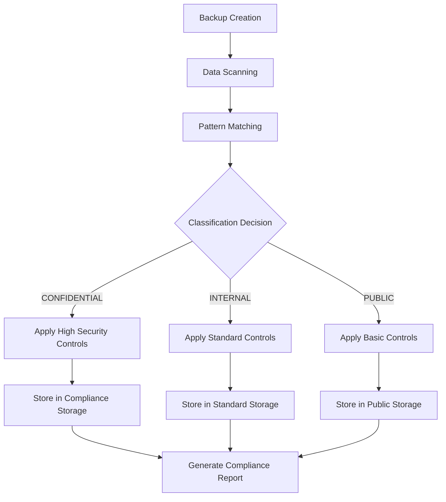

# Backup Classification and Handling Guidelines

## Purpose

This document provides detailed guidelines for classifying and handling backup data according to regulatory requirements and security best practices.

## Classification Matrix

### Data Classification Framework

| Classification | Definition | Examples | Regulatory Impact |
|----------------|------------|----------|-------------------|
| **CONFIDENTIAL** | Data requiring highest protection due to regulatory or business impact | Personal data, financial records, health information, payment data | GDPR, HIPAA, PCI-DSS, SOX |
| **INTERNAL** | Data for internal use that would cause moderate impact if disclosed | Application configs, system logs, performance metrics | Internal policies |
| **PUBLIC** | Data intended for public disclosure | Documentation, marketing content | None |

### Backup Handling Procedures by Classification

#### CONFIDENTIAL Data

**Storage Requirements:**
- Encryption: AES-256-GCM with HSM-backed keys
- Access: Multi-factor authentication + role-based access
- Location: Geographic restrictions based on data residency
- Retention: As per regulatory requirements (2-7 years)

**Handling Procedures:**
1. **Creation**
   - Automated classification upon backup creation
   - Apply encryption and access controls automatically
   - Generate compliance metadata and audit trail

2. **Storage**
   - Store in dedicated compliance storage tier
   - Implement immutability for retention period
   - Regular integrity verification with cryptographic hashing

3. **Access**
   - Require dual-control approval for restore operations
   - Document all access with audit trail
   - Time-boxed access with automatic revocation

4. **Destruction**
   - Secure deletion with cryptographic erasure
   - Verification of complete data destruction
   - Documentation for compliance reporting

#### INTERNAL Data

**Storage Requirements:**
- Encryption: AES-256-CBC with customer-managed keys
- Access: Role-based access with MFA for privileged operations
- Location: Standard data center security
- Retention: 1-3 years based on business needs

**Handling Procedures:**
1. **Creation**
   - Automatic classification based on data source
   - Apply standard encryption
   - Generate basic audit trail

2. **Storage**
   - Store in standard storage tiers
   - Regular backup verification
   - Cost-optimized storage allocation

3. **Access**
   - Role-based access control
   - Audit logging of access attempts
   - Periodic access review

4. **Destruction**
   - Standard deletion procedures
   - Confirmation of successful removal

#### PUBLIC Data

**Storage Requirements:**
- Encryption: Optional based on content
- Access: Standard authentication
- Location: Any suitable storage
- Retention: As needed

**Handling Procedures:**
1. **Creation**
   - Minimal security controls
   - Basic metadata tagging
   - Simple audit trail

2. **Storage**
   - Cost-optimized storage
   - Regular integrity checks
   - Easy accessibility

## Automated Classification System

### Classification Rules

```yaml
classification_rules:
  personal_data:
    patterns:
      - "email_address"
      - "phone_number"
      - "national_identifier"
      - "ip_address"
      - "location_data"
    classification: "CONFIDENTIAL"
    retention: "2y"
    frameworks: ["gdpr", "ccpa"]

  financial_data:
    patterns:
      - "credit_card_number"
      - "bank_account"
      - "transaction_amount"
      - "financial_statement"
    classification: "CONFIDENTIAL"
    retention: "7y"
    frameworks: ["sox", "pci-dss"]

  health_data:
    patterns:
      - "medical_record"
      - "diagnosis_code"
      - "treatment_plan"
      - "medication_info"
    classification: "CONFIDENTIAL"
    retention: "7y"
    frameworks: ["hipaa"]

  application_config:
    patterns:
      - "kubernetes_manifest"
      - "application_config"
      - "service_config"
    classification: "INTERNAL"
    retention: "1y"
    frameworks: []

  system_logs:
    patterns:
      - "application_log"
      - "system_log"
      - "access_log"
    classification: "INTERNAL"
    retention: "6m"
    frameworks: []
```

### Implementation Workflow



## Access Control Matrix

### Role-Based Access

| Role | CONFIDENTIAL | INTERNAL | PUBLIC | Additional Requirements |
|------|--------------|----------|--------|-------------------------|
| **backup-admin** | Full access | Full access | Full access | MFA + Annual certification |
| **backup-operator** | Limited restore | Full access | Full access | MFA + Quarterly review |
| **compliance-officer** | Read/audit | Read/audit | Read/audit | Background check + Training |
| **backup-auditor** | Read-only | Read-only | Read-only | Auditor certification |
| **application-owner** | Own data only | Own data only | Own data only | Business justification |

### Access Request Process

1. **Initial Request**
   - Submit access request with business justification
   - Manager approval required
   - Background check for confidential access

2. **Security Review**
   - Security team assesses request
   - Principle of least privilege applied
   - Time-limited access granted

3. **Provisioning**
   - Automated account creation
   - Required training completion
   - MFA enrollment

4. **Ongoing Monitoring**
   - Continuous access logging
   - Quarterly access review
   - Annual re-certification

5. **Access Revocation**
   - Automatic revocation on role change
   - Immediate revocation on security incident
   - Documentation of access history

## Geographic and Data Residency Requirements

### Data Residency Rules

| Data Type | Allowed Locations | Restrictions | Compliance Requirements |
|-----------|-------------------|--------------|------------------------|
| EU Personal Data | EU/EEA countries | Cannot transfer outside EU without appropriate safeguards | GDPR Chapter V |
| US Health Data | US territories | Cannot store in non-hipaa compliant regions | HIPAA |
| Financial Data | Country of origin | May require local storage for certain types | SOX, local regulations |
| Payment Data | PCI-compliant regions | Must use PCI-DSS compliant processors | PCI-DSS |

### Cross-Border Transfer Mechanisms

1. **Standard Contractual Clauses (SCCs)**
   - Required for EU data transfers outside EEA
   - Must be executed with all data processors
   - Regular review and updates

2. **Binding Corporate Rules (BCRs)**
   - For intra-organizational transfers
   - Require regulatory approval
   - Comprehensive compliance program

3. **Adequacy Decisions**
   - Transfer to countries with EU adequacy
   - Limited to specific data types
   - Ongoing monitoring required

## Encryption and Key Management

### Encryption Standards

| Data Classification | At Rest | In Transit | Key Management |
|---------------------|---------|------------|----------------|
| CONFIDENTIAL | AES-256-GCM | TLS 1.3 | HSM-backed KMS |
| INTERNAL | AES-256-CBC | TLS 1.2 | Customer-managed KMS |
| PUBLIC | Optional | TLS 1.2 | Service-managed keys |

### Key Lifecycle Management

1. **Key Generation**
   - Cryptographically secure random generation
   - Appropriate key length (256-bit for AES)
   - Unique keys per backup job

2. **Key Storage**
   - Hardware Security Module for CONFIDENTIAL data
   - Cloud KMS for INTERNAL data
   - Regular key backup and rotation

3. **Key Rotation**
   - CONFIDENTIAL: Every 30 days
   - INTERNAL: Every 90 days
   - PUBLIC: Every 180 days

4. **Key Destruction**
   - Cryptographic erasure
   - Multiple verification steps
   - Audit trail of destruction

## Incident Response Procedures

### Backup-Related Security Incidents

#### Detection and Classification

**Automated Detection**
- Anomaly detection in backup patterns
- Unauthorized access attempts
- Backup integrity failures
- Encryption key anomalies

**Manual Detection**
- Regular audit reviews
- User reports of unusual activity
- Compliance audit findings
- Third-party security assessments

#### Response Matrix

| Incident Type | Severity | Response Time | Notification Requirements |
|---------------|----------|---------------|--------------------------|
| Backup corruption | Critical | 1 hour | Executive, Legal, Regulatory |
| Unauthorized access | Critical | 1 hour | Executive, Security, Legal |
| Data breach | Critical | 1 hour | Executive, Legal, Regulatory |
| Backup failure | High | 4 hours | Operations, Management |
| Performance degradation | Medium | 8 hours | Operations |
| Configuration issue | Low | 24 hours | Operations |

#### Response Procedures

1. **Immediate Response (0-2 hours)**
   - Activate incident response team
   - Assess scope and impact
   - Implement containment measures
   - Preserve evidence

2. **Investigation (2-24 hours)**
   - Detailed forensic analysis
   - Root cause identification
   - Impact assessment
   - Compliance review

3. **Remediation (24-72 hours)**
   - Restore from clean backups
   - Implement security controls
   - Verify system integrity
   - Document all actions

4. **Reporting (72 hours+)**
   - Regulatory notifications
   - Executive reporting
   - Stakeholder communication
   - Post-incident review

## Compliance Validation and Testing

### Automated Validation

**Daily Checks**
- Backup completion verification
- Encryption status validation
- Access control compliance
- Retention policy adherence

**Weekly Checks**
- Backup integrity verification
- Key rotation status
- Audit trail completeness
- Geographic compliance

**Monthly Checks**
- Comprehensive compliance assessment
- Security control effectiveness
- Performance metrics analysis
- Documentation updates

### Manual Validation

**Quarterly Reviews**
- Compliance gap assessment
- Regulatory requirement review
- Security control testing
- Training effectiveness evaluation

**Annual Audits**
- Independent third-party audit
- Full compliance assessment
- Regulatory readiness evaluation
- Policy and procedure updates

## Documentation Requirements

### Backup Documentation

**Each backup must include:**
- Classification level
- Creation timestamp
- Data owner information
- Retention period
- Compliance frameworks
- Encryption details
- Access control settings

**Audit Trail Requirements:**
- Complete record of all operations
- Immutable storage with cryptographic protection
- 7-year retention for CONFIDENTIAL data
- Regular integrity verification

### Compliance Reporting

**Monthly Reports**
- Backup success rates
- Compliance score
- Incident summary
- Performance metrics

**Quarterly Reports**
- Compliance assessment results
- Gap analysis
- Remediation progress
- Regulatory updates

**Annual Reports**
- Full compliance evaluation
- Third-party audit results
- Strategic recommendations
- Policy updates

## Training and Awareness

### Required Training Programs

**Backup Administrators**
- Regulatory requirements (GDPR, HIPAA, PCI-DSS, SOX)
- Encryption and key management
- Incident response procedures
- Audit and compliance procedures

**Application Owners**
- Data classification principles
- Backup and restore procedures
- Security awareness
- Compliance responsibilities

**General Personnel**
- Data handling basics
- Security best practices
- Reporting procedures
- Policy awareness

### Training Schedule

| Role | Initial Training | Annual Refresher | Certification |
|------|------------------|------------------|---------------|
| backup-admin | 40 hours | 8 hours | Every 2 years |
| compliance-officer | 24 hours | 4 hours | Every 2 years |
| backup-operator | 16 hours | 4 hours | Every 3 years |
| application-owner | 8 hours | 2 hours | Every 3 years |

## Continuous Improvement

### Metrics and KPIs

**Operational Metrics**
- Backup success rate: Target > 99.9%
- Recovery time objective achievement: Target > 95%
- Compliance score: Target > 95%
- Security incident response time: Target < 1 hour

**Compliance Metrics**
- Regulatory requirement coverage: Target 100%
- Audit trail completeness: Target 100%
- Training completion rate: Target 100%
- Documentation accuracy: Target > 98%

### Improvement Process

1. **Regular Assessment**
   - Monthly performance reviews
   - Quarterly compliance assessments
   - Annual strategic reviews
   - Post-incident reviews

2. **Gap Analysis**
   - Identify compliance gaps
   - Assess security vulnerabilities
   - Evaluate operational inefficiencies
   - Review technology trends

3. **Remediation Planning**
   - Prioritize remediation activities
   - Allocate resources effectively
   - Define success criteria
   - Establish timelines

4. **Implementation and Monitoring**
   - Execute remediation plans
   - Monitor progress
   - Adjust strategies as needed
   - Document improvements

---

This guideline is a living document and will be updated regularly to reflect changes in regulatory requirements, technology capabilities, and business needs.