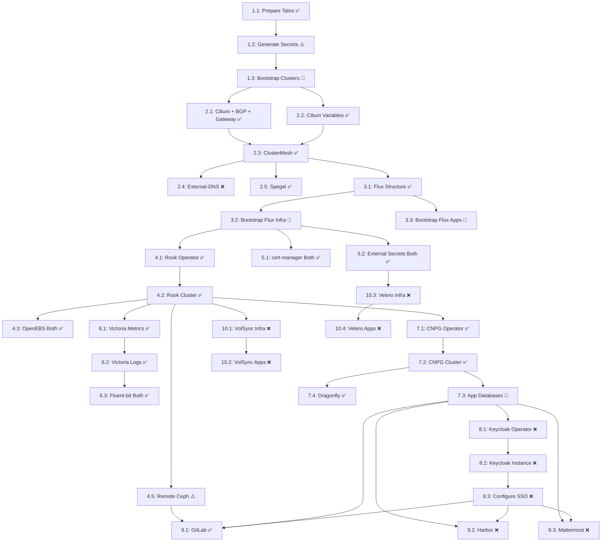

# Story Dependencies Graph

```mermaid
graph TD
    S1.1[1.1: Prepare Talos ✅] --> S1.2[1.2: Generate Secrets ⚠️]
    S1.2 --> S1.3[1.3: Bootstrap Clusters 🔲]
    S1.3 --> S2.1[2.1: Cilium + BGP + Gateway ✅]
    S1.3 --> S2.2[2.2: Cilium Variables ✅]
    S2.1 --> S2.3[2.3: ClusterMesh ✅]
    S2.2 --> S2.3
    S2.3 --> S2.4[2.4: External-DNS ❌]
    S2.3 --> S2.5[2.5: Spegel ✅]
    S2.3 --> S3.1[3.1: Flux Structure ✅]
    S3.1 --> S3.2[3.2: Bootstrap Flux Infra 🔲]
    S3.1 --> S3.3[3.3: Bootstrap Flux Apps 🔲]
    S3.2 --> S4.1[4.1: Rook Operator ✅]
    S4.1 --> S4.2[4.2: Rook Cluster ✅]
    S4.2 --> S4.3[4.3: OpenEBS Both ✅]
    S4.2 --> S4.5[4.5: Remote Ceph ⚠️]
    S3.2 --> S5.1[5.1: cert-manager Both ✅]
    S3.2 --> S5.2[5.2: External Secrets Both ✅]
    S4.2 --> S6.1[6.1: Victoria Metrics ✅]
    S6.1 --> S6.2[6.2: Victoria Logs ✅]
    S6.2 --> S6.3[6.3: Fluent-bit Both ✅]
    S4.2 --> S7.1[7.1: CNPG Operator ✅]
    S7.1 --> S7.2[7.2: CNPG Cluster ✅]
    S7.2 --> S7.3[7.3: App Databases 🔲]
    S7.2 --> S7.4[7.4: Dragonfly ✅]
    S7.3 --> S8.1[8.1: Keycloak Operator ❌]
    S8.1 --> S8.2[8.2: Keycloak Instance ❌]
    S8.2 --> S8.3[8.3: Configure SSO ❌]
    S4.5 --> S9.1[9.1: GitLab ✅]
    S7.3 --> S9.1
    S8.3 --> S9.1
    S7.3 --> S9.2[9.2: Harbor ❌]
    S8.3 --> S9.2
    S7.3 --> S9.3[9.3: Mattermost ❌]
    S8.3 --> S9.3
    S4.2 --> S10.1[10.1: VolSync Infra ❌]
    S10.1 --> S10.2[10.2: VolSync Apps ❌]
    S5.2 --> S10.3[10.3: Velero Infra ❌]
    S10.3 --> S10.4[10.4: Velero Apps ❌]
```

**Legend:**
- ✅ Config Complete
- ⚠️ Partial/Ready
- 🔲 Pending
- ❌ Not Implemented

---
